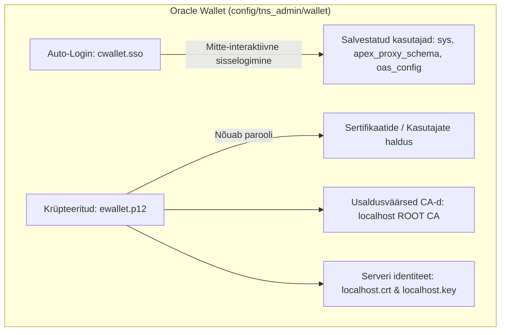

# Oracle Wallet (SEPS & TLS) Arhitektuuri ja Realiseerimise Plaan

See dokument koondab kokku tehnilise analüüsi ja detailse teostuskava Oracle Walleti (Secure External Password Store - SEPS ja TLS/TCPS) lisamiseks andmebaasi infrastruktuuri tulevikus.

---

## 1. Oracle Walleti Haldus ja Parool (SEPS loogika)

### Kas Walletil peab olema parool ja kus seda hoitakse?
**Jah, Walletil peab alati olema parool.** Wallet on krüpteeritud PKCS#12 standardil põhinev fail (`ewallet.p12`), mille sisu (paroolid ja privaatvõtmed) krüpteeritakse tugeva algoritmiga (nt AES-256).

1.  **Milleks on parool vajalik?**
    *   **Haldustoimingud:** Walleti parooli on vaja iga kord, kui soovime Walletisse lisada uusi ühendusi (kasutajaid/paroole), muuta olemasolevaid või importida uusi TLS sertifikaate.
2.  **Kuidas ühendutakse ilma paroolila (Auto-Login)?**
    *   Selleks, et skriptid ja kasutaja saaksid ühenduda ilma parooli sisestamata, genereeritakse Walletist **Auto-Login** versioon: fail nimega **`cwallet.sso`**.
    *   Kui see fail on olemas, loevad Oracle kliendid (SQLcl, TNS) seda automaatselt taustal ilma parooli küsimata.
3.  **Kus me haldusparooli hoiame?**
    *   **Lokaalses arenduses (DEV_LOCAL):** Parool genereeritakse automaatselt paigalduse ajal (sarnaselt teistele paroolidele) ja salvestatakse faili `.env` muutujasse `ORACLE_WALLET_PASSWORD`. See võimaldab meie skriptidel (nt arendajate lisamisel) Walletit automaatselt täiendada.
    *   **Toodangus (PROD):** Walleti parooli ei kirjutata kunagi failidesse. Seda hoitakse turvalises pilve paroolihoidlas (**Azure Key Vault**) ja seda teab ainult CI/CD runner paigalduse/uuenduse hetkel.

---

## 2. Sertifikaatide ja Usaldusahela Haldus Walletis

Wallet töötab samaaegselt nii paroolihoidlana (Credentials Store) kui ka sertifikaatide hoidlana (Keystore/Truststore).



### Kuidas sertifikaatide haldus toimub?
1.  **Andmebaasi kuulaja (TCPS port 2484) krüpteerimine:**
    *   Andmebaasi konteineri käivitamisel mountitakse serveri wallet kausta `/opt/oracle/admin/FREE/wallet`.
    *   See wallet sisaldab andmebaasi serveri unikaalset sertifikaati (loodud failide `localhost.crt` ja `localhost.key` baasil).
2.  **Kliendi usalduskontroll (SQLcl, ORDS):**
    *   Kliendi wallet (mis asub `config/tns_admin/wallet` all) sisaldab usaldusväärse sertifitseerimiskeskuse (CA) juursertifikaati.
    *   Kui klient ühendub andmebaasiga TCPS pordil, kontrollib klient läbi Walleti, kas andmebaasi sertifikaat on allkirjastatud usaldusväärse CA poolt. See ennetab täielikult pealtkuulamise rünnakuid (Man-in-the-Middle).

---

## 3. Millised kasutajad pannakse Walletisse ja miks?

### Walletisse lisatavad kasutajad (Otsesed andmebaasiühendused):
Walletisse salvestatakse ainult need kasutajad ja skeemid, mis teevad **otseseid võrguühendusi üle Oracle SQL*Net (TNS) protokolli**:

| Kasutaja / Alias | Kirjeldus | Miks on Walletis? |
| :--- | :--- | :--- |
| **`db_apex_proxy_sys`** | APEX Proxy DB administraator (`SYS`) | Paigaldusskriptidele, patchidele ja varukoopia utiliitidele ligipääsuks ilma paroolita. |
| **`db_publisher_sys`** | Publisher DB administraator (`SYS`) | Andmebaasi algseadistuseks ja teenuste käivitamiseks. |
| **`db_apex_proxy_schema`** | ORDS-i ühenduse kasutaja (`APEX_PROXY_SCHEMA`) | ORDS vajab seda andmebaasiga taustal ühendumiseks ja APEX-i REST API teenindamiseks. |
| **`db_publisher_oas`** | OAS / Publisher skeem (`OAS_CONFIG`) | Publisher andmebaasi skeemi migratsioonideks (Liquibase). |
| **`db_developer_user`** | Isiklik arendaja konto (nt `ALLAN`) | Arendaja lokaalseks SQLcl ja VS Code ühenduseks ilma parooli käsitsi trükkimata. |

### Miks veebiliidesega ühenduvaid kasutajaid (APEX Web Users / SSO) EI LISATA?
1.  **Puudub andmebaasi konto:** APEX-i veebirakendustesse (nt brauseris avatud APEX Builderisse või äriäppi) sisselogivad kasutajad ei ole andmebaasi kasutajad. Nad on virtuaalsed kasutajad, kes on salvestatud APEX-i sisemisse tabelisse või mida kontrollib pilve autentimisteenus (**Azure Entra-ID**).
2.  **ORDS vahendab ühendust:** Kui kasutaja logib veebis sisse, suhtleb tema brauser üle HTTPS-i ORDS-iga. ORDS omakorda teostab päringu andmebaasis, kasutades *oma* kindlat ühendust (mis on Walletis salvestatud kui `APEX_PROXY_SCHEMA` või `APEX_PUBLIC_USER`). Veebikasutajal endal polegi andmebaasi parooli, mida Walletisse panna.

---

## 4. Kuidas saab kasutaja parooli Walletist kätte?

Kui arendajal on tõesti vaja teada tekstilist parooli (näiteks ühenduse loomiseks mõnes välises süsteemis, mis ei toeta TNS/Walletit), saab ta parooli dekrüpteerida ja lugeda Oracle'i standardtööriistaga **`mkstore`**.

Lokaalses arenduses (DEV_LOCAL) on Walleti parool salvestatud sinu `.env` faili muutujasse **`ORACLE_WALLET_PASSWORD`**. 

### 1. Soovituslik viis: Automaatne abiskript
Oleme loonud mugava ja automaatse abiskripti, mis teostab indeksi otsingu ja parooli dekrüpteerimise sinu eest:
```bash
./scripts/internal/view-wallet-credential.sh <alias>
# Näited:
# ./scripts/internal/view-wallet-credential.sh DB_TEST_DEV
# ./scripts/internal/view-wallet-credential.sh DB_APEX_PROXY_SYS
```

### 2. Manuaalne viis: Konteineris mkstore käivitamine
Kui soovid käivitada utiliiti käsitsi andmebaasi konteineri kaudu (kus on Oracle Client olemas):

1. **Leia credentiali indeks:**
   Käivita käsk, sisesta Walleti parool `.env` failist ja vaata soovitud aliase indeksi numbrit:
   ```bash
   podman exec -it oracle-db-apex-proxy mkstore \
     -wrl "/opt/oracle/admin/FREE/wallet" \
     -listCredential
   ```
2. **Loe kasutajanimi või parool vastava indeksiga:**
   Kui näiteks aliase `DB_TEST_DEV` indeks on `4`, loe parool käsuga (sisesta uuesti Walleti parool):
   ```bash
   podman exec -it oracle-db-apex-proxy mkstore \
     -wrl "/opt/oracle/admin/FREE/wallet" \
     -viewEntry oracle.security.client.password4
   ```

---

## 5. Konteineri Paroolihaldus (Container Password Storage)

Tulevases realiseerimises kasutatakse **Variant A (Podman Secrets)** koos **Variant C-ga (Auto-open Wallet)**. See tagab järgmise turvataseme ja mugavuse:

1. **Turvaline algseadistus (Bootstrap):** Konteiner saab algseadistuse ajal parooli kätte läbi Podmani saladuste teenuse (`/run/secrets/wallet_password`). Parooli ei kuvata keskkonnamuutujates ega konteineri kirjelduses (`podman inspect`).
2. **Paroolita käitus (Runtime):** Tavaolukorras jookseb andmebaas ja TLS täiesti ilma parooli pärimiseta tänu automaatselt avanevale walleti failile (`cwallet.sso`).
3. **Pildi sõltumatus:** Konteineri pilt (`Dockerfile`) jääb unikaalsetest paroolidest täiesti puhtaks ja seda saab muutmata viia erinevatesse keskkondadesse (DEV, TEST, PROD).

---

## 6. Tehniline Teostuskava (Implementation Checklist)

1.  **[ ] Podman Secrets:** Täiendada `podman-compose.yml` ja `setup-all.sh`, et edastada `SYS` algne parool läbi Podmani saladuse (`/run/secrets/db_password`).
2.  **[ ] Walleti initsialiseerimine:** Luua skript `./scripts/internal/create-wallet.sh`, mis loob konteineri vahendusel auto-login walleti kausta `config/tns_admin/wallet/`.
3.  **[ ] TNS failide genereerimine:** Genereerida failid `sqlnet.ora` ja `tnsnames.ora` kausta `config/tns_admin/`.
4.  **[ ] Skriptide ümberkirjutamine:** Uuendada skripte (`setup-all.sh`, `create-developer.sh` jne), et nad ekspordiksid `TNS_ADMIN` ja ühenduksid kujul `sql /@alias`.
5.  **[ ] Dokumentatsiooni täiendamine:** Uuendada põhilist `README.md` ja `docs/turvalisus.md` faili.
