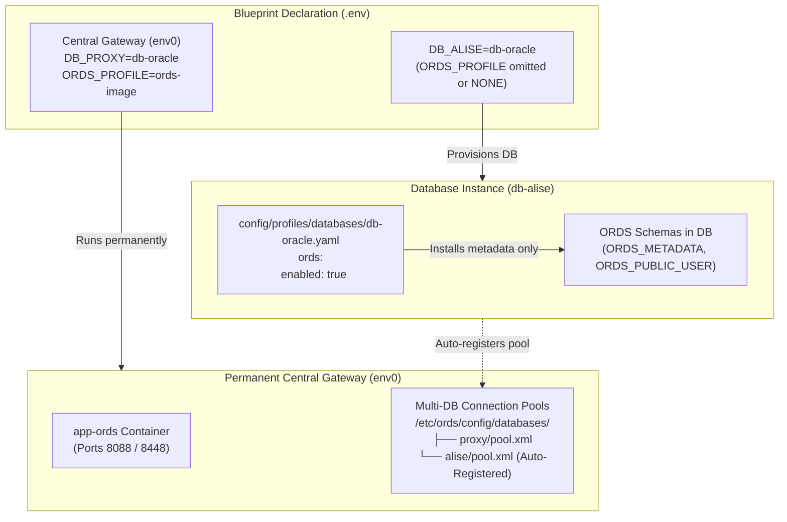

[ 🇬🇧 English ](ords-profiles-lifecycle.md) | [ 🇪🇪 Eesti ](et/ords-profiles-lifecycle.md) | [ 🇫🇮 Suomi ](fi/ords-profiles-lifecycle.md) | [ 🇸🇪 Svenska ](sv/ords-profiles-lifecycle.md) | [ 🇱🇻 Latviešu ](lv/ords-profiles-lifecycle.md) | [ 🇱🇹 Lietuvių ](lt/ords-profiles-lifecycle.md)

# 🌐 Oracle REST Data Services (ORDS) Profiles & Decoupled Lifecycle Guide

This guide documents the architecture, lifecycle orchestration, and configuration of **Oracle REST Data Services (ORDS)** across local containers, remote hosts, and cloud Autonomous Database (ADB) environments.

---

## 🏛️ 1. Decoupled Architecture Principles

In modern modular architectures, the web application gateway is decoupled from the database engine:



### Key Architectural Invariants:
1. **`ords.enabled: true` in Database Profile:**
   - Prepares the database-side ORDS schemas, metadata (`ORDS_METADATA`), and proxy users.
   - **Does NOT** spin up an `app-ords` web container.
2. **`ORDS_PROFILE` in Blueprint:**
   - Controls whether an `app-ords` container is instantiated.
   - If omitted or set to `NONE`, the database operates purely as a database backend with zero idle web container RAM.
3. **Automatic Central Gateway Registration:**
   - When Blueprint 0 (`env0`) is running, any newly provisioned database automatically generates its `<pool_name>.xml` pool descriptor and hot-reloads the central ORDS gateway.

---

## 📦 2. The 3 Canonical ORDS Profiles

All ORDS profile definitions reside in `config/profiles/ords/`:

| Profile | File | Type | Optimization & Target Domain |
| :--- | :--- | :--- | :--- |
| **`ords-image`** | `config/profiles/ords/ords-image.yaml` | `image` | **Official Oracle OCR Image.** (`container-registry.oracle.com/database/ords:latest`). Anti-virus optimized, zero local extraction, fast startup. Recommended for local dev & CI/CD. |
| **`ords-local-custom`** | `config/profiles/ords/ords-local-custom.yaml` | `local_custom` | **Host Custom Script.** Uses official ORDS binaries from `binaries/ords/` and custom standalone scripts, extracted inside ephemeral container. |
| **`ords-remote-custom`** | `config/profiles/ords/ords-remote-custom.yaml` | `remote_custom` | **Remote Server Gateway.** Connects to an existing standalone ORDS installation on a designated host/IP over SSH or HTTPS. |

### Example Blueprint Usage:
```bash
# Use official container image
ORDS_PROFILE=ords-image

# Use local custom scripts
ORDS_PROFILE=ords-local-custom

# Use remote ORDS host
ORDS_PROFILE=ords-remote-custom
```

---

## ☁️ 3. Oracle Autonomous Database (ADB) Integration

Oracle Autonomous Database (Cloud ADB Serverless) includes a fully managed, pre-installed ORDS instance in Oracle Cloud Infrastructure:

```yaml
# config/profiles/databases/db-adb.yaml
ords:
  enabled: true
  install_in_db: false       # Do NOT drop or overwrite cloud-managed ORDS_METADATA
  verify_version_match: true # Verify version compatibility with central gateway
```

### ADB Lifecycle Rules:
1. **Preserve Cloud Metadata (`install_in_db: false`):**
   - The deployment engine skips `ords install` inside the database, preventing destructive operations or privilege errors on cloud schemas.
2. **Version Compatibility Verification (`verify_version_match: true`):**
   - When registering ADB with a local or central ORDS gateway, the engine queries the ADB ORDS version via SQL and compares it with the gateway's ORDS version to ensure compatibility.
3. **mTLS Wallet Connection Pool:**
   - Generates the connection pool with `customURL` pointing to the cloud TNS alias using the unzipped cloud wallet credentials.

---

## 💡 4. No ORDS Server Guidance UX

When deploying a database blueprint where `ORDS_PROFILE` is not defined and no central ORDS container is active:

1. **Terminal Web Services Table:**
   ```text
   ┌─────────────────────────────────┬────────────────────────────────────────────┬─────────────────────────────┐
   │ Application                     │ URL                                        │ Authentication              │
   ├─────────────────────────────────┼────────────────────────────────────────────┼─────────────────────────────┤
   │ ℹ️ ORDS Web Gateway              │ NOT CONFIGURED (Standalone DB)             │ Run: ./scripts/setup-all.sh --b 0
   └─────────────────────────────────┴────────────────────────────────────────────┴─────────────────────────────┘
   ```
2. **Actionable Developer Hint:**
   ```text
   ℹ️  ORDS Server is not configured (no app-ords container).
   💡 To enable web UI, run: ./scripts/setup-all.sh --b 0 or add ORDS_PROFILE=ords-image
   ```
3. **Diagnostics Tooling (`scripts/check-urls.sh`):**
   - Correctly identifies that no web server is running and prints the same standardized guidance instead of throwing connection timeout errors.

---

## 🚀 5. Quick Commands

```bash
# 1. Start the permanent central ORDS gateway:
./scripts/setup-all.sh -b 0

# 2. Start a standalone business database (auto-registers pool in central ORDS):
./scripts/setup-all.sh -b 1

# 3. Verify web endpoints and active pools:
./scripts/check-urls.sh

# 4. View credentials for any database pool:
./scripts/get-password.sh DB_ALISE_ORDS_PUBLIC_USER
```
