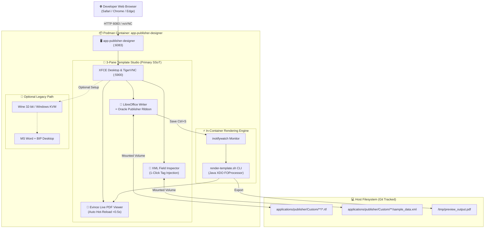
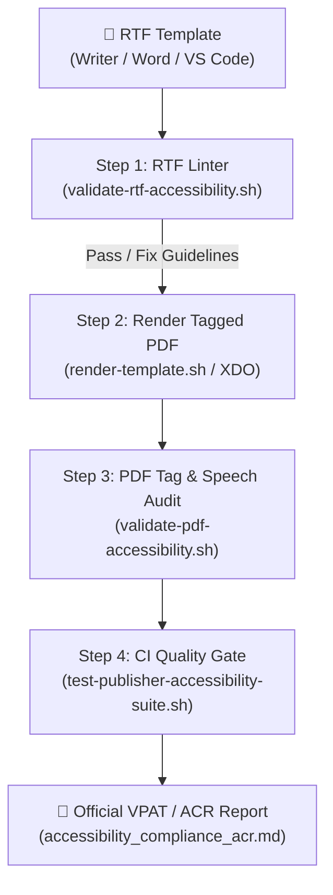

# Oracle Analytics Publisher Template Designer & Accessibility Guide: LibreOffice Writer 3-Pane Studio (Primary) & MS Word KVM/Wine (Optional)

[ 🇬🇧 English ](publisher-template-builder-guide.md) | [ 🇪🇪 Eesti ](et/publisher-template-builder-guide.md) | [ 🇫🇮 Suomi ](fi/publisher-template-builder-guide.md) | [ 🇸🇪 Svenska ](sv/publisher-template-builder-guide.md) | [ 🇱🇻 Latviešu ](lv/publisher-template-builder-guide.md) | [ 🇱🇹 Lietuvių ](lt/publisher-template-builder-guide.md)

---

## 1. Overview & Business Rationale

Designing **Pixel-Perfect business documents (Invoices, Delivery Notes, Packing Slips, Financial Reports)** in Oracle Analytics Publisher relies on **Rich Text Format (RTF) templates** merged with **XML data** to produce tagged, accessible PDF documents.

### 🛑 The Enterprise Problem Solved:
In restricted corporate IT environments, template authors encounter critical roadblocks:
1. **No Microsoft Office Licenses in Developer/CI Containers:** Corporate licenses are tied to individual user laptops. CI/CD runners and developer Linux containers cannot license Microsoft Word.
2. **Locked-Down Workstations (Zero Local Admin Rights):** Developers cannot install desktop executables (`BIPublisherDesktop64.exe`) or COM/VSTO Add-ins on managed corporate laptops.
3. **Cross-Platform Incompatibility:** Developers working on **macOS** or **Linux** have no native Microsoft Word Template Builder Add-in.

### 💡 The Solution: LibreOffice 3-Pane Studio (Primary SSoT):
The **`app-publisher-designer`** container (Blueprint 9) provides a zero-license, zero-install, out-of-the-box working workstation accessible directly in any web browser via **HTML5 noVNC on Port 6083** (`http://localhost:6083/vnc.html`):
- **LibreOffice 7.x/24.x Writer (Pre-Configured SSoT):** Ships pre-installed with custom **⚡ Oracle Publisher** menus, toolbars, XML tag injection, and hotkeys. Zero proprietary licenses required.
- **Evince Live PDF Viewer:** Re-renders and refreshes populated PDFs in `< 0.5s` upon saving (`Ctrl+S`).
- **Oracle XML Field Inspector:** Visual XML tree with 1-click tag insertion into Writer via X11 automation.
- **In-Container Fast-Rendering Engine:** Built-in Java Oracle XDO / `FOProcessor` and headless PDF export CLI.
- **Direct Git Synchronization:** Templates saved in the studio reside directly on the host in `templates/publisher/`.
- **Optional Advanced Mode:** Microsoft Word via Wine or Windows KVM remains available as an optional secondary path for teams with dedicated 32-bit Office media.

---

## 2. Architecture & Workstation Topology



---

## 3. Quickstart: LibreOffice Writer 3-Pane Studio (Primary SSoT)

The 3-Pane Studio is ready immediately upon starting Blueprint 9, without downloading external installers.

### Step 1: Start Designer Container
Via Blueprint 9 (Recommended):
```bash
./scripts/setup-all.sh -b 9
```
Or via standalone launcher script:
```bash
./scripts/publisher/start-designer.sh
```
To launch directly in a specific language (e.g. Estonian, Finnish, Swedish):
```bash
./scripts/publisher/start-designer.sh --lang et   # Options: en, et, fi, sv, lv, lt
```

### Step 2: Open Template Studio in Browser
1. Open `http://localhost:6083/vnc.html` in your web browser.
2. Double-click the **🚀 Oracle Publisher Template Studio** icon on the desktop.
3. The studio automatically arranges three responsive panes:
   - **Left Pane (65% width):** **LibreOffice Writer** with the active template (`arve_test_standard.rtf`).
   - **Top-Right Pane (35% width):** **Evince Live PDF Viewer** showing `valmis_arve.pdf`.
   - **Bottom-Right Pane (35% width):** **Oracle XML Field Inspector** displaying tree nodes from `arve_test_andmed.xml`.

### Step 3: Design & Tag Injection Workflow
1. **Oracle Publisher Menu & Toolbar in Writer:**
   - `🏷️ Insert Field`: Inserts `<?TAG_NAME?>` at the current cursor position.
   - `🔁 for-each Loop`: Wraps selected table rows with `<?for-each:LINES/LINE?> ... <?end for-each?>`.
   - `❓ Conditional (IF)`: Inserts conditional display blocks (`<?if:VAT_RATE > 0?>...<?end if?>`).
   - `⚡ Fast Render PDF`: Compiles the template to PDF on demand.
2. **1-Click XML Tag Insertion via Field Inspector:**
   - Select any node in the XML tree and click **👉 Sisesta Kursorisse (Insert to Cursor)** — the exact syntax is typed into Writer via X11 automation!
3. **Instant Live Preview:**
   - Press `Ctrl+S` in Writer. The background inotify monitor re-compiles the PDF and Evince refreshes in less than 0.5 seconds.

### Step 4: Stop Designer to Free Memory
```bash
./scripts/publisher/stop-designer.sh
```

---

## 4. In-Container & Host Test Rendering Process

You can test-compile templates without opening the graphical desktop.

### 4.1 Host CLI Test Renderer (`test-render.sh`)
The host wrapper script automatically detects whether `app-publisher-designer` is running:
```bash
# Basic usage:
./scripts/publisher/test-render.sh \
  templates/publisher/samples/arve_test_standard.rtf \
  templates/publisher/samples/arve_test_andmed.xml \
  [output.pdf]

# Multi-language rendering with XLIFF translation:
./scripts/publisher/test-render.sh --locale fi
```
- If the container is online, it delegates rendering to `/u01/oracle/bin/render-template.sh` inside the container.
- If offline, it uses local headless LibreOffice + XDO preprocessor fallback.

### 4.2 Direct In-Container CLI Execution
You can execute template rendering directly inside the running container:
```bash
podman exec -it app-publisher-designer /u01/oracle/bin/render-template.sh \
  /u01/templates/samples/arve_test_standard.rtf \
  /u01/templates/samples/arve_test_andmed.xml \
  /u01/templates/samples/valmis_arve_et.pdf \
  --locale et
```

### 4.3 Live Watcher & Hot-Reload (`watch-render-host.sh`)
When editing templates locally or in Microsoft VS Code:
```bash
./scripts/publisher/watch-render-host.sh \
  templates/publisher/samples/arve_test_standard.rtf \
  templates/publisher/samples/arve_test_andmed.xml \
  templates/publisher/samples/valmis_test_arve.pdf
```
- Monitors the RTF file using portable `stat` timestamps.
- Automatically re-renders the PDF on every save in `< 0.5s`.
- Opens your host default PDF reader (or VS Code PDF preview) automatically.

### 4.4 Multi-Language XLIFF (`.xlf`) Architecture
A single RTF template (`arve_test_standard.rtf`) serves all 6 languages via official Oracle XLIFF translation maps:
- `arve_test_standard_et.xlf` (Estonian)
- `arve_test_standard_en.xlf` (English)
- `arve_test_standard_fi.xlf` (Finnish)
- `arve_test_standard_sv.xlf` (Swedish)
- `arve_test_standard_lv.xlf` (Latvian)
- `arve_test_standard_lt.xlf` (Lithuanian)

Render in any language with:
```bash
./scripts/publisher/test-render.sh --locale fi
```

---

## 5. Document Accessibility & PDF/UA-1 Validation Process

All business documents produced by Oracle Analytics Publisher must comply with **PDF/UA-1 (ISO 14289-1)**, **WCAG 2.1 Level AA**, **European Accessibility Act (EAA / EN 301 549)**, and **Section 508**.

### Mandatory Design Rules (Summary):
1. **Heading Hierarchy:** Use real styles (`Heading 1` for document title, `Heading 2` for sections). Never simulate headings with bold text.
2. **Repeating Table Headers (`\trhdr`):** Every multi-page data table must have repeating headers enabled (*LibreOffice: Table Properties -> Text Flow -> Repeat header*; *MS Word: Row -> Repeat as header row*).
3. **Images & Logos Alt-Text:** Every image must have descriptive alt text. Corporate logos use the centralized dynamic URI:
   ```text
   url:{concat($IMAGE_DIR, '/company_logo.png')}
   Alt: Ettevõtte ametlik logo
   ```
4. **Color Contrast:** Minimum ratio **4.5:1** for standard body text. Never use light gray on white.
5. **Natural Language Tag:** PDF must declare `/Lang` (`et-EE`, `en-US`, `fi-FI`, etc.).

### Step-by-Step Accessibility Audit Workflow:



#### Step 1: RTF Structural Linting
Run the RTF accessibility linter before compiling:
```bash
./scripts/publisher/validate-rtf-accessibility.sh templates/publisher/samples/accessible_starter_template.rtf --strict
```
Checks for:
- Standard `\s1` / `Heading 1` and `\s2` / `Heading 2` styles.
- Presence of table header repeat control words (`\trhdr`).
- Alternative text on graphic objects (`\picw`, `\pich`).
- Detection of prohibited empty spacer table cells.

#### Step 2: Tagged Accessible PDF Export
During rendering, the engine injects required PDF structural elements:
- Document catalog structure tree: `/StructTreeRoot`
- Marked content metadata: `/MarkInfo << /Marked true >>`
- Natural language dictionary: `/Lang (et-EE)`

#### Step 3: PDF Tag & Screen Reader Speech Inspection
Verify generated PDF tags and simulate the exact speech heard by screen readers (NVDA, JAWS):
```bash
./scripts/publisher/validate-pdf-accessibility.sh templates/publisher/samples/valmis_arve_et.pdf
```
Outputs structural tag verification:
- Document Title (`/H1`)
- Table Structure (`/Table`, `/TR`, `/TH`, `/TD`)
- Image Alt-Text (`/Figure /Alt (...)`)
- Spoken utterance timeline for blind users.

#### Step 4: Automated CI Quality Gate & ACR Report
Execute the comprehensive accessibility test suite:
```bash
./tests/integration/test-publisher-accessibility-suite.sh
```
- Tests all templates under `templates/publisher/accessibility_suite/`.
- Benchmarks compliance in `metrics/accessibility_benchmarks.json` and `.env`.
- Generates the official **Accessibility Conformance Report (VPAT / ACR)** at:
  [`tests/reports/accessibility_compliance_acr.md`](../tests/reports/accessibility_compliance_acr.md).

For complete technical specifications, see the skill reference:
👉 [`.agents/skills/oracle_publisher_accessibility/SKILL.md`](../.agents/skills/oracle_publisher_accessibility/SKILL.md).

---

## 6. Modern Developer Workflow: Microsoft VS Code & GitHub Copilot

Developers can author RTF templates directly inside **Microsoft VS Code** with AI assistance:

1. **Automated Copilot Instructions:** VS Code GitHub Copilot automatically reads [`.github/copilot-instructions.md`](../.github/copilot-instructions.md) and [`templates/publisher/COPILOT_INSTRUCTIONS.md`](../templates/publisher/COPILOT_INSTRUCTIONS.md).
2. **Start Live Watcher in Terminal:**
   ```bash
   ./scripts/publisher/watch-render-host.sh
   ```
3. **Open Template in VS Code:**
   Open `templates/publisher/samples/arve_test_standard.rtf`.
4. **Prompt Copilot (`Cmd+I` / Chat):**
   Ask Copilot to add columns, format currencies (`format-number`), or insert conditional blocks using fields from `templates/publisher/samples/arve_test_andmed.xml`.
5. **Instant Live Preview (`Cmd+S`):**
   Saving the file instantly triggers re-compilation in `< 0.5s` and updates the preview.
6. **Automated Verification:**
   Run `./tests/unit/test-publisher-rtf-template.sh` to validate schema and syntax.

---

## 7. Optional Alternative: Microsoft Word & BIP Desktop via Wine or Windows KVM

For organizations with valid Microsoft Office licenses that prefer the official Oracle Word Add-In Ribbon:

### Step 1: Stage Office & BIP Installers
Place standalone 32-bit installers into `binaries/publisher/`:
- `binaries/publisher/setup.exe` (Office 2010/2013/2016 32-bit standalone installer)
- `binaries/publisher/BIPublisherDesktop32.exe` (Oracle BI Publisher Desktop Template Builder)

### Step 2: Run Setup Helper
Run the automated installation script from the host:
```bash
./scripts/publisher/setup-word-designer.sh
```
Or open the desktop in browser (`http://localhost:6083/vnc.html`) and click **"⚡ Paigalda Word & Publisher Designer"**.
The installed Word and BIP Add-In persist across restarts via the volume `publisher_designer_wine`.

### Available Workstation Profiles:
1. **Wine 32-bit Runtime (Default — `config/profiles/publisher/publisher-designer-standard.yaml`):**
   - Ubuntu 22.04 with Wine 32-bit prefix, `.NET 4.0`, and MSXML6.
2. **Native Windows KVM Mode (`config/profiles/publisher/publisher-designer-windows.yaml`):**
   - Virtualized Windows desktop via `dockur/windows` with hardware KVM acceleration and RDP support on port 3389.

---

## 8. Oracle Analytics Publisher Template Syntax Cheat-Sheet

| Feature | Oracle BI Publisher RTF Tag | Description |
| :--- | :--- | :--- |
| **Field Value** | `<?INVOICE_NUM?>` | Emits XML element value |
| **Repeating Rows** | `<?for-each:G_LINES?>` ... `<?end for-each?>` | Iterates over XML array of line items |
| **Conditional Block** | `<?if:VAT_RATE > 0?>` ... `<?end if?>` | Shows block only if condition is true |
| **Number Formatting** | `<?format-number(TOTAL, '#,##0.00')?>` | Formats currency / decimals |
| **Date Formatting** | `<?format-date(INVOICE_DATE, 'YYYY-MM-DD')?>` | Formats standard dates |
| **Dynamic Central Logo** | `url:{concat($IMAGE_DIR, '/company_logo.png')}` | References centralized image without hardcoding local disk paths |
| **Table Header Repeat** | `\trhdr` (Table Row Properties) | Mandatory for PDF/UA-1 multi-page table accessibility |
| **Document Title (H1)** | Style `Heading 1` in Writer/Word | Mandatory single H1 tag for screen readers |

---

## 9. Enterprise GitOps Standard (`applications/publisher/`), REST Deployment & CI/CD Pipeline

To ensure enterprise-grade stability, zero-trust credential security, and CI/CD compliance, all templates and data models are managed under `applications/publisher/` mirroring the Oracle Analytics Publisher server catalog (`/Custom/<Domain>/<ReportName>/`).

### 9.1 Directory Structure & GitOps Invariant

```text
applications/publisher/
├── .gitignore                         # Excludes binary *.xdoz and *.xdmz archives
├── README.md                          # Documentation (6 languages: EN, ET, FI, SV, LV, LT)
└── Custom/
    └── Invoices/
        └── Invoice_Report/
            ├── Invoice_Report.xdo/       # Git-tracked report package
            │   ├── template.rtf          # Accessible PDF/UA-1 RTF template
            │   ├── template_et.xlf       # Estonian XLIFF translations
            │   ├── template_fi.xlf       # Finnish XLIFF translations
            │   └── _manifest.xml         # Publisher report manifest
            └── Invoice_DataModel.xdm/    # Git-tracked data model package
                ├── datamodel.sql         # Clean SQL data collection query
                ├── datamodel.xml         # XML data model bound to ALISE_APP_DB
                └── sample_data.xml       # Sample data for offline and CI testing
```

### 9.2 Scaffolding & Deployment CLI Tools

1. **Scaffold a New Report:**
   ```bash
   ./scripts/publisher/create-report.sh Custom/Invoices/Packing_Slip "Packing Slip Report"
   ```
2. **Deploy to Publisher Server (REST API / Copy):**
   ```bash
   ./scripts/publisher/deploy-template.sh Custom/Invoices/Invoice_Report --mode rest
   ```
3. **Deploy with Immediate Server-Side Test-Render:**
   ```bash
   ./scripts/publisher/deploy-template.sh Custom/Invoices/Invoice_Report --render
   ```

### 9.3 Security Roles & SEPS Wallet Rotation

| User | WebLogic Group | SEPS Wallet Alias | Scope & Permissions |
| :--- | :--- | :--- | :--- |
| `bip_developer` | `XMLP_DEVELOPER`, `XMLP_TEMPLATE_DESIGNER` | `PUBLISHER_DEVELOPER` | Template & Data Model creation in `/Custom/` |
| `bip_user` | `XMLP_SCHEDULER`, `XMLP_ANALYZER` | `PUBLISHER_USER` | Running reports, viewing/deleting job history |
| `bip_admin` | `XMLP_ADMIN` | `PUBLISHER_ADMIN` | BIP catalog administration (no WebLogic console) |

Rotate passwords via Oracle SEPS Wallet:
```bash
./scripts/rotate-password.sh publisher dev     # Rotates bip_developer password
./scripts/rotate-password.sh publisher user    # Rotates bip_user password
./scripts/rotate-password.sh publisher admin   # Rotates bip_admin password
```

### 9.4 GitHub Actions CI/CD Workflow (`.github/workflows/deploy-publisher-reports.yml`)

```mermaid
sequenceDiagram
    autonumber
    actor Dev as 👨‍💻 Release Manager<br/>(Developer / Operator)
    participant GHA as ⚙️ GitHub Actions Runner<br/>(deploy-publisher-reports)
    participant QG as 🧪 CI Quality Gates<br/>(Linter & Test-Render)
    participant Art as 📦 GitHub Artifacts<br/>(Downloadable PDF)
    participant Sec as 🔑 Secret Store<br/>(GitHub Secrets / OIDC)
    participant Pub as 🏢 Publisher Server<br/>(:9502 REST API)

    Dev->>GHA: 1. Trigger workflow_dispatch<br/>(environment: dev/test/prod, report path)
    activate GHA

    rect rgb(30, 41, 59)
        Note over GHA,QG: Automated Pre-deployment Quality Gates
        GHA->>QG: 2. XML & SQL syntax check<br/>(xmllint datamodel.xml)
        QG-->>GHA: ✅ Syntax validated
        GHA->>QG: 3. RTF accessibility audit<br/>(PDF/UA-1, \trhdr, H1/H2, Alt-text)
        QG-->>GHA: ✅ Accessibility rules passed
        GHA->>QG: 4. Headless test-render<br/>(using sample_data.xml)
        QG-->>GHA: ✅ Sample PDF generated
        GHA->>Art: 5. Upload sample PDF artifact<br/>(actions/upload-artifact@v4)
        Art-->>Dev: 👁️ PDF downloadable in GitHub UI
    end

    rect rgb(15, 23, 42)
        Note over GHA,Pub: Deployment to Publisher Server (REST API)
        GHA->>Sec: 6. Query credentials (OAuth2 Bearer<br/>or bip_developer password)
        Sec-->>GHA: 🔑 Secure authorization header
        GHA->>Pub: 7. POST /xmlpserver/services/rest/v1/reports<br/>(deploy-template.sh --mode rest)
        Pub-->>GHA: HTTP 200 / 201 Created (Idempotent)
        
        opt If test_render enabled
            GHA->>Pub: 8. POST /reports/{path}/run (Server Render)
            Pub-->>GHA: 📑 Official server PDF stream
        end
    end

    GHA->>Dev: 9. Publish $GITHUB_STEP_SUMMARY<br/>(Deployment summary & report links)
    deactivate GHA
```



