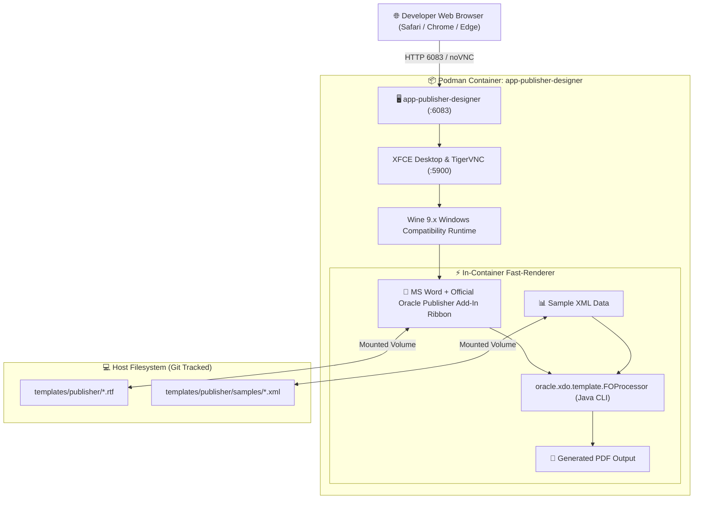

# Oracle Analytics Publisher Desktop & MS Word Pixel-Perfect Workstation Guide

[ 🇬🇧 English ](publisher-template-builder-guide.md) | [ 🇪🇪 Eesti ](et/publisher-template-builder-guide.md) | [ 🇫🇮 Suomi ](fi/publisher-template-builder-guide.md) | [ 🇸🇪 Svenska ](sv/publisher-template-builder-guide.md) | [ 🇱🇻 Latviešu ](lv/publisher-template-builder-guide.md) | [ 🇱🇹 Lietuvių ](lt/publisher-template-builder-guide.md)

---

## 1. Overview & Business Rationale

Designing **Pixel-Perfect business documents (Invoices, Delivery Notes, Packing Slips, Financial Reports)** in Oracle Analytics Publisher relies on **Rich Text Format (RTF) templates** created via **Microsoft Word and the official Oracle Analytics Publisher Desktop (Template Builder for Word) Add-in**.

### 🛑 The Enterprise Problem Solved:
In restricted enterprise environments, developers face major roadblocks:
1. **Locked-Down Workstations (Zero Local Admin Rights):** Developers cannot install desktop executables (`BIPublisherDesktop64.exe`) or MS Word COM/VSTO Add-ins on corporate laptops.
2. **IT Ticketing Bottlenecks:** Requesting local plugin installations through internal IT service desks takes weeks or is blocked by security policies.
3. **Cross-Platform Compatibility:** Developers working on **macOS** or **Linux** have no native Word Template Builder Add-in.

### 💡 The Podman Workstation Solution:
The **`app-publisher-designer`** container solves this completely:
- Runs an isolated **Windows Word runtime with the official Oracle BI Publisher Desktop Add-in** accessible directly in any web browser via **HTML5 noVNC on Port 6083** (`http://localhost:6083/vnc.html`).
- **0 MB Idle RAM:** Runs on-demand; start it when designing templates and stop it to free memory.
- **Direct Git Sync:** Templates saved in Word reside directly on the host in `templates/publisher/`.

---

## 2. Architecture & Port Map



- **HTML5 noVNC Web GUI:** `http://localhost:6083/vnc.html`
- **Direct VNC Port:** `5903`
- **Volume Mount:** `./templates/publisher:/u01/templates:z`

---

## 3. Quickstart & Workflow

### Step 1: Start the Designer Container
Via Blueprint 9 (Recommended):
```bash
./scripts/setup-all.sh -b 9
```
Or via standalone script:
```bash
./scripts/publisher/start-designer.sh
```

### Step 2: Open in Web Browser
```bash
./scripts/publisher/open-designer.sh
# Or navigate to: http://localhost:6083/vnc.html
```

### Step 3: Design Your Template in Word
Inside the noVNC browser window:
1. Click the **Publisher** tab on the top Word ribbon.
2. Click **Sample XML** and choose `/u01/templates/samples/arve_naidisandmed.xml`.
3. Use **Insert $\rightarrow$ Table/Form Wizard** or **Field** to place data tags.
4. Click **Preview $\rightarrow$ PDF** to inspect the rendered invoice instantly.
5. Save the document (`Ctrl+S`) — the `.rtf` file is automatically saved into your Git repository.

### Step 4: Test Render via CLI
You can test compile templates without opening the GUI:
```bash
./scripts/publisher/test-render.sh templates/publisher/samples/arve_eesti_standard.rtf templates/publisher/samples/arve_naidisandmed.xml
```

### Step 5: Stop Designer to Free Resources
```bash
./scripts/publisher/stop-designer.sh
```

---

## 4. Oracle BI Publisher Template Syntax Cheat-Sheet

| Feature | Oracle BI Publisher RTF Tag | Description |
| :--- | :--- | :--- |
| **Field Value** | `<?INVOICE_NUM?>` | Emits XML element value |
| **Repeating Rows** | `<?for-each:G_LINES?>` ... `<?end for-each?>` | Iterates over XML array of line items |
| **Conditional Block** | `<?if:VAT_RATE > 0?>` ... `<?end if?>` | Shows block only if condition is true |
| **Number Formatting** | `<?format-number(TOTAL, '#,##0.00')?>` | Formats currency / decimals |
| **Date Formatting** | `<?format-date(INVOICE_DATE, 'YYYY-MM-DD')?>` | Formats standard dates |
