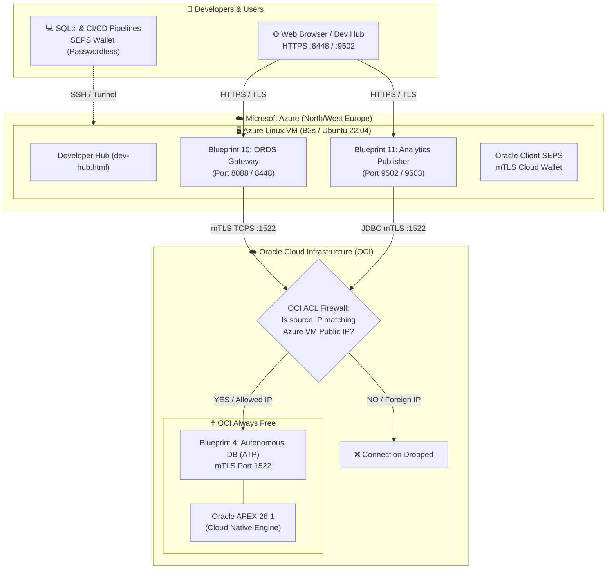

# Multi-Cloud Enterprise Remote Blueprint Setup Guide
## Oracle Cloud Infrastructure (OCI Always Free) & Microsoft Azure (Free Tier)

[ 🇬🇧 English ](remote-multicloud-setup-guide.md) | [ 🇪🇪 Eesti ](et/remote-multicloud-setup-guide.md) | [ 🇫🇮 Suomi ](fi/remote-multicloud-setup-guide.md) | [ 🇸🇪 Svenska ](sv/remote-multicloud-setup-guide.md) | [ 🇱🇻 Latviešu ](lv/remote-multicloud-setup-guide.md) | [ 🇱🇹 Lietuvių ](lt/remote-multicloud-setup-guide.md)

---

## 1. Overview & Architecture

This guide details how to configure and deploy a multi-cloud enterprise topology:
- **Database Layer (OCI Always Free):** Oracle Autonomous Database Serverless (ATP/ADW, Blueprint 4). Access is strictly restricted via Access Control List (ACL) to the Azure VM public IP address, communicating over encrypted mTLS (`cwallet.sso`, AES-256) on port `1522`.
- **Application & Gateway Layer (Microsoft Azure):** Linux Virtual Machine (Standard B2s / B1s) running standalone ORDS Gateway (**Blueprint 10**) and Analytics Publisher (**Blueprint 11**) with 0 local databases.
- **Client & Security Layer:** Developers and end users access the Azure web interfaces (Dev Hub, APEX Builder, Publisher) over HTTPS, while automated tools use passwordless SEPS Wallets.



---

## 2. Prerequisites & Free Tier Allocations

| Cloud Provider | Component | Free Tier Tier | Cost |
| :--- | :--- | :--- | :--- |
| **OCI (Oracle Cloud)** | Autonomous Transaction Processing (ATP) | 1 ECPU / OCPU, 20 GB storage, Always Free | **$0.00 / month** |
| **Microsoft Azure** | Virtual Machine (`Standard_B2s` / `Standard_B1s`) | 2 vCPU, 4 GB RAM, Ubuntu 22.04 LTS | **$0.00** (Free Account credit / 12 mo) |
| **Microsoft Azure** | Network Security Group (NSG) | Inbound: 22, 8088, 8448, 9502, 9503 | **$0.00** |

---

## 3. Step 1: OCI Autonomous Database Setup (ATP)

1. Log in to your [Oracle Cloud Infrastructure Console](https://cloud.oracle.com/).
2. Navigate to **Oracle Database** $\rightarrow$ **Autonomous Database**.
3. Click **Create Autonomous Database**:
   - **Display Name & Database Name:** `adbp` (or `freeadb`).
   - **Workload Type:** *Transaction Processing (ATP)*.
   - **Deployment Type:** *Serverless*.
   - **Always Free:** Select the **Always Free** toggle.
   - **Database Version:** Select *23ai* (or *19c*).
   - **Administrator Credentials:** Set a secure password for user `ADMIN` (store it safely).
   - **Network Access:**
     - Select **Secure access from allowed IPs and VCNs only**.
     - Add your developer workstation's public IP.
     - *(After creating the Azure VM in Step 2, you will also add the Azure VM's public IP here).*
4. Click **Create Autonomous Database**. Wait ~2–3 minutes until the lifecycle state changes to **Available** (Green).
5. **Download mTLS Cloud Wallet:**
   - On the Autonomous Database details page, click **Database Connection**.
   - Under *Download client credentials (Wallet)*, click **Download Wallet**.
   - Enter a wallet password (e.g. `Welcome_12345#`) and download `Wallet_adbp.zip`.
   - Place this file in your project directory: `config/tns_admin/Wallet_adbp.zip`.

---

## 4. Step 2: Microsoft Azure Linux VM Setup

1. Log in to the [Azure Portal](https://portal.azure.com/).
2. Navigate to **Virtual Machines** $\rightarrow$ **Create** $\rightarrow$ **Azure virtual machine**.
   - **Resource Group:** Create new (e.g. `rg-oracle-multicloud`).
   - **Virtual machine name:** `vm-oracle-edge-gateway`.
   - **Region:** `North Europe` or `West Europe` (choose closest to your OCI region for lowest latency).
   - **Image:** `Ubuntu Server 22.04 LTS - x64 Gen2` (or `Oracle Linux 9`).
   - **Size:** `Standard_B2s` (2 vCPUs, 4 GiB memory) — ensures sufficient RAM for Publisher & ORDS.
   - **Authentication type:** *SSH public key*.
   - **SSH public key source:** Use existing public key (`~/.ssh/id_ed25519.pub` or `~/.ssh/id_rsa.pub`).
3. **Configure Network Security Group (NSG) Inbound Rules:**
   - Allow port `22` (SSH) from your local IP.
   - Allow port `8088` & `8448` (ORDS HTTP & HTTPS).
   - Allow port `9502` & `9503` (Analytics Publisher HTTP & HTTPS).
4. Click **Review + create**, then **Create**.
5. Once deployed, note the **Public IP address** of the Azure VM (e.g. `20.105.45.12`).
6. **Update OCI ACL:**
   - Go back to OCI Autonomous Database $\rightarrow$ **Network** $\rightarrow$ **Edit Access Control List (ACL)**.
   - Add `<AZURE_VM_PUBLIC_IP>/32` to the allowed IP list and save.

---

## 5. Step 3: Automated Remote Deployment (`deploy-remote.sh`)

Use the unified remote deployment script to deploy the code, configure Podman, upload the OCI mTLS Wallet, and start the remote blueprints:

```bash
# 1. Deploy Blueprint 10 (Standalone Central ORDS Gateway & Dev Hub) to Azure VM:
./scripts/deploy-remote.sh \
    --host <AZURE_VM_PUBLIC_IP> \
    --user ubuntu \
    --key ~/.ssh/id_ed25519 \
    --wallet config/tns_admin/Wallet_adbp.zip \
    --blueprint 10

# 2. Deploy Blueprint 11 (Standalone Analytics Publisher Server) to Azure VM:
./scripts/deploy-remote.sh \
    --host <AZURE_VM_PUBLIC_IP> \
    --user ubuntu \
    --key ~/.ssh/id_ed25519 \
    --wallet config/tns_admin/Wallet_adbp.zip \
    --blueprint 11
```

---

## 6. Step 4: Running the Multi-Cloud Test Suite

Execute the automated multi-cloud test suite to verify end-to-end functionality:

```bash
./tests/test-remote-multicloud.sh \
    --azure-host <AZURE_VM_PUBLIC_IP> \
    --oci-db-name adbp \
    --wallet config/tns_admin/Wallet_adbp.zip
```

The test suite automatically verifies:
1. **Network SLA & Latency:** Cross-cloud RTT between Azure and OCI.
2. **Zero-Trust SEPS Wallet:** Verifies mTLS passwordless connectivity via SQLcl (`/@DB_ADB_ADMIN`).
3. **ORDS Web Endpoints (BP 10):** APEX Builder, Database Actions (SQL Web), and AutoREST endpoints.
4. **Analytics Publisher (BP 11):** Verifies Publisher data models and PDF report generation over JDBC mTLS.
5. **ACL Enforcement:** Confirms that traffic from unwhitelisted IPs is rejected.
6. **Reporting:** Outputs results to `tests/reports/remote_multicloud_test_report.md`.
