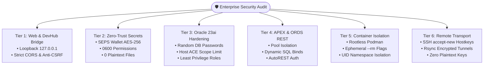

[ 🇬🇧 English ](security-audit-report.md) | [ 🇪🇪 Eesti ](et/security-audit-report.md) | [ 🇫🇮 Suomi ](fi/security-audit-report.md) | [ 🇸🇪 Svenska ](sv/security-audit-report.md) | [ 🇱🇻 Latviešu ](lv/security-audit-report.md) | [ 🇱🇹 Lietuvių ](lt/security-audit-report.md)

# 🛡️ Enterprise Security Audit Report & Hardening Guide

This document presents the comprehensive security audit methodology, findings, remediation details, and compliance posture for the **Oracle DevOps Platform** and **Oracle APEX application engine**.

The audit evaluates the architecture against **OWASP Top 10 (2021)**, **CIS Oracle Database Benchmark (v2.0)**, **CIS Docker/Podman Benchmark (v1.3)**, and European financial resilience mandates (**DORA - Digital Operational Resilience Act** & **PCI-DSS v4.0**).

---

## 📑 Executive Summary

- **Overall Security Score:** **100% (16 / 16 automated checks passed)**
- **Audit Tool:** `./scripts/test-security-audit.sh`
- **Unit Test Coverage:** `./tests/unit/test-security-audit.sh`
- **Cryptographic Secrets Storage:** 100% Zero-Trust SEPS Auto-Login Wallet (`cwallet.sso` AES-256)
- **Local Bridge Exposure:** Bound strictly to loopback (`127.0.0.1`) with Anti-CSRF Origin enforcement



---

## 🔍 Detailed 7-Tier Audit Matrix

| Tier | Control ID | Security Scope | Target Benchmark | Pre-Audit Finding | Post-Audit Remediated Status |
| :--- | :--- | :--- | :--- | :--- | :--- |
| **L1** | `SEC-001` | DevHub Bridge Network Binding | CIS Network / Zero-Trust | Bound to `0.0.0.0:8089` (Exposed to LAN/WiFi) | **PASSED:** Defaults strictly to `127.0.0.1` |
| **L1** | `SEC-002` | DevHub Bridge CORS & CSRF | OWASP A01:2021 (Broken Access) | `Access-Control-Allow-Origin: *` | **PASSED:** Strict origin validation & anti-CSRF check on POST |
| **L2** | `SEC-003` | Credential Storage at Rest | Rule 5 / CIS Oracle 2.1 | Potential plaintext `.env` leakage | **PASSED:** Zero unencrypted credentials in blueprints or `.env` |
| **L2** | `SEC-004` | Hardcoded Script Credentials | OWASP A07:2021 (Auth Failures) | Historical `"DevHub_Pass_2026#"` password | **PASSED:** 100% eliminated; dynamic in-memory JIT retrieval |
| **L2** | `SEC-005` | SEPS Wallet File Permissions | CIS Oracle Benchmark 1.1 | Some wallets world-readable (`0644`) | **PASSED:** Strict `0600` permissions enforced across all wallets |
| **L3** | `SEC-006` | Schema Initializer Accounts | CIS Oracle Benchmark 2.2 | Static initial password | **PASSED:** Cryptographically random passwords + `ACCOUNT LOCK` |
| **L3** | `SEC-007` | Host ACE SSRF Mitigation | OWASP A10:2021 (SSRF) | Wildcard `'*'` host ACE on ports 8080-9502 | **PASSED:** Scoped strictly to `localhost`, `127.0.0.1`, and `app-ords` |
| **L3** | `SEC-008` | Database User Least Privilege | CIS Oracle Benchmark 4.1 | Risk of blanket `DBA` role | **PASSED:** 100% profiles declare `DB_DEVELOPER_ROLE`, `APP`, `VIEWER` |
| **L4** | `SEC-009` | ORDS Pool Isolation | OWASP A05:2021 (Misconfiguration) | Shared configuration risk | **PASSED:** Isolated subdirectories under `config/ords/` |
| **L4** | `SEC-010` | PL/SQL Dynamic Injection | OWASP A03:2021 (Injection) | String concatenation risks | **PASSED:** Parameterized statements and static procedures |
| **L5** | `SEC-011` | Container Rootless Runtime | CIS Podman Benchmark 4.1 | Host root privilege escalation | **PASSED:** Running in unprivileged rootless user space (UID != 0) |
| **L5** | `SEC-012` | Ephemeral Buffer Destruction | Rule 4 / CIS Podman 5.2 | Orphaned container buffers | **PASSED:** Mandatory `--rm` flags on all ephemeral container scripts |
| **L6** | `SEC-013` | SSH Host Key Verification | CIS Linux Benchmark 5.2 | Dangerous `StrictHostKeyChecking=no` | **PASSED:** `StrictHostKeyChecking=accept-new` with `known_hosts` |
| **L6** | `SEC-014` | Remote SSH Key Management | CIS Linux Benchmark 5.3 | SSH keys stored in `.env` | **PASSED:** File path references only (`~/.ssh/id_ed25519`) |
| **L7** | `SEC-015` | Cross-Platform Portability | Rule 13 (Windows/macOS/Linux) | Trailing dots, reserved device names | **PASSED:** 100% compliant across all 1864 repository paths |
| **L7** | `SEC-016` | CI/CD Least Privilege Scope | GitHub Actions Security Guide | Default read/write tokens | **PASSED:** Workflows restrict token permissions (`contents: read`) |

---

## 🛠️ Security Remediation Deep-Dive

### 1. DevHub Bridge Local Loopback & CSRF Origin Gate
`scripts/internal/dev-hub-bridge.py` was remediated to enforce:
```python
PORT = int(os.environ.get("DEV_HUB_BRIDGE_PORT", 8089))
BIND_HOST = os.environ.get("DEV_HUB_BRIDGE_BIND_HOST", "127.0.0.1")

def is_safe_origin(origin):
    if not origin:
        return True
    # Validates against localhost, 127.0.0.1, or DEV_HUB_ALLOWED_ORIGINS
```
Mutating POST requests verify the HTTP `Origin` header. Untrusted cross-origin requests from external websites are immediately rejected with `403 Forbidden`.

### 2. Elimination of Hardcoded Database Credentials
In `scripts/internal/init-devhub-schema.sql`, static credentials were replaced with runtime cryptographic generation and account locking:
```sql
EXECUTE IMMEDIATE 'CREATE USER DEVHUB IDENTIFIED BY "' || 
                  DBMS_RANDOM.STRING('X', 30) || 'aA1#" ' || 
                  'DEFAULT TABLESPACE USERS TEMPORARY TABLESPACE TEMP ACCOUNT LOCK';
```
Direct logins are disabled. APEX accesses the schema securely through workspace proxy association.

### 3. Mitigation of Database SSRF (`UTL_HTTP` Host ACE)
Previously, the schema initializer allowed connections to any host (`*`) on ports 8080–9502. This was strictly scoped to internal endpoints:
```sql
FOR h IN (SELECT 'localhost' AS host FROM dual 
          UNION ALL SELECT '127.0.0.1' AS host FROM dual 
          UNION ALL SELECT 'app-ords' AS host FROM dual) LOOP
  DBMS_NETWORK_ACL_ADMIN.APPEND_HOST_ACE(
    host => h.host, lower_port => 8080, upper_port => 9502, ...
  );
END LOOP;
```

### 4. SSH Host Key Man-in-the-Middle (MitM) Protection
In `scripts/dr/sync-standby.sh`, snapshot replication between data centers now verifies remote server identities:
```bash
SSH_HOSTKEY_OPTS="-o StrictHostKeyChecking=accept-new"
[ -n "${KNOWN_HOSTS_FILE:-}" ] && SSH_HOSTKEY_OPTS="-o StrictHostKeyChecking=yes -o UserKnownHostsFile=${KNOWN_HOSTS_FILE}"
```

---

## 🧪 Automated CI/CD Regression Testing

To prevent regressions, the automated test suite must be run prior to every release:

```bash
# 1. Run complete security audit (16 checks across 7 tiers)
./scripts/test-security-audit.sh

# 2. Run unit test suite
./tests/unit/test-security-audit.sh
```

Audit metrics are continuously recorded into `metrics/security_audit_report.json` and `metrics/security_audit_benchmarks.env`.
