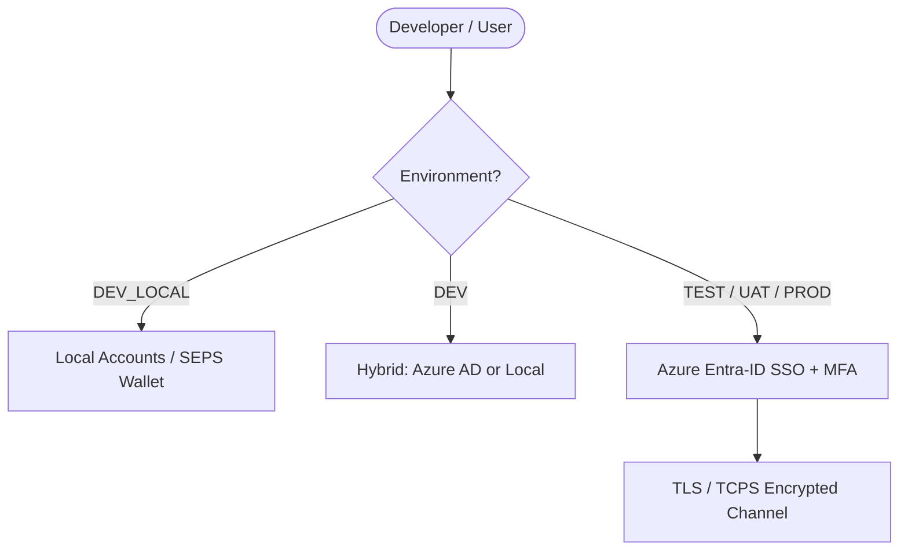

[ 🇬🇧 English ](security.md) | [ 🇪🇪 Eesti ](et/security.md) | [ 🇫🇮 Suomi ](fi/security.md) | [ 🇸🇪 Svenska ](sv/security.md) | [ 🇱🇻 Latviešu ](lv/security.md) | [ 🇱🇹 Lietuvių ](lt/security.md)

# 🛡️ Oracle Free DB & APEX Security & SSO Architecture

This document consolidates security considerations, credential management, developer user roles, and cloud Single Sign-On (SSO / Azure Entra-ID) architecture.

---

## 1. Zero-Trust Local Credential Store (Rule 5)

All passwords and secrets reside strictly inside the AES-256 encrypted **Oracle SEPS (Secure External Password Store) Auto-Login Wallet** (`cwallet.sso`).

- **Strict Prohibition on Plaintext Files:** Passwords are never written to the filesystem in plaintext (no `.json`, `.txt`, `.env`, or `.cache` files).
- **In-Memory Just-In-Time Querying:** Passwords and connection properties are decrypted in-memory dynamically via:
  ```bash
  ./scripts/get-password.sh <alias>
  ```
- **Least-Privilege Roles:** For each database instance, dedicated least-privilege roles are automatically created:
  - `DBA_ADMIN`: Administrative schema and DDL/DML tasks (`DBA` role).
  - `DEV`: Daily development role with Oracle 23ai `DB_DEVELOPER_ROLE`.
  - `APP`: Runtime application schema user (`CREATE SESSION`, `RESOURCE`).
  - `VIEWER`: Read-only audit and testing account (`READ ANY TABLE`).

---

## 2. Environment Security & Authentication Matrix

| Environment (`ENVIRONMENT_TYPE`) | Location | Authentication (APEX & DB) | User Management | TLS Encryption (TCPS) |
| :--- | :--- | :--- | :--- | :--- |
| **`DEV_LOCAL`** | Local Developer Workstation | Local SEPS Wallet Accounts | Automated / `create-developer.sh` | Optional (Offline) |
| **`DEV`** | Shared Development Server | Hybrid (Local + **Azure AD**) | Azure AD + JIT / Local | Optional |
| **`TEST`** | Test Server (CI/CD) | **Azure Entra-ID (SSO)** | Central (Azure AD Groups) | Yes (Port 2484) |
| **`UAT`** | Staging Server | **Azure Entra-ID (SSO)** | Central (Azure AD Groups) | Yes (Port 2484) |
| **`PROD`** | Production Server | **Azure Entra-ID (SSO)** | Central (Azure AD Groups) | Yes (Port 2484) |



---

## 3. Adaptive 5-Tier TLS/HTTPS Engine

Web services (ORDS, APEX, Analytics Publisher) utilize an adaptive 5-tier certificate hierarchy without requiring local administrator/root privileges (`scripts/internal/resolve-tls-mode.sh`):

```text
config/certs/
├── custom/          # Tier 0: Developer-provided custom certificates (tls.crt, tls.key)
├── public/          # Tier 1: Public FQDN & Let's Encrypt / Public CA
├── corp/            # Tier 2: Enterprise Internal PKI Wildcard (corp_cert.crt)
├── user_ca/         # Tier 3: Local Root CA (trusted in user keychain, 0-admin)
└── self_signed/     # Tier 4: On-the-fly generated self-signed fallback
```

---

## 4. Single Sign-On (SSO) Integrations

- **Database-Level SSO:** Oracle 23ai natively supports Azure AD OAuth2 tokens and global roles.
- **ORDS & REST APIs:** ORDS validates incoming Bearer JWT tokens against Azure AD public keys.
- **APEX Application SSO:** Applications use Social Sign-In (OpenID Connect) with automated Just-In-Time user provisioning and group mapping.
