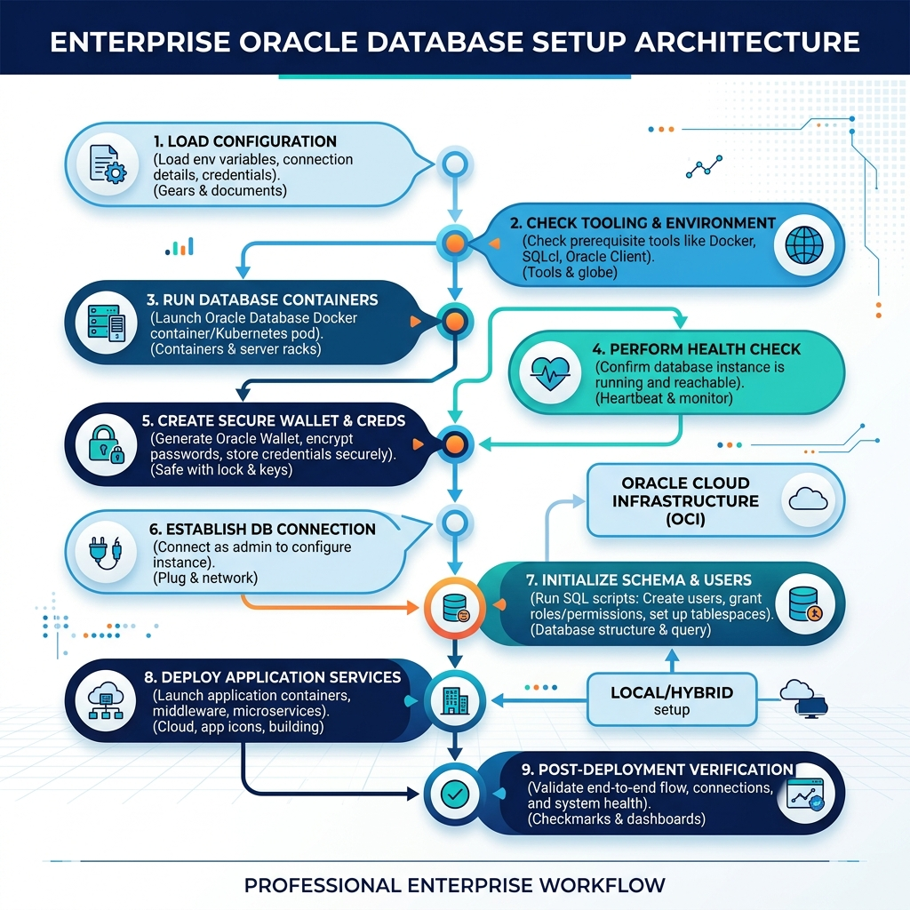

# Paigaldusprotsessi voodiagramm ja arhitektuursed sammud (setup-all.sh)

See dokument kirjeldab projekti peamise ülesseadistamise skripti `./scripts/setup-all.sh` täielikku elutsüklit, otsustuskohti ja optimeerimise loogikat.

---

## 📊 Voodiagramm (Flowchart)

> [!TIP]
> Kui sinu Markdowni vaatur ei toeta graafilist Mermaid joonist otse, saad vaadata salvestatud pilti siit:

```mermaid
flowchart TD
    Start([Käivitus: setup-all.sh]) --> LoadConfig[1. Laadi seaded failist .env]
    LoadConfig --> CheckArgs{Kontrolli käsurea argumente}
    
    CheckArgs -->|--force / -y| NonInteractive[Automaatne režiim: Jäta kinnitused vahele]
    CheckArgs -->|Tavaline| Interactive[Küsi kinnitust ja kettaruumi kontrolli]
    
    NonInteractive --> CheckSQLcl
    Interactive --> CheckSQLcl
    
    CheckSQLcl{Kas kohalik SQLcl ja Java on olemas?}
    CheckSQLcl -->|Jah| LocalSQLcl[Eelista kohalikku run_sqlcl wrapperit]
    CheckSQLcl -->|Ei| EphemeralSQLcl["Fallback: Kasuta ajutist SQLcl konteinerit (SQLCL_CONTAINER_IMAGE)"]
    
    LocalSQLcl --> Step1[Samm 1: Kontrolli/laadi pildid Podman-isse]
    EphemeralSQLcl --> Step1
    
    Step1 --> Step2{Kas ORDS zip on juba olemas?}
    Step2 -->|Jah| SkipORDSDownload[Jäta ORDS allalaadimine vahele]
    Step2 -->|Ei| DownloadORDS[Laadi ORDS zip .env failis toodud lingilt]
    
    DownloadORDS --> Step3{Kas APEX zip on muutunud või puudu?}
    SkipORDSDownload --> Step3
    
    Step3 -->|Ei| SkipAPEXUnzip[Jäta lahtipakkimine vahele markerfaili alusel]
    Step3 -->|Jah| UnzipAPEX[Paki APEX zip lahti kausta apex/]
    
    UnzipAPEX --> Step4["Samm 4: Genereeri Podman Secrets (/run/secrets/) ja käivita compose"]
    SkipAPEXUnzip --> Step4
    
    Step4 --> WaitDB{Oota, kuni db-apex-proxy on healthy}
    WaitDB --> Step45["Samm 4.5: Registreeri tunnused Oracle SEPS Walletisse (ewallet.p12 / cwallet.sso)"]
    
    Step5[Samm 5: Oota ORDS käivitumist]
    Step45 --> Step5
    
    Step5 --> Step6{Kontrolli: Kas APEX on andmebaasis juba olemas?}
    Step6 -->|Jah, sama versioon| SkipAPEXInstall[Jäta APEX mootori paigaldus vahele]
    Step6 -->|Ei või vana| InstallAPEX["Paigalda APEX (optimeerimiseks zip kopeeritakse ja pakitakse lahti konteineris)"]
    
    InstallAPEX --> CheckPatch{Kas APEX Patch on juba paigaldatud?}
    SkipAPEXInstall --> CheckPatch
    
    CheckPatch -->|Jah| SkipPatch[Jäta Patch vahele]
    CheckPatch -->|Ei, leitud zip| ApplyPatch[Paigalda Patch catpatch.sql abil ja uuenda ORDS pildid volume-is]
    
    ApplyPatch --> Step7[Samm 7: Algseadista skeemid ja käivita Liquibase migratsioonid]
    SkipPatch --> Step7
    
    Step7 --> Step8{Kas --no-monitor-app on määratud?}
    Step8 -->|Jah| SkipApps[Jäta rakenduste paigaldus vahele]
    Step8 -->|Ei, leitud failid| DeployApps[Paigalda valmispakitud APEX rakendused]
    
    DeployApps --> CreateTestUsers["Loo testkasutajad: TEST_DEV (ORDS.ENABLE_SCHEMA + ADB rollid) & TEST_WEB_USER"]
    SkipApps --> CreateTestUsers
    
    CreateTestUsers --> TrustCert{Tuvasta OS sertifikaadi usaldamiseks}
    
    TrustCert -->|macOS| TrustMac["Sudo keychain: security add-trusted-cert"]
    TrustCert -->|Windows / Git Bash| TrustWin["Kasutaja hoidla: certutil -user -store Root"]
    TrustCert -->|WSL| TrustWSL["WSL/Windows: certutil.exe (wslpath kaudu)"]
    TrustCert -->|--force / Muu OS| SkipTrust[Jäta sertifikaadi lisamine vahele]
    
    TrustMac --> SaveMetrics[Salvesta setup kestus metrics/setup_benchmarks.json]
    TrustWin --> SaveMetrics
    TrustWSL --> SaveMetrics
    SkipTrust --> SaveMetrics
    
    SaveMetrics --> End([Lõpp: Keskkond valmis, paroolid krüpteeritud Oracle SEPS Walletis])
```

> 

---

## 💡 Süsteemi arhitektuursed põhimõtted ja sammud:

1.  **Turvaline paroolihaldus (Podman Secrets Bootstrap -> Oracle SEPS Wallet Runtime):**
    *   **Esmakordne käivitus (Bootstrap):** Konteinerite esmasel püstitamisel genereerib `generate-passwords.sh` unikaalsed suure entroopiaga paroolid mälupõhisesse **Podman Secrets** hoidlasse (`/run/secrets/`). Koodifailides ja skriptides puuduvad igasugused kõvakodeeritud vaikeparoolid (*zero hardcoded fallback passwords*).
    *   **Püsiv säilitamine ja ühendused (Runtime):** Sammu 4.5 käigus registreerib `create-wallet.sh` kõik tunnused (`ADMIN`, `DB_APEX_PROXY_SYS`, `DB_TEST_DEV`, `TEST_WEB_USER`) krüpteeritud **Oracle SEPS Walletisse** (`ewallet.p12` / `cwallet.sso`). Arendajad ja utiliidid loevad paroole ja teevad ühendusi otse Walletist (`./scripts/internal/view-wallet-credential.sh <ALIAS>`).
2.  **Automaatne ORDS & SQL Developer Web aktiveerimine (`TEST_DEV`):**
    *   `TEST_DEV` kasutaja loomisel rakendatakse automaatselt Oracle ADB arendaja rollid (`CONSOLE_DEVELOPER`, `DWROLE`, `RESOURCE`, `DB_DEVELOPER_ROLE`) ja aktiveeritakse ORDS REST / Database Actions liides (`ORDS.ENABLE_SCHEMA` teekonnaga `test_dev`).
    *   `TEST_DEV` kasutajaga saab koheselt sisse logida otse aadressil `https://localhost:8443/ords/test_dev/_sdw/`.
3.  **Intelligentne SQLcl Fallback (ajutine CLI-konteiner):**
    Skript kontrollib automaatselt kohaliku Java ja SQLcl olemasolu ning ühenduvust. Kui need puuduvad või neil puuduvad krüptograafia ja Walletite tarbeks PKI provideri `.jar` failid, lülitub skript automaatselt ümber **ajutise SQLcl konteineri** (`SQLCL_CONTAINER_IMAGE`) kasutamisele `--rm` võtmega. See tagab sujuva paigalduse ka lukustatud või puhtates arendusmasinates.
4.  **Täielik idempotentsus (Idempotent Setup):**
    *   **APEX mootor:** Enne paigalduse alustamist teeb skript andmebaasi päringu. Kui APEX (versioon 26.1.2) on andmebaasi juba paigaldatud, jäetakse paigaldus täielikult vahele (säästab ~5 minutit).
    *   **APEX Patch:** Päritakse andmebaasist viimase paigaldatud patchi registrit. Kui bundle patch on juba rakendatud, jäetakse catpatch.sql käivitamine vahele.
    *   **ORDS:** Kui andmebaasis on ORDS schema juba algseadistatud ja ühenduse andmed klapivad, ei tehta korduspaigaldust.
5.  **Microsoft Defenderi ja I/O optimeerimine:**
    Kui andmebaas jookseb kohalikus Podman/Docker konteineris, siis APEX-i tarkvarapaketti (mis koosneb tuhandetest väikestest failidest) ei pakita lahti host-masina kettale (kus viirusetõrje seda skaneeriks ja protsessi aeglustaks). Selle asemel kopeeritakse üks tihendatud `.zip` fail otse konteinerisse, pakitakse lahti sealises kiirfailisüsteemis (`/tmp/`) & teostab SQL installi otse konteineri seest.
6.  **Automaatne sertifikaatide usaldamine operatsioonisüsteemides:**
    Lokaalne HTTPS (ADB: `8443`, Standard DB: `8448`) põhineb isesekreeritud juursertifikaadil (`Local Dev Root CA`). Skript tuvastab operatsioonisüsteemi ja usaldab selle automaatselt:
    *   **macOS:** Kasutatakse `security add-trusted-cert` lisamaks see süsteemsesse võtmehoidjasse (küsitakse sudo parooli).
    *   **Windows (Git Bash):** Kasutatakse Windowsi `certutil` käsku sertifikaadi usaldamiseks aktiivse kasutaja hoidlasse (ei nõua administraatori õigusi).
    *   **WSL:** WSL-is käivitatakse `certutil.exe` Windowsi poolel, lahendades sertifikaadi asukoha tee läbi `wslpath -w` utiliidi.
