[ 🇬🇧 English ](setup-all-workflow.md) | [ 🇪🇪 Eesti ](et/setup-all-workflow.md) | [ 🇫🇮 Suomi ](fi/setup-all-workflow.md) | [ 🇸🇪 Svenska ](sv/setup-all-workflow.md) | [ 🇱🇻 Latviešu ](lv/setup-all-workflow.md) | [ 🇱🇹 Lietuvių ](lt/setup-all-workflow.md)

# Setup Process Flowchart and Architectural Steps (setup-all.sh)

This document describes the complete lifecycle, decision points, and optimization logic of the primary provisioning script `./scripts/setup-all.sh`.

---

## 📊 Process Flowchart

> [!TIP]
> If your Markdown viewer does not render Mermaid diagrams directly, view the pre-rendered diagram here:

```mermaid
flowchart TD
    Start([Launch: setup-all.sh]) --> LoadConfig[1. Load settings from .env]
    LoadConfig --> CheckArgs{"Check CLI<br/>arguments"}
    
    CheckArgs -->|--force / -y| NonInteractive[Automated Mode:<br/>Skip prompts]
    CheckArgs -->|Default| Interactive[Request confirmation &<br/>check disk space]
    
    NonInteractive --> CheckSQLcl
    Interactive --> CheckSQLcl
    
    CheckSQLcl{"Is local SQLcl<br/>and Java present?"}
    CheckSQLcl -->|Yes| LocalSQLcl[Prefer local<br/>run_sqlcl wrapper]
    CheckSQLcl -->|No| EphemeralSQLcl["Fallback: Use ephemeral<br/>SQLcl container (SQLCL_CONTAINER_IMAGE)"]
    
    LocalSQLcl --> Step1[Step 1: Verify & pull container images]
    EphemeralSQLcl --> Step1
    
    Step1 --> Step2{"Is ORDS zip<br/>already cached?"}
    Step2 -->|Yes| SkipORDSDownload[Skip ORDS download]
    Step2 -->|No| DownloadORDS[Download ORDS zip from .env URL]
    
    DownloadORDS --> Step3{"Has APEX zip<br/>changed or missing?"}
    SkipORDSDownload --> Step3
    
    Step3 -->|No| SkipAPEXUnzip[Skip unzip based on marker file]
    Step3 -->|Yes| UnzipAPEX[Unpack APEX zip to apex/ folder]
    
    UnzipAPEX --> Step4["Step 4: Generate Podman Secrets<br/>(/run/secrets/) & start compose"]
    SkipAPEXUnzip --> Step4
    
    Step4 --> WaitDB{"Wait until db-apex-proxy<br/>is healthy"}
    WaitDB --> Step45["Step 4.5: Register credentials in<br/>Oracle SEPS Wallet (cwallet.sso)"]
    
    Step5[Step 5: Wait for ORDS startup]
    Step45 --> Step5
    
    Step5 --> Step6{"Check: Is APEX<br/>already in DB?"}
    Step6 -->|Yes, same version| SkipAPEXInstall[Skip APEX engine installation]
    Step6 -->|No or outdated| InstallAPEX["Install APEX (zip transferred<br/>& unpacked inside container)"]
    
    InstallAPEX --> CheckPatch{"Is APEX patch<br/>already applied?"}
    SkipAPEXInstall --> CheckPatch
    
    CheckPatch -->|Yes| SkipPatch[Skip patch]
    CheckPatch -->|No, zip found| ApplyPatch[Apply patch via catpatch.sql<br/>& update ORDS images volume]
    
    ApplyPatch --> Step7[Step 7: Initialize schemas &<br/>execute Liquibase migrations]
    SkipPatch --> Step7
    
    Step7 --> Step8{"Is --no-monitor-app<br/>specified?"}
    Step8 -->|Yes| SkipApps[Skip application deployment]
    Step8 -->|No, files found| DeployApps[Deploy pre-bundled APEX applications]
    
    DeployApps --> CreateTestUsers["Create test users: TEST_DEV<br/>(ORDS.ENABLE_SCHEMA) & TEST_WEB_USER"]
    SkipApps --> CreateTestUsers
    
    CreateTestUsers --> TrustCert{"Detect OS for<br/>certificate trust"}
    
    TrustCert -->|macOS| TrustMac["Sudo keychain: security add-trusted-cert"]
    TrustCert -->|Windows / Git Bash| TrustWin["User store: certutil -user -store Root"]
    TrustCert -->|WSL| TrustWSL["WSL/Windows: certutil.exe (via wslpath)"]
    TrustCert -->|--force / Other OS| SkipTrust[Skip local certificate registration]
    
    TrustMac --> SaveMetrics[Save setup duration to<br/>metrics/setup_benchmarks.json]
    TrustWin --> SaveMetrics
    TrustWSL --> SaveMetrics
    SkipTrust --> SaveMetrics
    
    SaveMetrics --> End([Done: Environment ready, credentials encrypted in Oracle SEPS Wallet])
```

> 

---

## 💡 Architectural Principles and Operational Steps:

1. **Secure Credential Store (Podman Secrets Bootstrap -> Oracle SEPS Wallet Runtime):**
   * **First-run Bootstrap:** During initial container startup, `generate-passwords.sh` generates unique high-entropy passwords into an in-memory **Podman Secrets** store (`/run/secrets/`). The codebase contains zero hardcoded fallback passwords.
   * **Persistence and Connections (Runtime):** During Step 4.5, `create-wallet.sh` registers all credentials (`ADMIN`, `DB_APEX_PROXY_SYS`, `DB_TEST_DEV`, `TEST_WEB_USER`) into an encrypted **Oracle SEPS Wallet** (`ewallet.p12` / `cwallet.sso`). Developers and CLI tools extract passwords dynamically (`./scripts/get-password.sh <ALIAS>`).
2. **Automated ORDS & SQL Developer Web Activation (`TEST_DEV`):**
   * Provisioning `TEST_DEV` applies Oracle ADB developer roles (`CONSOLE_DEVELOPER`, `DWROLE`, `RESOURCE`, `DB_DEVELOPER_ROLE`) and activates ORDS REST / Database Actions (`ORDS.ENABLE_SCHEMA` mapped to path `test_dev`).
   * Developers can immediately log in to Database Actions at `https://localhost:8443/ords/test_dev/_sdw/`.
3. **Intelligent SQLcl Fallback (Ephemeral CLI Container):**
   The script checks for local Java and SQLcl binaries. If missing or lacking required PKI provider `.jar` files for Oracle Wallets, the script automatically routes execution through an **ephemeral SQLcl container** (`SQLCL_CONTAINER_IMAGE`) with `--rm`. This ensures reliable provisioning on zero-trust or locked-down developer workstations.
4. **Complete Idempotency:**
   * **APEX Engine:** Before initiating setup, the script queries the database dictionary. If APEX (matching target version 26.1.2) is already installed, the installation is skipped (saving ~5 minutes).
   * **APEX Patch:** The patch registry is inspected. If the bundle patch is already applied, running `catpatch.sql` is skipped.
   * **ORDS:** If the ORDS schema is already initialized with matching connection parameters, re-initialization is avoided.
5. **Anti-Virus & Microsoft Defender I/O Optimization:**
   When running the database in a local container, large software packages (such as APEX containing tens of thousands of files) are never unpacked onto the host disk where antivirus real-time inspection causes massive I/O bottlenecks. A single `.zip` archive is copied into the container filesystem (`/tmp/`) and unzipped internally.
6. **Cross-Platform SSL Certificate Trust:**
   Local HTTPS services (ADB: `8443`, Standard DB: `8448`) utilize a self-signed root certificate (`Local Dev Root CA`). The provisioning pipeline detects the host OS and trusts the certificate automatically:
   * **macOS:** Invokes `security add-trusted-cert` into the System Keychain (requests sudo password).
   * **Windows (Git Bash):** Invokes Windows `certutil` to import into the CurrentUser Root store (requires zero administrator privileges).
   * **WSL:** Executes `certutil.exe` on the Windows host, converting paths dynamically via `wslpath -w`.

---

## ❓ Related FAQ & Official Resources

- Troubleshooting steps, OOM handling, port collisions, and Golden Snapshot recovery: [Platform FAQ](faq.md).
- Official Oracle Container Registry images and download guides: [Oracle Resources and Downloads](oracle-resources-and-downloads.md).
