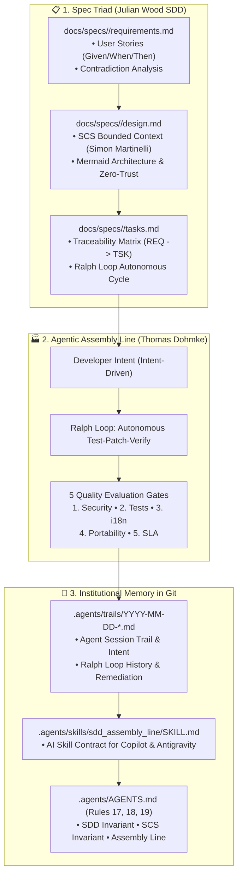

[ 🇬🇧 English ](spec-driven-development-and-assembly-line.md) | [ 🇪🇪 Eesti ](et/spec-driven-development-and-assembly-line.md) | [ 🇫🇮 Suomi ](fi/spec-driven-development-and-assembly-line.md) | [ 🇸🇪 Svenska ](sv/spec-driven-development-and-assembly-line.md) | [ 🇱🇻 Latviešu ](lv/spec-driven-development-and-assembly-line.md) | [ 🇱🇹 Lietuvių ](lt/spec-driven-development-and-assembly-line.md)

# Spec-Driven Development (SDD), Self-Contained Systems (SCS) & Agentic Assembly Line

> **Architectural Standard & Operational Runbook for Transitioning from Vibe Coding to Viable Code in Oracle DevOps Platform**

---

## 🧭 Executive Summary

As software engineering accelerates with generative AI, prompt-and-pray prototyping (*vibe coding*) provides unprecedented exploratory velocity. However, mission-critical enterprise platforms (financial data, government registries, mission-critical ERPs) demand **deterministic reliability, institutional memory, and zero architectural drift**.

To establish enterprise viability, the Oracle DevOps Platform implements a unified tripartite engineering standard synthesized from three international software engineering leaders:

1. **Julian Wood (Principal Developer Advocate, AWS):** **Spec-Driven Development (SDD)** — Transitioning from unstructured prompts to structured specifications (`requirements.md`, `design.md`, `tasks.md`), pre-implementation contradiction analysis, and strict Given/When/Then acceptance criteria.
2. **Simon Martinelli (Software Architect, martinelli.ch):** **Self-Contained Systems (SCS) & AI Context Economics** — Rejection of the "Distributed Big Ball of Mud" microservices anti-pattern; vertical domain slicing (UI + Logic + Data); Oracle Pluggable Databases (PDBs) as the ultimate database SCS; and context window budgeting (<300–500 lines per spec).
3. **Thomas Dohmke (Co-founder & CEO Entire.io / ex-GitHub CEO):** **The Agentic Assembly Line** — Intent-driven development, autonomous **Ralph Loops** (test-patch-verify cycles), Git-persisted **Session Trails** (`.agents/trails/`), and 5 automated Quality Evaluation Gates.

---

## 🏛️ Architecture Overview



---

## 📋 Pillar 1: Spec-Driven Development (Julian Wood, AWS)

*Vibe coding* starts by jumping directly into code. Spec-Driven Development (SDD) mandates that **intent and requirements precede implementation**:

### 1. The Specification Triad (`docs/specs/<domain>/`)
Every domain feature or system boundary maintains three canonical documents:
- **`requirements.md`:** 
  - **Context & Personas:** Who needs this and why?
  - **Functional Requirements (`[REQ-XX]`):** Explicitly formulated using Gherkin Given/When/Then syntax.
  - **Pre-Implementation Contradiction Analysis (Rule 17):** Uncompromising check for mutually exclusive flags, conflicting UX states, and parameter clashes (e.g., `-s` snapshot restore vs `--fresh` rebuild). Contradictions must be resolved in the spec *before* writing code.
  - **Non-Functional Requirements (NFRs):** Latency, security (Rule 5 Zero-Trust), and accessibility (WCAG / PDF/UA-1).
- **`design.md`:**
  - **SCS Bounded Context:** What belongs inside the domain and what is an external contract.
  - **Mermaid Architecture & Sequence Diagrams:** Responsive visual representations following Rule 10.
  - **Security Model:** Zero-Trust credential handling via SEPS Wallet (no plaintext on disk).
- **`tasks.md`:**
  - **Traceability Matrix:** Every atomic task (`[TSK-XX]`) must link back to a requirement (`[REQ-YY]`).
  - **Verification Commands:** Deterministic terminal commands to prove task completion.
  - **Ralph Loop Instructions:** Autonomous verification criteria.

### 2. Canonical Templates
Canonical templates are maintained under `docs/specs/templates/`:
- `requirements.template.md`
- `design.template.md`
- `tasks.template.md`

---

## 📦 Pillar 2: Self-Contained Systems & Context Economics (Simon Martinelli)

As software complexity grows, microservices often introduce distributed complexity, network fragility, and shared database anti-patterns. Simon Martinelli advocates for **Self-Contained Systems (SCS)**:

### 1. Vertical Domain Autonomy
- Each SCS contains its own Web UI, Business Logic, and Dedicated Storage.
- **Oracle Pluggable Databases (PDBs) as the Ultimate SCS:** PDBs (`FREEPDB1`, `ALISEPDB`, `PUBPDB`) provide total data sovereignty, separate data dictionaries, isolated tablespaces, and independent credentials within a single, lightweight container footprint.
- Cross-database SQL joins across domain boundaries are strictly prohibited; communication happens via asynchronous APIs or event bridges.

### 2. AI Context Window Budgeting (<300–500 lines)
Monolithic specification documents (5,000+ lines) exhaust LLM attention spans and trigger hallucinations.
- Each domain spec is isolated in its own folder (`docs/specs/<domain>/`).
- Individual specification files are budgeted to **under 300–500 lines**.
- This enables an AI agent (GitHub Copilot, Google Antigravity) to load the complete vertical slice (`requirements.md` + `design.md` + `tasks.md` + implementation code) in a single high-fidelity prompt window.

---

## 🏭 Pillar 3: The Agentic Assembly Line (Thomas Dohmke)

Thomas Dohmke envisions modern software engineering as an **Agentic Assembly Line**, where developers guide intent while autonomous AI agents execute tasks through tight feedback loops:

### 1. Autonomous Ralph Loops (Test-Patch-Verify)
When executing implementation tasks, agents do not stop at the first failure or ask trivial questions:
1. **Execute Test:** Run the associated verification test or local CI simulator (`tests/test-local-ci.sh`).
2. **Inspect Failure:** Ingest stdout/stderr logs and diagnose the root cause in context.
3. **Patch Code:** Autonomously refactor code and scripts to address the failure.
4. **Re-verify:** Re-run the test suite until 100% PASS (exit code 0).
5. **Quality Gates:** Pass the 5 release gates before committing.

### 2. Institutional Memory in Git (`.agents/trails/`)
Chat transcripts in web interfaces are ephemeral and lost across sessions. To build permanent institutional memory:
- Every agent session records its intent, decisions, solved contradictions, and Ralph Loop self-corrections into a markdown session trail under `.agents/trails/YYYY-MM-DD-<topic>.md`.
- Future developers or AI agents can inspect Git history to understand **why** an architectural decision was made.

### 3. The 5 Quality Evaluation Gates
Code is deemed production-ready only when it passes all 5 gates:
- 🛡️ **Gate 1: Security & Zero-Trust (Rule 5):** Passwords decrypted dynamically in-memory from SEPS Wallet; no plaintext secrets on disk; `install_logs/` strictly gitignored (Rule 1.2).
- 🧪 **Gate 2: Functional Correctness & Spec Traceability (Rule 17):** Automated unit and integration tests pass with 100% exit code 0 (`tests/unit/test-spec-traceability.sh`).
- 🌐 **Gate 3: Multilingual Symmetry (Rule 9):** 100% translation coverage across all 6 supported languages (EN, ET, FI, SV, LV, LT) verified by `./tests/test-multilingual-support.sh`.
- 💻 **Gate 4: Cross-Platform Portability (Rule 13 & 14):** Strict ASCII filenames, NTFS compatibility, and Linux/macOS/Windows execution without path collisions (`test-filename-portability.sh`).
- ⚡ **Gate 5: Performance & Recovery SLA (Rule 1):** FastStart baseline restoration in $\le$ 20 seconds.

---

## 🛠️ Automated CI & Governance Enforcement

Traceability and methodology compliance are enforced automatically on every commit:

```bash
# Run the 7-step SDD & Assembly Line verification test:
./tests/unit/test-spec-traceability.sh

# Run local GitHub Actions CI simulator with dry-run verification:
./tests/test-local-ci.sh --dry-run
```

The test validates:
1. Canonical templates presence in `docs/specs/templates/`.
2. Completeness of domain specification triads in `docs/specs/`.
3. Requirement ID uniqueness and Contradiction Analysis.
4. SCS Bounded Context, Mermaid diagram, and Zero-Trust definitions in `design.md`.
5. Requirement-to-Task Traceability Matrix and Ralph Loop in `tasks.md`.
6. Session trails in `.agents/trails/` with intent and 5 Quality Gates.
7. Governance Rules 17, 18, 19 in `.agents/AGENTS.md` and the AI Skill.

---

## 🔗 Related Resources

- **Governance Rules:** [`.agents/AGENTS.md`](../.agents/AGENTS.md) (Rules 17, 18, 19)
- **AI Skill Contract:** [`.agents/skills/sdd_assembly_line/SKILL.md`](../.agents/skills/sdd_assembly_line/SKILL.md)
- **Session Trails:** [`.agents/trails/`](../.agents/trails/README.md)
- **Domain Specifications:** [`docs/specs/devops-portal/`](specs/devops-portal/requirements.md)
- **Local CI Runner:** [`tests/test-local-ci.sh`](../tests/test-local-ci.sh)
