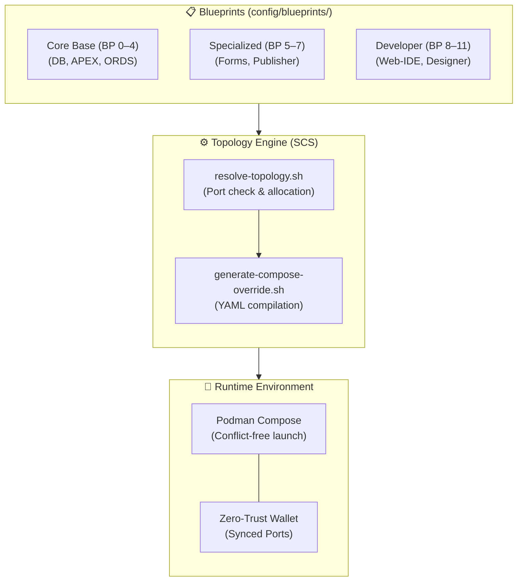

# Blueprints & Dynamic Port Topology — Technical Design & Architecture

- **Domain (SCS):** `blueprints-topology`
- **Referenced Requirements:** `docs/specs/blueprints-topology/requirements.md`
- **Methodology:** Simon Martinelli (SCS Architecture) & Julian Wood (SDD Design)

---

## 1. Architectural Overview & Bounded Context

The Blueprint and Topology system is an autonomous **Self-Contained System (SCS)** that governs declarative stack models and host port allocation while enforcing Zero-Trust service isolation.

---

## 2. Port Topology Matrix

| Service | Default Host Port | Container Port | Profile |
| :--- | :--- | :--- | :--- |
| **Oracle 23ai Free DB** | `1521` | `1521` | `db-oracle-free` |
| **ORDS Smart Gateway** | `8088` (HTTP) / `8448` (HTTPS) | `8080` / `8443` | `ords-standard` |
| **Analytics Publisher** | `9704` | `9704` | `publisher-standard` |
| **Oracle Forms 14c** | `9001` (WLS) / `6080` (noVNC) | `9001` / `6080` | `forms-standard` |
| **Web-IDE (VS Code)** | `8444` | `8443` | `web-ide-standard` |

---

## 3. Zero-Trust Architecture & Core Base Protection

- **Core Base Protection:** Switching blueprints leaves core database volumes and credentials fully intact.
- **Port Isolation:** Endpoints prefer encrypted transports (HTTPS/TLS) across development and production profiles.
