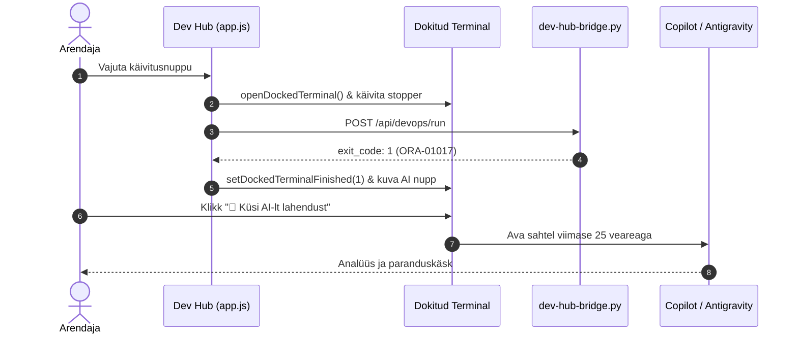

# DevOps Juhtpaneel — Tehniline Disain ja Arhitektuur (Technical Design)

- **Domeen (SCS):** `devops-portal`
- **Viidatud Nõuded:** `docs/specs/devops-portal/requirements.md`
- **Metoodika:** Simon Martinelli (SCS Arhitektuur) & Julian Wood (SDD Disain)

---

## 1. Arhitektuuriline Ülevaade ja Piiritletud Kontekst (Bounded Context)

DevOps juhtpaneel on **Self-Contained System (SCS)**, mis haldab platvormi elutsüklit iseseisvalt läbi asünkroonse Pythoni sillasüsteemi ja brauseri Vanilla JS SPA:

```mermaid
flowchart TD
    subgraph UI["💻 Dev Hub SPA (Frontend)"]
        direction TB
        REC["Quick Recipes"]
        STUDIOS["Setup & Reset Studiod"]
        DOCK["Dokitav Terminal (Ring-Buffer 1500 rida)"]
        AI_DRAWER["Copilot & Antigravity Sahtel"]
        STUDIOS --> DOCK
        REC --> DOCK
        DOCK -.->|Tõrke korral| AI_DRAWER
    end

    subgraph Bridge["⚙️ Sildserver (scripts/internal/dev-hub-bridge.py)"]
        direction TB
        MUTEX["Mutex Lock (409 Conflict)"]
        REGEX["Regex Sanitizer (^[a-zA-Z0-9_]{3,30}$)"]
        AUDIT["Audit Logger (install_logs/audit_events.jsonl)"]
        SUBPROC["Asünkroonne Alamprotsess (Popen)"]
        MUTEX --> REGEX --> AUDIT --> SUBPROC
    end

    subgraph CLI["🚀 Kestvusmootor (scripts/*.sh)"]
        SETUP["setup-all.sh"]
        RESET["reset-all.sh"]
        DIAG["check-urls.sh / check-wallet.sh"]
    end

    UI -->|POST /api/devops/run (JSON)| Bridge
    SUBPROC --> CLI
```

---

## 2. Komponentide Lepingud ja Liidesed

### 2.1. Bridge API Leping (`/api/devops/run`)
- **Meetod:** `POST`
- **Päise tüüp:** `application/json`
- **Sisendparameetrid:**
  ```json
  {
    "command": "setup-studio-fast | reset-studio-deep | create-dev-user",
    "username": "dev_user (valikuline, regex-kontrollitud)"
  }
  ```
- **Väljundformaat:**
  ```json
  {
    "status": "ok",
    "exit_code": 0,
    "duration_s": 18.2,
    "output": "Kogu terminali väljund teksti kujul..."
  }
  ```
- **Tõrkekoodid:**
  - `400 Bad Request`: Tundmatu käsk või vigane kasutajanimi.
  - `409 Conflict`: Toiming juba kestab teises taustaprotsessis (Mutex lukk).

---

## 3. Sekventsidiagramm: Tõrke Autonoomne Teatamine ja AI Parandus



---

## 4. Turvalisuse ja Ohutuse Mudel

1. **Ei mingeid `shell=True` käivitusi:** Python käivitab skriptid ranged massiividena: `["./scripts/create-developer.sh", safe_user]`.
2. **Zero-Trust Wallet Integratsioon:** Volitusi küsitakse käitusajal mälus `./scripts/get-password.sh` kaudu otse SEPS auto-login Walletist; ühtegi parooli ei kirjutata kettale lihttekstina (Reegel 5).
3. **Pöördumatute toimingute lukk:** Sügav lähtestus nõuab kliendipoolset märkeruutu enne nupu lubamist ja serveripoolset kinnitust.
