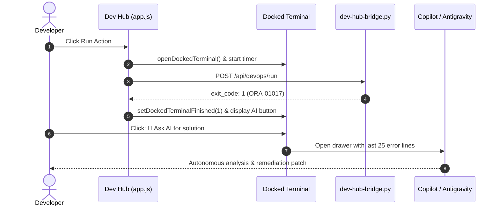

# DevOps Portal — Technical Design & Architecture

- **Domain (SCS):** `devops-portal`
- **Referenced Requirements:** `docs/specs/devops-portal/requirements.md`
- **Methodology:** Simon Martinelli (SCS Architecture) & Julian Wood (SDD Design)

---

## 1. Architectural Overview & Bounded Context

The DevOps Portal is an autonomous **Self-Contained System (SCS)** that orchestrates the platform lifecycle via an asynchronous Python bridge and a Vanilla JS SPA frontend:

```mermaid
flowchart TD
    subgraph UI["💻 Dev Hub SPA (Frontend)"]
        direction TB
        REC["Quick Recipes"]
        STUDIOS["Setup & Reset Studios"]
        DOCK["Docked Terminal (1500-line ring buffer)"]
        AI_DRAWER["Copilot & Antigravity Drawer"]
        STUDIOS --> DOCK
        REC --> DOCK
        DOCK -.->|On Failure| AI_DRAWER
    end

    subgraph Bridge["⚙️ Bridge Server<br/>(scripts/internal/dev-hub-bridge.py)"]
        direction TB
        MUTEX["Mutex Lock (409 Conflict)"]
        REGEX["Regex Sanitizer: /^[a-zA-Z0-9_]{3,30}$/"]
        AUDIT["Audit Logger (install_logs/audit_events.jsonl)"]
        SUBPROC["Async Subprocess (Popen)"]
        MUTEX --> REGEX --> AUDIT --> SUBPROC
    end

    subgraph CLI["🚀 Engine Scripts (scripts/*.sh)"]
        SETUP["setup-all.sh"]
        RESET["reset-all.sh"]
        DIAG["check-urls.sh / check-wallet.sh"]
    end

    UI -->|POST /api/devops/run (JSON)| Bridge
    SUBPROC --> CLI
```

---

## 2. Component Contracts & Interfaces

### 2.1. Bridge API Contract (`/api/devops/run`)
- **Method:** `POST`
- **Content-Type:** `application/json`
- **Request Body:**
  ```json
  {
    "command": "setup-studio-fast | reset-studio-deep | create-dev-user",
    "username": "dev_user (optional, regex validated)"
  }
  ```
- **Response Format:**
  ```json
  {
    "status": "ok",
    "exit_code": 0,
    "duration_s": 18.2,
    "output": "Standard terminal output string..."
  }
  ```
- **Error Codes:**
  - `400 Bad Request`: Unknown command or invalid username input.
  - `409 Conflict`: Task is already running in background (Mutex lock active).

---

## 3. Sequence Diagram: Error Escalation & AI Troubleshooting



---

## 4. Security & Safety Model

1. **No `shell=True` execution:** Python executes scripts as sanitized argument arrays: `["./scripts/create-developer.sh", safe_user]`.
2. **Zero-Trust Wallet Integration:** Credentials are dynamically queried at runtime via `./scripts/get-password.sh` from the SEPS Wallet; no passwords touch the filesystem in plaintext (Rule 5).
