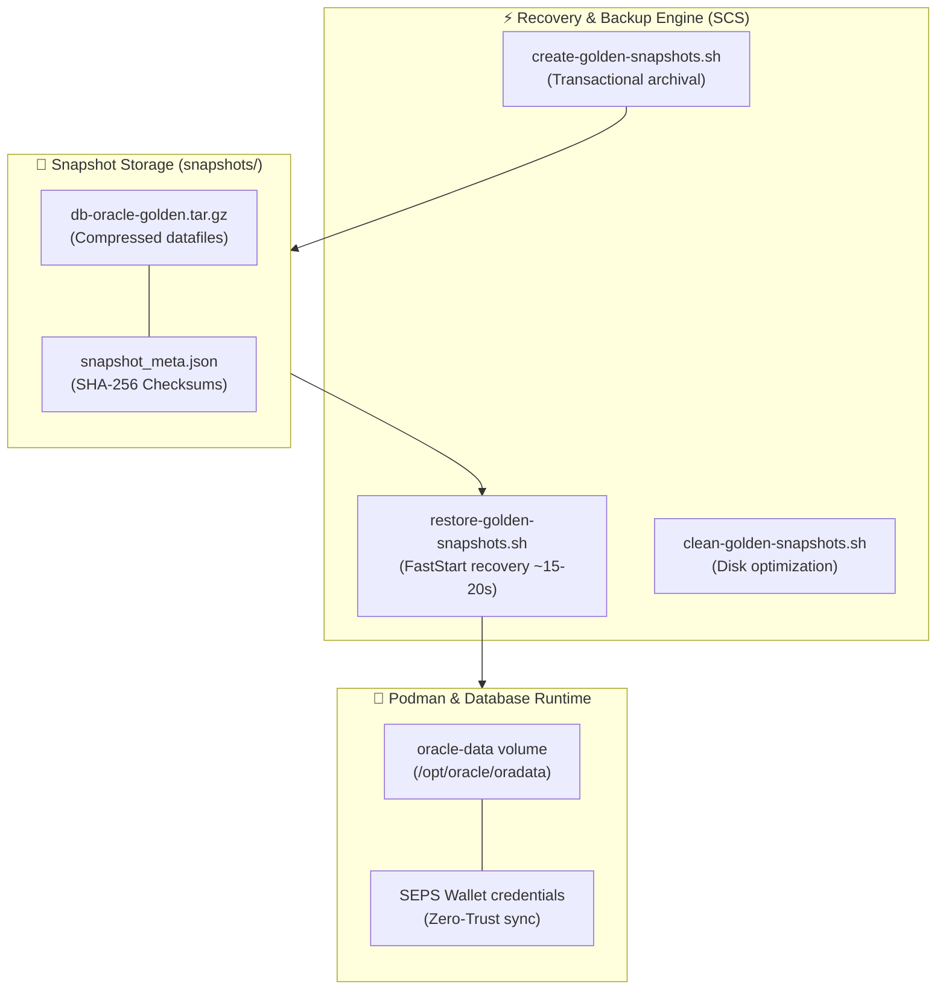
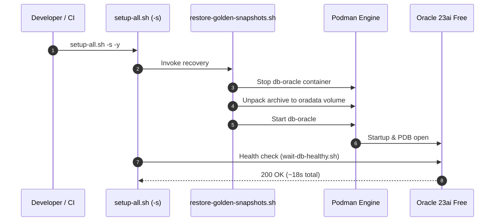

# Golden Snapshot Disaster Recovery — Technical Design & Architecture

- **Domain (SCS):** `golden-snapshots`
- **Referenced Requirements:** `docs/specs/golden-snapshots/requirements.md`
- **Methodology:** Simon Martinelli (SCS Architecture) & Julian Wood (SDD Design)

---

## 1. Architectural Overview & Bounded Context

The Golden Snapshot subsystem is an autonomous **Self-Contained System (SCS)** that orchestrates physical database volume backup, archival, and fast restoration while preserving transactional integrity and Zero-Trust credential synchronization.

---

## 2. Process Flow & FastStart Execution

---

## 3. Non-Functional Invariants

- **Zero-Trust Wallet Synchronization:** The archived database state is verified against the auto-login keys in `wallet/`.
- **Ephemeral Cleanup:** Orphaned lock files and temporary archives are pruned automatically upon process exit.
