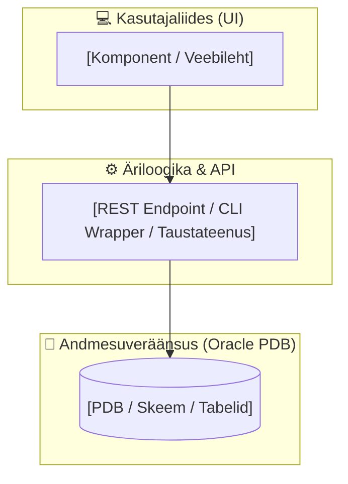
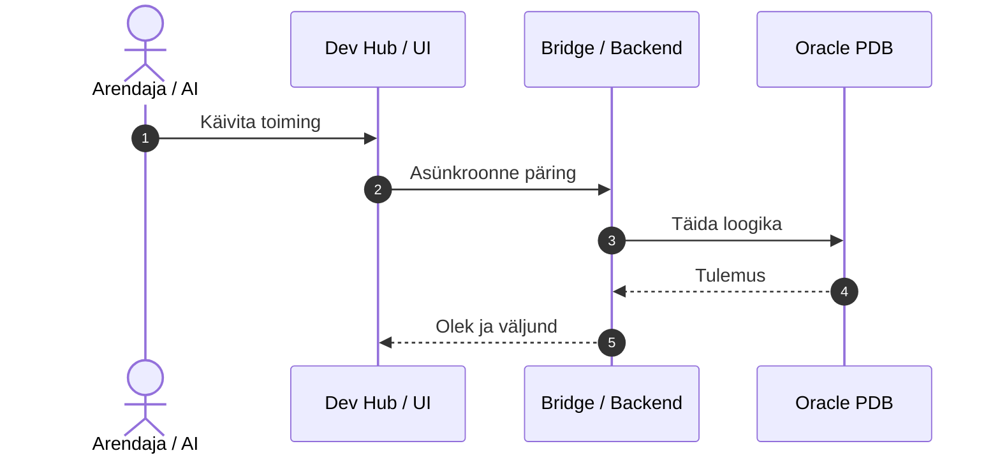

# [Feature / SCS Name] — Tehniline Disain ja Arhitektuur (Technical Design)

- **Domeen (SCS):** `[nt: devops-portal, alis-core, publisher]`
- **Viidatud Nõuded:** `docs/specs/[domain]/requirements.md`
- **Metoodika:** Simon Martinelli (Self-Contained Systems & Parnas Modularization) & Julian Wood (SDD)

---

## 1. Arhitektuuriline Ülevaade ja Piiritletud Kontekst (Bounded Context)

Kirjelda, kuidas see moodul funktsioneerib iseseisva Self-Contained Systemina (SCS).

---

## 2. Komponentide Lepingud ja Liidesed (Contracts & APIs)

### 2.1. API või CLI Leping
- **Käsk / Endpoint:** `[nt: POST /api/devops/run]`
- **Sisendparameetrid (JSON / CLI argumendid):**
  - `param1 (string, required)`: Regex `^[a-zA-Z0-9_]{3,30}$`.
- **Väljundformaat:**
  - `status (string)`: `ok | error`
  - `duration_s (number)`: Kestus sekundites.
  - `exit_code (integer)`: `0` (edu) või veakood.

### 2.2. Andmesuveräänsus ja Andmemudel (Database Schema / DDL)
- Milliseid PDB tabeleid, sekventse või vaateid see SCS omab?
- **Reegel 18:** Teiste süsteemide andmeid ei loeta sünkroonsete 2PC lukkudega, vaid asünkroonse replikatsiooni teel.

---

## 3. Sekventsidiagramm ja Olekuüleminekud (Sequence & Lifecycle)

---

## 4. Turvalisuse ja Ohutuse Mudel (Threat Model & Safety Gates)

- **Sisendi saniteerimine:** Kuidas välistatakse SQL-injection või shell-injection?
- **Autentimine:** Kuidas loetakse volitusi (SEPS Wallet auto-login, null lihtteksti kettal)?
- **Hävitavate toimingute kaitse:** Kas on vajalik 2-astmeline kinnituskaitse (*Confirmation Gate*)?
