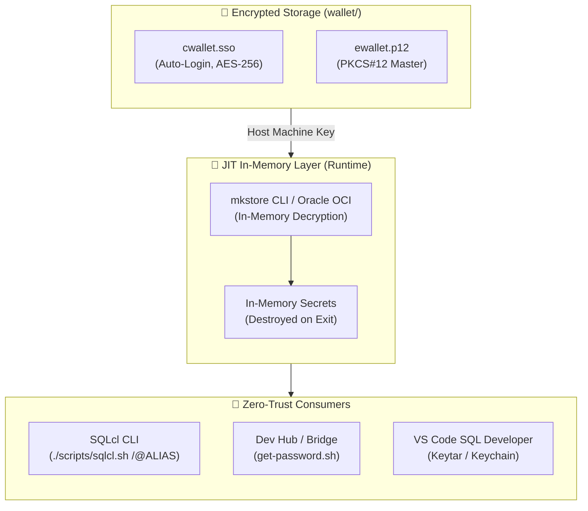
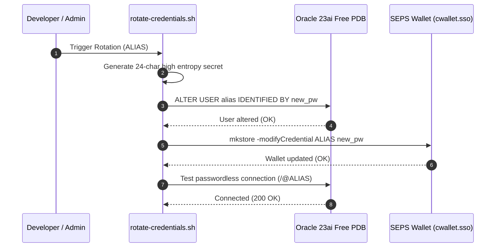

# Zero-Trust SEPS Wallet — Technical Design & Architecture

- **Domain (SCS):** `wallet-security`
- **Referenced Requirements:** `docs/specs/wallet-security/requirements.md`
- **Methodology:** Simon Martinelli (SCS Architecture) & Julian Wood (SDD Design)

---

## 1. Architectural Overview & Bounded Context

Credential security and the Oracle SEPS wallet comprise an autonomous **Self-Contained System (SCS)** bounded context. This subsystem manages database secret lifecycles, encrypted storage at rest, and runtime in-memory retrieval strictly conforming to Zero-Trust architecture.

---

## 2. Component Contracts and Interfaces

### 2.1. Wallet Credential Reader API (`get-password.sh`)
- **Command:** `./scripts/get-password.sh <ALIAS>`
- **Input:** TNS Wallet alias (e.g. `DB_DEV`, `DB_SYS`, `DB_APEX_ADMIN`)
- **Output:** Decrypted password to standard output (or exit code 1 on error).
- **Security Contract:** Passwords are never persisted to disk, caching files, or terminal logs.

### 2.2. Passwordless SQLcl Authentication
- **Command:** `./scripts/sqlcl.sh /@<ALIAS>`
- **Environment:**
  - `TNS_ADMIN=$WORKSPACE_DIR/wallet`
  - `JAVA_TOOL_OPTIONS=-Doracle.net.tns_admin=$TNS_ADMIN`
- **Outcome:** Instant authenticated session without password prompts.

---

## 3. Credential Rotation Lifecycle

---

## 4. Non-Functional Requirements (NFRs)

- **NFR-SEC-1 (File Permissions):** Wallet files are strictly set to `chmod 0600` and wallet directory to `chmod 0700`.
- **NFR-SEC-2 (Git Exclusion):** Directory `wallet/` and files `*.sso`, `*.p12` are permanently in `.gitignore`.
- **NFR-SEC-3 (Zero-Trace Execution):** Ephemeral containers run with `--rm`, ensuring immediate memory cleanup and secret destruction upon process exit.
