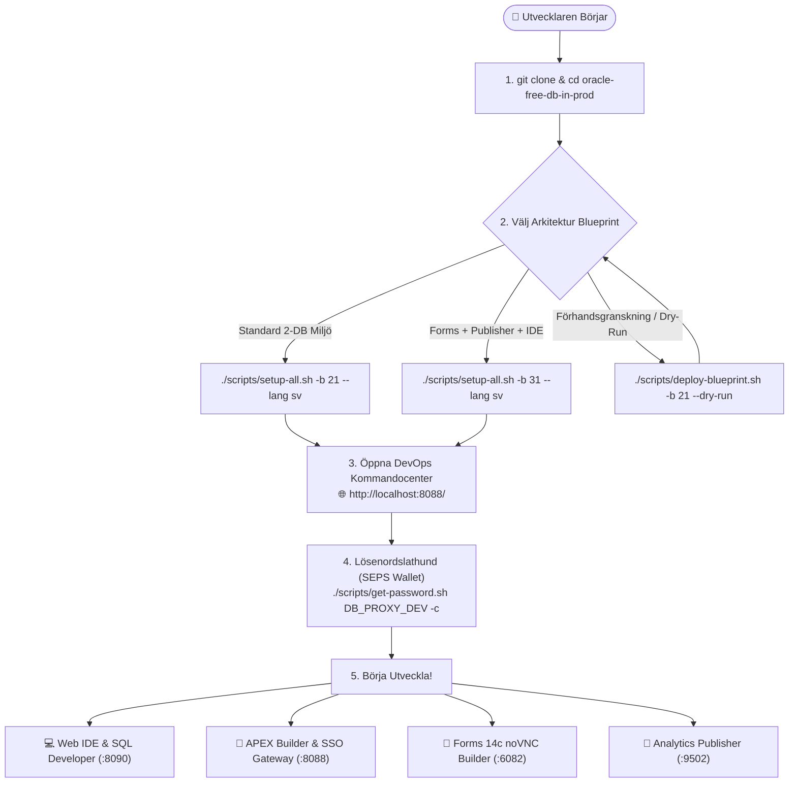
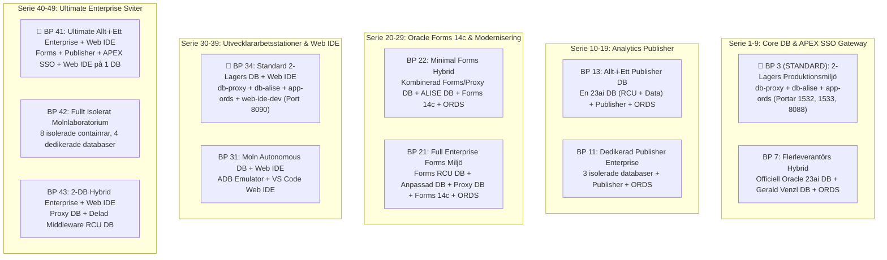

[ 🇬🇧 English ](../../README.md) | [ 🇪🇪 Eesti ](../et/README.md) | [ 🇫🇮 Suomi ](../fi/README.md) | [ 🇸🇪 Svenska ](README.md) | [ 🇱🇻 Latviešu ](../lv/README.md) | [ 🇱🇹 Lietuvių ](../lt/README.md)

# Oracle DevOps Plattform (Svensk Guide)

> **Produktionsklar, licensavgiftsfri (0 €) och 100% lösenordsfri (SEPS Wallet) utvecklings- och DevOps-plattform för Oracle 23ai, APEX SSO Gateway, Forms 14c, Publisher och Web IDE.**

---

## ⚡ 60-Sekunders Snabbstart

```bash
# 1. Klona arkivet och gå till mappen
git clone https://github.com/allanlahe/oracle-free-db-in-prod.git && cd oracle-free-db-in-prod

# 2. Starta standard 2-lagers produktionsmiljö (Blueprint 21)
./scripts/setup-all.sh -b 21 --lang sv

# 3. Visa lösenord, webbadresser och urklippshjälp (eller öppna Dev Hub på http://localhost:8088/)
./scripts/get-password.sh
```

> [!TIP]
> **Windows Git-Konfiguration (Regel 13):**
> Innan du klonar på Windows, konfigurera Git för att stödja långa sökvägar och skydda NTFS-filsystem:
> ```powershell
> git config --global core.protectNTFS true
> git config --global core.longpaths true
> git config --global core.autocrlf input
> ```

---

## 🗺️ Introduktionsresa för Nya Utvecklare (Onboarding Journey)



---

## ⚡ Setup-All 10-Fas Livscykelarkitektur

```mermaid
flowchart LR
    P1["1. Hämta Avbilder"] --> P2["2. Hämta ORDS"]
    P2 --> P3["3. APEX Paket"]
    P3 --> P4["4. Starta Containrar"]
    P4 --> P5["5. Vänta på DB-Hälsa"]
    P5 --> P6["6. Installera APEX"]
    P6 --> P7["7. Scheman & SEPS Init"]
    P7 --> P8["8. Driftsätt APEX Appar"]
    P8 --> P9["9. Middleware & Tjänster"]
    P9 --> P10["10. Gyllene Ögonblicksbild (~15s DR)"]
```



---

## 🌐 Dev Hub (`http://localhost:8088/`) — Enhetligt Kontrollcenter (*Single Pane of Glass*)

Utvecklare behöver inte memorera dussintals olika portar. **Dev Hub** fungerar som en central portal:
- **1-Klick Tjänstelänkar:** Direktåtkomst till APEX Builder, Database Actions (SDW), Forms 14c körtid, HTML5 noVNC Forms Builder och Analytics Publisher.
- **1-Klick Lösenordskopiering:** Ett klick kopierar det dekrypterade lösenordet direkt till urklipp (redo att klistra in med `Cmd+V` / `Ctrl+V`).
- **Hälsodiagnostik i Realtid:** Automatisk latenskontroll var 6:e sekund.
- **Integrerad Markdown Dokumentationsläsare:** Läs och sök guider direkt i webbläsaren.
- **Blueprint Driftsättning och Hantering:** Driftsätt och byt blueprints via webbläsaren eller kommandot `./scripts/deploy-blueprint.sh`.
- **ORDS Smart Gateway-panel:** Realtidsvy över central ORDS-containerstatus, anslutningspooler (connection pools), svarstid (ms) och 1-klicksynkronisering.

---

## 🌐 ORDS Smart Gateway och Autonom Mikroregistrering (Variant 3)

Plattformen eliminerar portkonflikter och duplicerade ORDS-containrar genom mönstret **Smart Gateway + Autonom Mikroregistrerare**:

- **Central Kärngateway:** En enda `app-ords`-container körs på portarna 8088 (HTTP) och 8448 (HTTPS) och betjänar alla aktiva databaser.
- **Autonom Mikroregistrerare:** Varje databas hanterar sin egen poolkonfiguration (`config/ords/proxy/databases/<pool_name>/pool.xml`).
- **Virtuella Tjänstetoken (`ords/<pool>`):** Blueprints deklarerar virtuella token (t.ex. `ords/proxy`, `ords/alise`). Dev Hub utvärderar beredskap via containerhälsa och realtidsrespons.
- **CLI för Poolhantering:**
  ```bash
  ./scripts/internal/manage-ords-pools.sh status
  ./scripts/internal/manage-ords-pools.sh status json
  ./scripts/internal/manage-ords-pools.sh sync
  ```

---

## 🔑 Var Hittar Jag Mitt Lösenord? (SEPS Wallet Lathund)

Alla lösenord genereras med högkryptografisk säkerhet och lagras säkert i **Oracle SEPS (Secure External Password Store) Wallets** och Podman Secrets.

```bash
# Visa fullständig lösenordsmatristabell:
./scripts/get-password.sh

# Kopiera utvecklarlösenord direkt till urklipp:
./scripts/get-password.sh DB_PROXY_DEV -c

# Kopiera APEX administratörslösenord:
./scripts/get-password.sh DB_PROXY_APEX_ADMIN -c

# Anslut till databasen via SQLcl UTAN något lösenord:
sql /@DB_PROXY_DEV
```

---

## 🎯 3 Intressentperspektiv och Affärsvärde

| Perspektiv | Huvudfördelar och Daglig Upplevelse | Teknisk Möjliggörare |
| :--- | :--- | :--- |
| **👤 Slutanvändare och Verksamhet** | • **Ingen Klientinstallation:** Modern HTML5-upplevelse och APEX Universal Theme.<br/>• **Single Sign-On (SSO):** En inloggning för både APEX och äldre Forms-system.<br/>• **Pixel-Perfect Rapporter:** Automatiserad PDF/Excel-dokumentgenerering. | • ORDS Multi-Pool Gateway<br/>• APEX Reverse Proxy SSO för Forms<br/>• Analytics Publisher REST API |
| **💻 Utvecklare** | • **~15s FastStart Återställning:** Omedelbar nollställning med Gyllene Ögonblicksbilder.<br/>• **Lösenordsfri SQL:** Snabb anslutning via `./scripts/sqlcl.sh` och SEPS Wallet.<br/>• **Installationsfri Web IDE:** VS Code i webbläsaren med Oracle SQL Developer och AI. | • Podman FastStart Ögonblicksbilder<br/>• SEPS Oracle Wallet Auto-Synk<br/>• `code-server` Web IDE Container |
| **🛡️ Revisor och Arkitekt** | • **0 € Licensavgift:** Oracle 23ai Free DB i produktion.<br/>• **Zero-Trust Nätverksisolering:** Databasen exponerar aldrig rå SQL till publika nätverk.<br/>• **Styrd Exekvering:** EBNF-deklarativa kontrakt, AST-säkerhetsanalys och VPD. | • JSON-Relational Duality<br/>• 2-Lagers Nätverkstopologi<br/>• Oracle Virtual Private Database (VPD) |

---

## 🔄 Integrationsfokus för Oracle APEX och Forms 14c

I denna arkitektur är **Oracle APEX 26.1** primärt positionerad som:
1. **Bro för Modernisering av Forms:** Stegvis modernisering av Forms 14c-skärmar till responsiva moderna webbapplikationer med [Oracle APEXlang DSL](https://docs.oracle.com/en/database/oracle/apex/26.1/apxln/).
2. **Enterprise SSO Reverse Proxy för Forms:** APEX hanterar moderna identitetsleverantörer (Azure Entra ID, SAML, OAuth2) och förmedlar säkra autentiserade sessioner till Forms 14c utan dyr WebLogic OAM/OIF-infrastruktur.

---

## 📋 11 Kuraterade Arkitektur Blueprints



### 🚀 Blueprint Driftsättning och Hantering (`./scripts/deploy-blueprint.sh`)

```bash
# 1. Kontrollera aktiv blueprint och tjänstehälsa:
./scripts/deploy-blueprint.sh --status --lang sv

# 2. Driftsätt Blueprint 3 (STANDARD 2-Lagers Produktionsmiljö):
./scripts/deploy-blueprint.sh -b 3 --lang sv

# 3. Driftsätt Blueprint 41 (Ultimate Allt-i-Ett Enterprise):
./scripts/deploy-blueprint.sh -b 41 --lang sv

# 4. Simulera driftsättning utan ändringar (Dry-Run):
./scripts/deploy-blueprint.sh -b 34 --dry-run

# 5. Visa 11 blueprints i kommandotolken:
./scripts/deploy-blueprint.sh --list --lang sv
```

---

## ⚡ Accelererad ~15s Återställning & Automatisk Versionskontroll

Oracle Free DB in Prod innehåller en **intelligent flernivåbaserad Golden Snapshot- och Skip-motor** (`scripts/internal/snapshot-resolver.sh`) som förkortar starttiden vid andra körningen från **~6–12 minuter till ~15 sekunder**:

1. **Automatisk Versionskontroll & Ogiltigförklaring av Gamla Snapshots (`.meta.json`):**
   - Varje Golden Snapshot inkluderar ett maskinläsbart `.meta.json`-avtal som sparar versioner av APEX, databas, ORDS och mellanprogramvara.
   - Före återställning kontrolleras versionskompatibiliteten strikt. Om en föråldrad snapshot upptäcks (t.ex. mål `APEX 26.1` mot snapshot `24.2`), varnar systemet med `VERSION MISMATCH`, utför en ren installation och genererar automatiskt en ny uppdaterad snapshot.
2. **Profilbaserad Återanvändning & Skip-Matris:**
   - Eftersom identiska databasprofiler delas mellan flera blueprints (t.ex. `db-proxy-oracle` i BP 3, BP 7, BP 21, BP 22, BP 34, BP 43), lämnar byte av blueprint (t.ex. BP 3 $\rightarrow$ BP 34 för Web IDE) databasen orörd och startar endast den saknade behållaren på **~3 sekunder**.
3. **Shared vs. Dedicated WebLogic-Topologier:**
   - **Delad WebLogic (BP 41 & BP 43):** En gemensam All-in-One-databas (`db-dev-full`), samlade RCU-scheman (`DEV_`), 1 kombinerad snapshot och låg RAM-användning (~6–8 GB).
   - **Dedikerad WebLogic (BP 11, BP 21 & BP 42):** Oberoende databaser (`db-forms`, `db-publisher`), modulära snapshots och selektiv start som sparar upp till 4 GB RAM.

---

## 🚀 Snabbstart (Quickstart CLI)

```bash
# 1. Starta önskad blueprint:
./scripts/setup-all.sh -b 3 --lang sv

# 2. Visa lösenords- och tjänstematristabell (eller kopiera med -c):
./scripts/get-password.sh
./scripts/get-password.sh DB_PROXY_DEV -c

# 3. Rotera lösenord säkert utan avbrott:
./scripts/rotate-password.sh db-proxy dev
./scripts/rotate-password.sh all

# 4. Kontrollera aktiva webbtjänster och SEPS Wallet-anslutningar:
./scripts/check-urls.sh --lang sv
./scripts/check-wallet.sh

# 5. Kör automatiserat inloggnings- och gränssnittstest:
./scripts/test-browser-login.sh

# 6. Kör verifieringstest för flerspråkighet (Regel 9: EN, ET, FI, SV, LV, LT):
./tests/test-multilingual-support.sh

# 7. Skapa eller återställ Gyllene Ögonblicksbilder (~15s återställning):
./scripts/snapshots/create-golden-snapshots.sh
./scripts/snapshots/restore-golden-snapshots.sh

# 8. Rensa loggar, tillfälliga filer och gamla ögonblicksbilder:
./scripts/clean-logs.sh -y
./scripts/snapshots/clean-golden-snapshots.sh -y

# 9. Återställ miljön till rent utgångsläge:
./scripts/reset-all.sh -y
```

---

---

## 🧭 Oracle APEX DevHub-Applikation och APEXlang CI/CD

Förutom den fristående HTML Dev Hub (`docs/dev-hub.html`) innehåller plattformen en **Oracle APEX-applikation (App 101: DevHub)** skapad deklarativt med [Oracle APEXlang DSL](https://docs.oracle.com/en/database/oracle/apex/26.1/apxln/) i katalogen [`applications/devhub/`](../../applications/devhub/):

- **Noll-Fotavtryck Dokumentation i Databasen:** Dokumentationen sparas aldrig som CLOB-fält i databasen. En lokal REST-dokumentationsbrygga (`scripts/internal/dev-hub-bridge.py` på port 8089) strömmar lokaliserad Markdown direkt från Git till APEX, där den renderas med `APEX_MARKDOWN.TO_HTML`.
- **Interaktiv Presentation och Översikt (Sida 7):** Innehåller en interaktiv presentation med 8 bilder som täcker plattformsvisionen, utvecklarnas utmaningar, rollbaserade fördelar, 11 arkitekturmodeller, Zero-Trust SEPS Wallet-säkerhet, ~15s Golden Snapshot-återställning och svar på kritiska frågor från chefsarkitekter och f.d. DBA:er.
- **Databas- och Schemamotor:** Bygger på ett dedikerat schema `DEVHUB` och paketet `DEVHUB.DEV_HUB_PKG`, som utför snabba hälsokontroller (`UTL_HTTP`) över alla lokala tjänster med sub-100 ms latens.
- **Officiella SQLcl 26.2 APEXlang-Verktyg:**
  ```bash
  # Validera APEXlang deklarativ kod mot kompilatorreglerna:
  node .agents/skills/apexlang/tools/apexctl.mjs apexlang validate --app-path applications/devhub

  # Validera och importera App 101 till PROXY_WORKSPACE via SQLcl:
  ./scripts/sqlcl.sh DEVHUB/<lösenord>@localhost:1533/FREEPDB1
  SQL> apex validate -input ./applications/devhub -workspace PROXY_WORKSPACE
  SQL> apex import -input ./applications/devhub -id 101 -workspace PROXY_WORKSPACE
  ```
- **Automatiserat CI/CD-Arbetsflöde:** Dedikerat GitHub Actions-arbetsflöde [`.github/workflows/deploy-devhub-apexlang.yml`](../../.github/workflows/deploy-devhub-apexlang.yml) med lokal offline-emulering via `./scripts/test-local-ci.sh deploy-devhub-apexlang.yml --dry-run`.
- **Enhetstestsystem:** Kör `./tests/unit/test-apex-devhub.sh` för att verifiera schemat, PL/SQL-kompilering, REST markdown-åtkomst och 6 språk.

---

## 📑 Användarguider

- 🚀 **[docs/sv/forms-to-apex-migration-guide.md](forms-to-apex-migration-guide.md):** **Oracle Forms $\rightarrow$ APEX Moderniserings- och Migreringsguide** — Affärsnytta, TCO-jämförelse, 5-stegs automatiserat arbetsflöde och [Oracle APEXlang DSL](https://docs.oracle.com/en/database/oracle/apex/26.1/apxln/).
- 📐 **[docs/forms-setup.md](../../docs/forms-setup.md):** Oracle Forms 14c Guide.
- 📑 **[docs/publisher-setup.md](../../docs/publisher-setup.md):** Analytics Publisher Guide.
- 💻 **[docs/web-ide-artifactory.md](../../docs/web-ide-artifactory.md):** Web IDE Guide.
- 🌐 **[docs/dev-hub.html](../../docs/dev-hub.html):** **Developer & DevOps Command Center** (`http://localhost:8088/` och `http://localhost:6082/vnc.html`).
- 🧪 **[docs/sv/apex-devhub-test-plan.md](apex-devhub-test-plan.md):** **Oracle APEX DevHub Testplan** — Flernivåig teststrategi (utPLSQL-enhetstester, REST-bryggsonder, hybrida Playwright/curl E2E-flöden och APEX Advisor-kvalitetsgranskning) med Golden Snapshot-isolering.
- 📊 **[config/blueprints/README.md](../../config/blueprints/README.md):** 11 Blueprints-katalog.
- 📖 **[Oracle APEX 26.1 APEXlang Reference Manual](https://docs.oracle.com/en/database/oracle/apex/26.1/apxln/):** Officiell specifikation för deklarativ `.apx`-grammatik och kompilatorkommandon.
- 📜 **[Officiell APEXlang EBNF-grammatik (`apexlang.ebnf`)](https://docs.oracle.com/en/database/oracle/apex/26.1/apxln/apexlang.ebnf):** Maskinläsbar formell EBNF-specifikation för begränsad AI-avkodning (GBNF) och statiska säkerhetsverktyg.

