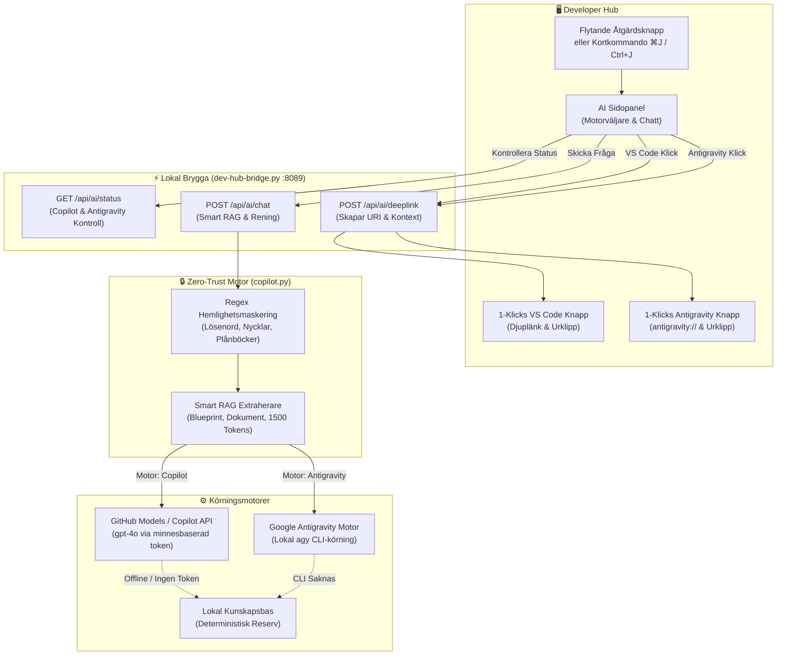

[ 🇬🇧 English ](../devhub-copilot-assistant.md) | [ 🇪🇪 Eesti ](../et/devhub-copilot-assistant.md) | [ 🇫🇮 Suomi ](../fi/devhub-copilot-assistant.md) | [ 🇸🇪 Svenska ](devhub-copilot-assistant.md) | [ 🇱🇻 Latviešu ](../lv/devhub-copilot-assistant.md) | [ 🇱🇹 Lietuvių ](../lt/devhub-copilot-assistant.md)

# 🤖 Dev Hub Flerleverantörs AI-assistent (Copilot + Antigravity) och Zero-Trust RAG-guide

Denna guide dokumenterar Developer Hubs (`docs/dev-hub.html`) **flerleverantörs AI-assistent**, med stöd för både **GitHub Copilot** och **Google Antigravity**, Regel 5 Zero-Trust-säkerhetskontroller, offline-kunskapsbas samt 1-klicks broar till VS Code Copilot Chat och Antigravity.

---

## 🏛️ 1. Teknisk arkitektur och dataflöde

Assistenten använder en dubbelmotorig arkitektur via kortkommandot `⌘J` / `Ctrl+J`, med enkel växling mellan GitHub Copilot och Google Antigravity:

---

## 🔒 2. Zero-Trust-säkerhet och efterlevnad av Regel 5

1. **Sparas aldrig på disk:** Autentiseringstoken och kommandoradsinteraktion sker uteslutande i minnet.
2. **Dynamisk maskering:** Alla användarfrågor och dokumentationsutdrag passerar funktionen `sanitize_text`:
   - Databaslösenord (`password: ...`, `IDENTIFIED BY ...`)
   - SEPS Wallet-sökvägar (`cwallet.sso`, `ewallet.p12`)
   - Privata SSH- och TLS-nycklar (`BEGIN PRIVATE KEY`)
   - GitHub-åtkomsttoken (`ghp_*`, `github_pat_*`)

---

## ⌨️ 3. Kortkommandon och funktioner

| Åtgärd | Kortkommando / Avtryckare | Beskrivning |
| :--- | :--- | :--- |
| **Öppna / Stäng assistent** | `⌘J` (macOS) / `Ctrl+J` (Windows/Linux) | Öppnar eller stänger AI-panelen från valfri Dev Hub-flik. |
| **Växla motor** | Knapparna i rubriken `[ GitHub Copilot | Google Antigravity ]` | Växlar aktiv AI-motor (`localStorage`). |
| **Helskärm / Återställ** | Övre högra knappen `⛶` | Expanderar panelen till helskärm för källkodsgranskning. |
| **Skicka fråga** | `Enter`-tangenten | Skickar frågan till den valda AI-motorn. |
| **Öppna i VS Code** | Klicka på `Öppna i VS Code Copilot` | Kopierar full RAG-kontext till urklipp och öppnar `vscode://github.copilot/chat`. |
| **Öppna i Antigravity** | Klicka på `Öppna i Antigravity` | Kopierar full RAG-kontext till urklipp och öppnar `antigravity://chat` (eller startar appen). |

---

## 🔄 4. 3-Nivåers offline-reservsystem

Om utvecklarens dator saknar internetanslutning:
1. **Nivå 1 (Ansluten):** Frågar GitHub Models (`gpt-4o`) eller anropar lokal `agy` CLI.
2. **Nivå 2 (CLI-reserv):** Använder lokala CLI-verktyg.
3. **Nivå 3 (Lokal offline):** Genererar omedelbart deterministiska svar från lokal dokumentation.
