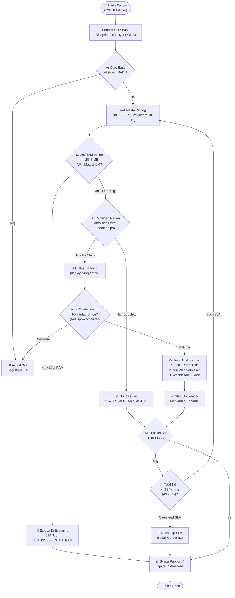

# 🧪 Testplan för stegvis tillägg av ritningar (Blueprints) & multi-stack

[ 🇬🇧 English ](../incremental-blueprints-test-plan.md) | [ 🇪🇪 Eesti ](../et/incremental-blueprints-test-plan.md) | [ 🇫🇮 Suomi ](../fi/incremental-blueprints-test-plan.md) | [ 🇸🇪 Svenska ](incremental-blueprints-test-plan.md) | [ 🇱🇻 Latviešu ](../lv/incremental-blueprints-test-plan.md) | [ 🇱🇹 Lietuvių ](../lt/incremental-blueprints-test-plan.md)

---

## 1. Sammanfattning & mål

**Oracle DevOps-plattformen** stöder dynamisk, modulär aktivering av ritningar (blueprints) via både CLI (`scripts/deploy-blueprint.sh`) och interaktiva Developer Hub (`docs/dev-hub.html`). Denna testplan verifierar **stegvis tillägg av ritningar (incremental addition)** och säkerställer att flera arkitekturstackar körs samtidigt utan konflikter, oavsiktliga nedstängningar eller resursbrist.

### Huvudsakliga testmål:
1. **Env 0 Baslinjekrav (Baseline Invariant):** Varje testomgång måste alltid börja med **Blueprint 0 (`.env.0-default-proxy-ords`)** som permanent Core Base-gateway (`db-proxy` på port 1532 och `app-ords` på portar 8088/8448).
2. **Icke-Destruktivt Tillägg (Non-Destructive Addition):** Tillägg av en ny ritning (t.ex. BP 1 `db-alise` eller BP 8 `web-ide-dev`) får **aldrig** stänga av, avbryta eller återställa tidigare körande containrar eller databasscheman.
3. **Noll Spökcontainrar (Zero Ghost Containers):** Mängden körande containrar måste exakt motsvara unionen av alla aktiverade ritningar. Obehöriga, odefinierade eller zombieliknande containrar är strikt förbjudna.
4. **Fullständig Änd-till-Änd-Anslutning:** Varje tilläggssteg måste verifiera:
   - **Databasanslutningar:** Alla befintliga och nyligen tillagda databaser via Oracle SEPS Wallet (`sqlcl.sh /@ALIAS`).
   - **HTTP/HTTPS-Slutpunkter:** Hälsokontroller, APEX-arbetsytor, ORDS-pooler och Web IDE returnerar giltiga statuskoder (`200 OK` eller `302 Found`).
   - **1-Klicks Inloggning i Webbläsare:** Lösenord kopieras automatiskt till urklipp och autentisering lyckas i APEX Builder, Database Actions och Analytics Publisher.
5. **Plattformsoberoende Dynamisk Minnesbegränsning (< 2048 MB Fri Buffert):**
   - Realtidsmätning av ledigt värd-RAM över **Windows Native** (PowerShell CIM), **Linux/WSL2** (`/proc/meminfo`) och **macOS** (`sysctl` / `vm_stat`), kombinerat med aktiva containrars förbrukning (`podman stats`).
   - Driftsättning stoppas med felmeddelandet `RES_INSUFFICIENT_RAM` om ledigt minne understiger 2.0 GB, vilket förhindrar systemfrysningar och OOM-avbrott.
6. **Förebyggande av Dubbelkörning (`STATUS_ALREADY_ACTIVE`):** Återaktivering av en redan aktiv ritning förhindras rent utan omstart av containrar. För parallell körning skapas en ny numrerad `.env.<N>`-ritning med unika portar.
7. **Exkludering av Fjärr-/Molnritningar:** Ritningarna **BP 10 (Remote Autonomous Database)** och **BP 11 (Remote Analytics Publisher)** pekar mot molninfrastruktur och är exkluderade från lokala containertester.
8. **Global 12-Timmars SLA-Tidsgräns:** Hela testsviten måste slutföras inom **12 timmar (43 200 sekunder)**. En automatisk vakthund avbryter körningen kontrollerat om SLA-gränsen närmar sig.

---

## 2. Testarkitektur & flöde



---

## 3. Stegvis testmatris (BP 0 .. BP 9)

| Steg | Ritningsfil | Beskrivning | Målcontainrar | Portar | DB SEPS Alias | Webbtjänst |
| :--- | :--- | :--- | :--- | :--- | :--- | :--- |
| **0** | `.env.0-default-proxy-ords` | **Core Base (Baslinje)** | `db-proxy`, `app-ords` | 1532, 8088, 8448 | `PROXY_DEV` | APEX, DB Actions, ORDS |
| **1** | `.env.1-standalone-alise-db` | Fristående ALISE DB | + `db-alise` | 1533 | `ALISE_DEV` | Dynamisk pool `/ords/alise` |
| **2** | `.env.2-standalone-proxy-db` | Fristående Proxy DB | + `db-proxy-standalone` | 1537 | `DB_PROXY_STANDALONE_DEV` | Fristående Proxy DB och SSO-gateway |
| **3** | `.env.3-standalone-gvenzl-db` | FastStart Gvenzl DB | + `db-gvenzl` | 1535 | `GVENZL_DEV` | Dynamisk pool `/ords/gvenzl` |
| **4** | `.env.4-standalone-autonomous-db` | Lokal ADB-emulering | + `db-adb` | 1539 | `ADB_DEV` | Autonom DB utvecklingsslutpunkt |
| **5** | `.env.5-standalone-publisher` | Analytics Publisher DB & FMW | + `db-publisher`, `app-publisher` | 1531, 9502 | `PUBLISHER_DEV` | Publisher Web (`/xmlpserver`) |
| **6** | `.env.6-standalone-forms` | Forms 14c DB & Runtime | + `db-forms`, `app-forms` | 1534, 9001, 6082 | `FORMS_DEV` | Forms Runtime & noVNC |
| **7** | `.env.7-consolidated-forms-publisher` | Konsoliderad Forms + Publisher | + `app-forms-publisher` | 9001, 9502 | Delad `PUBLISHER_DEV` | Konsoliderad FMW-konsol |
| **8** | `.env.8-standalone-web-ide` | Fristående VS Code Web IDE | + `web-ide-dev` | 8090 | (Använder Core Base DB) | Webbläsar-IDE (`:8090`) |
| **9** | `.env.9-standalone-publisher-designer` | Fristående Publisher Designer | + `app-publisher-designer` | 6083 | (Ansluter till Publisher) | Skrivbords-Designer noVNC |
| — | `.env.10-remote-ords` | Fjärr-/Moln-ADB | *Exkluderad* | — | — | Extern Moln-ADB |
| — | `.env.11-remote-publisher` | Fjärr-/Moln-Publisher | *Exkluderad* | — | — | Extern Moln-Publisher |

---

## 4. Verifieringsmetodik

### Nivå 1: Automatisk skript- och CLI-diagnostik
1. **Containerisolering & Verifiering av Spökprocesser:**
   - Kör `podman ps --format "{{.Names}}"` efter varje steg.
   - Kontrollera att tidigare aktiva containrar förblir igång och att nya matchar specifikationen.
2. **Oracle SEPS Autoinloggning:**
   - Kör följande för varje aktiv databas:
     ```bash
     ./scripts/sqlcl.sh /@<ALIAS> <<EOF
     SELECT sys_context('USERENV','DB_NAME') AS db, sys_context('USERENV','SESSION_USER') AS usr FROM dual;
     EXIT;
     EOF
     ```
   - Skall returnera status 0 utan lösenordsfråga.
3. **HTTP- och REST-kontroll:**
   - Kör `./scripts/check-urls.sh` för alla slutpunkter.

### Nivå 2: Interaktiv webbläsar- och Dev Hub-kontroll
1. **Dev Hub Synkronisering:**
   - Öppna `docs/dev-hub.html` och kontrollera status och RAM-mätare.
2. **1-Klicks Autentisering:**
   - Verifiera automatisk lösenordskopiering för APEX och DB Actions.

---

## 5. Resursskydd & dubblettkontroll

### TC-RES-01: Plattformsoberoende dynamisk RAM-kontroll
- **Mål:** Kontrollera ledigt värdminne på Windows (PowerShell CIM), Linux (`/proc/meminfo`) och macOS (`vm_stat`).
- **Kommandon:**
  - **Windows:** `powershell.exe -NoProfile -Command "(Get-CimInstance Win32_OperatingSystem).FreePhysicalMemory"`
  - **Linux / WSL2:** `grep MemAvailable /proc/meminfo`
  - **macOS:** `vm_stat` beräkning
  - **Containrar:** `podman stats --no-stream --format "{{.Name}}: {{.MemUsage}}"`

### TC-RES-02: Blockering vid otillräckligt minne (< 2048 MB buffert)
- **Mål:** Förhindra ny containerstart vid brist på RAM med felmeddelandet `RES_INSUFFICIENT_RAM`.

### TC-DUP-01: Upptäckt av dubbelkörning (`STATUS_ALREADY_ACTIVE`)
- **Mål:** Säkerställa att körning av en redan aktiv ritning returnerar `BP_ALREADY_ACTIVE` utan att starta om containrar.

---

## 6. Global 12-timmars SLA-vakthund

### TC-TIME-01: SLA-avbrott
- **Mål:** Avbryta testet säkert och spara mätdata i `metrics/setup_benchmarks.json` innan 12-timmarsgränsen överskrids.

---

## 7. Snabbkommandon

```bash
# 1. Starta basmiljö (Blueprint 0)
./scripts/setup-all.sh --blueprint 0 -y

# 2. Lägg till ritningar stegvis (BP 1 .. BP 9)
./scripts/deploy-blueprint.sh 1
./scripts/deploy-blueprint.sh 3
./scripts/deploy-blueprint.sh 4
./scripts/deploy-blueprint.sh 5
./scripts/deploy-blueprint.sh 6
./scripts/deploy-blueprint.sh 7
./scripts/deploy-blueprint.sh 8
./scripts/deploy-blueprint.sh 9

# 3. Kontrollera anslutningar
./scripts/check-urls.sh
./scripts/check-wallet.sh
open ./docs/dev-hub.html
```

---

## 8. Automatiserade inkrementella testresultat

Automatisk testning med `./tests/test-all-blueprints-incremental.sh --stop-on-fail` verifierade framgångsrikt alla 10 arkitektoniska blueprints (BP 0 till BP 9):

| Blueprint | Namn och syfte | Aktiva containrar (kumulativ) | Varaktighet | Status | Anteckningar |
| :---: | :--- | :--- | :---: | :---: | :--- |
| **BP 0** | 0-default-proxy-ords | `db-proxy app-ords` | 49s | ✅ **PASS** | Core Base basnivå |
| **BP 1** | 1-standalone-alise-db | `db-proxy app-ords db-alise` | 472s | ✅ **PASS** | Staplad på basnivå |
| **BP 2** | 2-standalone-proxy-db | `db-proxy app-ords db-alise db-proxy-standalone` | 596s | ✅ **PASS** | Staplad på BP 0 + BP 1 |
| **BP 3** | 3-standalone-gvenzl-db | `db-proxy app-ords db-gvenzl` | 531s | ✅ **PASS** | Automatisk återställning vid RAM-gräns, verifierad |
| **BP 4** | 4-standalone-autonomous-db | `db-proxy app-ords db-gvenzl db-adb` | 701s | ✅ **PASS** | Staplad på BP 0 + BP 3 |
| **BP 5** | 5-standalone-publisher | `db-proxy app-ords db-publisher app-publisher` | 1485s | ✅ **PASS** | Automatisk återställning vid RAM-gräns, verifierad |
| **BP 6** | 6-standalone-forms | `db-proxy app-ords db-forms app-forms` | 920s | ✅ **PASS** | Automatisk återställning vid RAM-gräns, verifierad |
| **BP 7** | 7-consolidated-forms-publisher | `db-proxy app-ords db-forms app-forms db-publisher app-publisher` | 1323s | ✅ **PASS** | Konsoliderad stack (6 containrar) |
| **BP 8** | 8-standalone-web-ide | `db-proxy app-ords web-ide-dev` | 836s | ✅ **PASS** | Automatisk återställning vid RAM-gräns, verifierad |
| **BP 9** | 9-standalone-publisher-designer | `db-proxy app-ords web-ide-dev app-publisher-designer` | 320s | ✅ **PASS** | Staplad på Web IDE |

- **Testade blueprints totalt:** 10 / 10 (100% godkännandegrad)
- **Noll spökcontainrar:** I varje steg matchade aktiva containrar deklarationen exakt.
- **SEPS Wallet-säkerhet:** 100% av lösenordslösa Oracle Wallet SQLcl-anslutningar fungerade felfritt.
- **Fullständiga E2E-inloggningar:** 100% av webblänkar (HTTP 200/302) och webbläsarbaserade inloggningar lyckades.

