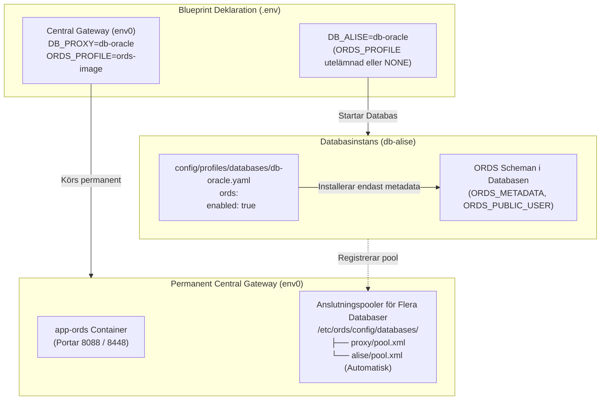

[ 🇬🇧 English ](../ords-profiles-lifecycle.md) | [ 🇪🇪 Eesti ](../et/ords-profiles-lifecycle.md) | [ 🇫🇮 Suomi ](../fi/ords-profiles-lifecycle.md) | [ 🇸🇪 Svenska ](ords-profiles-lifecycle.md) | [ 🇱🇻 Latviešu ](../lv/ords-profiles-lifecycle.md) | [ 🇱🇹 Lietuvių ](../lt/ords-profiles-lifecycle.md)

# 🌐 Oracle REST data services (ORDS) profiler och frikopplad livscykelguide

Denna guide dokumenterar arkitektur, livscykelorkestrering och konfiguration för **Oracle REST Data Services (ORDS)** över lokala containrar, fjärrservrar och Oracle Autonomous Database (ADB) i molnet.

---

## 🏛️ 1. Principer för frikopplad arkitektur

I modern modulär arkitektur är webbapplikationsgatewayen frikopplad från databasmotorn:



### Viktiga arkitekturregler:
1. **`ords.enabled: true` i Databasprofilen:**
   - Förbereder databasens ORDS-scheman, metadata (`ORDS_METADATA`) och proxy-användare.
   - **Startar INTE** webbcontainern `app-ords`.
2. **`ORDS_PROFILE` i Blueprinten:**
   - Bestämmer om en `app-ords`-container ska startas.
   - Om parametern utelämnas eller sätts till `NONE`, fungerar databasen rent som bakomliggande databas utan onödig minnesförbrukning för webbservern.
3. **Automatisk Registrering i Central Gateway:**
   - När Blueprint 0 (`env0`) körs i bakgrunden skapar varje ny databas automatiskt sin poolkonfiguration `<poolnamn>.xml` och laddar om den centrala ORDS-containern direkt.

---

## 📦 2. Tre kanoniska ORDS-profiler

Alla ORDS-profiler finns i katalogen `config/profiles/ords/`:

| Profil | Fil | Typ | Optimering och Målområde |
| :--- | :--- | :--- | :--- |
| **`ords-image`** | `config/profiles/ords/ords-image.yaml` | `image` | **Officiell Oracle OCR Containeravbildning.** (`container-registry.oracle.com/database/ords:latest`). Antivirusoptimerad, ingen lokal extrahering, snabb start. Rekommenderas för lokal utveckling och CI/CD. |
| **`ords-local-custom`** | `config/profiles/ords/ords-local-custom.yaml` | `local_custom` | **Lokal Anpassad Skriptinstallation.** Använder officiella arkiv från `binaries/ords/` och anpassade skript, uppackade i tillfällig container. |
| **`ords-remote-custom`** | `config/profiles/ords/ords-remote-custom.yaml` | `remote_custom` | **Fjärrserver Gateway.** Ansluter till en befintlig fristående ORDS-server över SSH eller HTTPS. |

---

## ☁️ 3. Oracle autonomous database (ADB) integration

Oracle Autonomous Database (Cloud ADB Serverless) innehåller en förinstallerad och molnhanterad ORDS-instans:

```yaml
# config/profiles/databases/db-adb.yaml
ords:
  enabled: true
  install_in_db: false       # Ta INTE bort eller skriv över molnhanterat ORDS_METADATA
  verify_version_match: true # Verifiera versionskompatibilitet med central gateway
```

---

## 💡 4. Vägledning när ORDS-server saknas

Om en databas startas utan `ORDS_PROFILE` och den centrala ORDS-containern inte körs:
- Terminalen visar en informativ status och åtgärd:
  `ℹ️  ORDS-server är inte konfigurerad (ingen app-ords container).`
  `💡 Vägledning: För att aktivera webbgränssnittet, kör: ./scripts/setup-all.sh --b 0 eller lägg till ORDS_PROFILE=ords-image`

---

## 🚀 5. Snabbkommandon

```bash
# 1. Starta permanent central ORDS-gateway:
./scripts/setup-all.sh -b 0

# 2. Starta fristående databas (registrerar pool automatiskt i central ORDS):
./scripts/setup-all.sh -b 1

# 3. Kontrollera webbadresser:
./scripts/check-urls.sh
```
