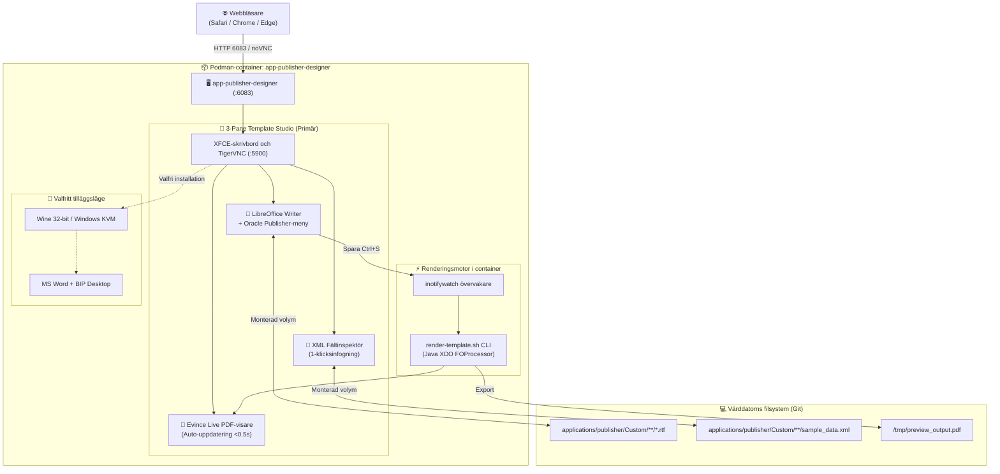

# Oracle Analytics Publisher mallbyggare & tillgänglighetsguide: LibreOffice Writer 3-Pane Studio (Primär) & MS Word KVM/Wine (Valfri)

[ 🇬🇧 English ](../publisher-template-builder-guide.md) | [ 🇪🇪 Eesti ](../et/publisher-template-builder-guide.md) | [ 🇫🇮 Suomi ](../fi/publisher-template-builder-guide.md) | [ 🇸🇪 Svenska ](publisher-template-builder-guide.md) | [ 🇱🇻 Latviešu ](../lv/publisher-template-builder-guide.md) | [ 🇱🇹 Lietuvių ](../lt/publisher-template-builder-guide.md)

---

## 1. Översikt och affärsnytta

Design av pixel-perfekta affärsdokument (fakturor, följesedlar, finansiella rapporter) i Oracle Analytics Publisher bygger på **Rich Text Format (RTF)-mallar** kombinerade med **XML-data** för att generera tillgängliga och strukturerade PDF-dokument.

### 🛑 Lösning på företagsutmaningar:
I låsta företagsmiljöer möter utvecklare hinder:
1. **Inga Microsoft Office-licenser i utvecklings- och CI-containrar:** Företagslicenser är knutna till personliga arbetsstationer. CI/CD-system och Linux-containrar har inte tillgång till MS Word.
2. **Låsta arbetsstationer (inga administratörsrättigheter):** Utvecklare kan inte installera program (`BIPublisherDesktop64.exe`) på företagets datorer.
3. **Plattformsoberoende:** Utvecklare på **macOS** eller **Linux** saknar officiellt tillägg för Word Template Builder.

### 💡 Lösningen: LibreOffice 3-Pane Studio (Primär SSoT):
Behållaren **`app-publisher-designer`** (Blueprint 9) erbjuder en omedelbart fungerande studio direkt i webbläsaren via **HTML5 noVNC på port 6083** (`http://localhost:6083/vnc.html`):
- **LibreOffice 7.x/24.x Writer (Förkonfigurerad SSoT):** Innehåller anpassade **⚡ Oracle Publisher**-menyer, verktygsfält, XML-tagginfogning och snabbtangenter. Kräver inga externa licenser.
- **Evince Live PDF-läsare:** Re-renderar och uppdaterar PDF-filen på under 0,5 sekunder vid varje sparning (`Ctrl+S`).
- **Oracle XML Fältinspektör:** Visuellt XML-träd med 1-klicksinfogning direkt till Writer via X11-automatisering.
- **Snabb renderingsmotor i behållaren:** Inbyggd Java Oracle XDO / `FOProcessor` och kommandoradsverktyg.
- **Direkt Git-synkronisering:** Sparade mallar ligger direkt på värdens filsystem under `templates/publisher/`.
- **Valfritt läge:** Microsoft Word via Wine eller Windows KVM stöds som ett valfritt alternativ för miljöer med 32-bitars installationsfiler.

---

## 2. Arkitektur och arbetsstationstopologi



---

## 3. Snabbstart: LibreOffice Writer 3-Pane Studio (Primär)

Studion är redo omedelbart efter start av Blueprint 9 utan extra installationsfiler.

### Steg 1: Starta behållaren
Via Blueprint 9 (Rekommenderas):
```bash
./scripts/setup-all.sh -b 9
```
Eller via skript:
```bash
./scripts/publisher/start-designer.sh --lang sv   # Alternativ: en, et, fi, sv, lv, lt
```

### Steg 2: Öppna Template Studio i webbläsaren
1. Öppna `http://localhost:6083/vnc.html`.
2. Dubbelklicka på skrivbordsikonen **🚀 Oracle Publisher Template Studio**.
3. Tre fönster ordnas automatiskt:
   - **Vänster (65%):** **LibreOffice Writer** med aktiv mall (`arve_test_standard.rtf`).
   - **Övre höger (35%):** **Evince Live PDF-läsare** som visar `valmis_arve.pdf`.
   - **Nedre höger (35%):** **Oracle XML Fältinspektör** för `arve_test_andmed.xml`.

### Steg 3: Design och infogning
1. **Verktygsfält och meny i Writer:**
   - `🏷️ Infoga fält`: Infogar `<?TAG_NAME?>` vid markören.
   - `🔁 for-each loop`: Omsluter rader med `<?for-each:LINES/LINE?> ... <?end for-each?>`.
   - `❓ Villkor (IF)`: Infogar villkorsblock (`<?if:VAT_RATE > 0?>...<?end if?>`).
   - `⚡ Snabb-rendera PDF`: Genererar PDF direkt.
2. **1-klicksinfogning:**
   - Välj nod i XML-trädet och klicka på **👉 Sisesta Kursorisse** för att klistra in koden direkt i Writer.
3. **Live förhandsgranskning:**
   - Spara i Writer (`Ctrl+S`) — Evince uppdaterar förhandsgranskningen på under 0,5 sekunder.

### Steg 4: Stoppa behållaren för att frigöra minne
```bash
./scripts/publisher/stop-designer.sh
```

---

## 4. Testkörning och rendering i container och på värddator

### 4.1 CLI-testverktyg på värddatorn (`test-render.sh`)
```bash
./scripts/publisher/test-render.sh \
  templates/publisher/samples/arve_test_standard.rtf \
  templates/publisher/samples/arve_test_andmed.xml \
  [utdata.pdf]

# Flerspråkig rendering med XLIFF:
./scripts/publisher/test-render.sh --locale sv
```

### 4.2 Direktkörning inuti containern
```bash
podman exec -it app-publisher-designer /u01/oracle/bin/render-template.sh \
  /u01/templates/samples/arve_test_standard.rtf \
  /u01/templates/samples/arve_test_andmed.xml \
  /u01/templates/samples/valmis_arve_sv.pdf \
  --locale sv
```

### 4.3 Live Watcher & Hot-Reload (`watch-render-host.sh`)
```bash
./scripts/publisher/watch-render-host.sh \
  templates/publisher/samples/arve_test_standard.rtf \
  templates/publisher/samples/arve_test_andmed.xml \
  templates/publisher/samples/valmis_test_arve.pdf
```
Övervakar RTF-ändringar och re-renderar automatiskt vid varje sparning på under 0,5 sekunder.

---

## 5. Tillgänglighet & PDF/UA-1 granskningsprocess

Dokument måste uppfylla **PDF/UA-1 (ISO 14289-1)**, **WCAG 2.1 Level AA**, **Europeiska tillgänglighetsdirektivet (EAA / EN 301 549)** och **Section 508**.

### 4-stegs testprocess:
1. **Steg 1: RTF-strukturgranskning:**
   ```bash
   ./scripts/publisher/validate-rtf-accessibility.sh templates/publisher/samples/accessible_starter_template.rtf --strict
   ```
2. **Steg 2: Export av tillgänglig PDF med taggar (`/StructTreeRoot`, `/MarkInfo`, `/Lang`).**
3. **Steg 3: Granskning av taggar och skärmläsarsimulering:**
   ```bash
   ./scripts/publisher/validate-pdf-accessibility.sh templates/publisher/samples/valmis_arve_sv.pdf
   ```
4. **Steg 4: Automatiserat testpaket & ACR-rapport:**
   ```bash
   ./tests/integration/test-publisher-accessibility-suite.sh
   ```
   Genererar officiell rapport: [`tests/reports/accessibility_compliance_acr.md`](../../tests/reports/accessibility_compliance_acr.md).

Se fullständig specifikation:
👉 [`.agents/skills/oracle_publisher_accessibility/SKILL.md`](../../.agents/skills/oracle_publisher_accessibility/SKILL.md).

---

## 6. Utvecklarflöde: VS Code & GitHub Copilot

1. Copilot använder automatiskt instruktioner från [`.github/copilot-instructions.md`](../../.github/copilot-instructions.md).
2. Starta övervakaren: `./scripts/publisher/watch-render-host.sh`.
3. Spara (`Cmd+S`) för omedelbar visning av resultatet.

---

## 7. Valfritt: MS Word & BIP Desktop via Wine eller Windows KVM

För miljöer med 32-bitars Office-licenser:
1. Placera `setup.exe` och `BIPublisherDesktop32.exe` i `binaries/publisher/`.
2. Kör `./scripts/publisher/setup-word-designer.sh`.

---

## 8. Snabbreferens för mallsyntax

| Funktion | Oracle BI Publisher RTF Tag | Beskrivning |
| :--- | :--- | :--- |
| **Fältvärde** | `<?INVOICE_NUM?>` | Visar värde från XML-element |
| **Repeterande rader**| `<?for-each:G_LINES?>` ... `<?end for-each?>` | Itererar över radartiklar |
| **Villkorsblock** | `<?if:VAT_RATE > 0?>` ... `<?end if?>` | Visar block vid uppfyllt villkor |
| **Upprepa tabellhuvud**| `\trhdr` | Obligatoriskt för PDF/UA-1 tabeller |
| **Dokumentrubrik** | Format `Heading 1` | Obligatorisk H1-tagg för skärmläsare |

---

## 9. GitOps Företagsstandard (`applications/publisher/`), REST-distribution och CI/CD-pipeline

För att garantera tillförlitlighet på företagsnivå och nollförtroendesäkerhet hanteras alla mallar och datamodeller i `applications/publisher/`, vilket speglar Oracle Analytics Publisher-serverns katalog 1:1 (`/Custom/<Domän>/<Rapport>/`).

### 9.1 Katalogstruktur och GitOps-invariant

```text
applications/publisher/
├── .gitignore                         # Exkluderar binära *.xdoz och *.xdmz arkiv
├── README.md                          # Dokumentation (6 språk: EN, ET, FI, SV, LV, LT)
└── Custom/
    └── Invoices/
        └── Invoice_Report/
            ├── Invoice_Report.xdo/       # Git-spårat rapportpaket
            │   ├── template.rtf          # Tillgänglig PDF/UA-1 RTF-mall
            │   ├── template_et.xlf       # Estniska XLIFF-översättningar
            │   ├── template_fi.xlf       # Finska XLIFF-översättningar
            │   └── _manifest.xml         # Publisher-rapportmanifest
            └── Invoice_DataModel.xdm/    # Git-spårat datamodellpaket
                ├── datamodel.sql         # Ren SQL-datainsamlingsfråga
                ├── datamodel.xml         # Datamodell XML (kopplad till ALISE_APP_DB)
                └── sample_data.xml       # Exempeldata för testning
```

### 9.2 Kommandoradsverktyg (CLI)

1. **Skapa ny rapport (Scaffolding):**
   ```bash
   ./scripts/publisher/create-report.sh Custom/Invoices/Packing_Slip "Följesedel"
   ```
2. **Distribuera till server (REST API / Copy):**
   ```bash
   ./scripts/publisher/deploy-template.sh Custom/Invoices/Invoice_Report --mode rest
   ```
3. **Distribuera med omedelbar PDF-testrendering på servern:**
   ```bash
   ./scripts/publisher/deploy-template.sh Custom/Invoices/Invoice_Report --render
   ```

### 9.3 Säkerhetsroller och SEPS Wallet-rotation

| Användare | WebLogic-grupp | SEPS Wallet Alias | Behörigheter |
| :--- | :--- | :--- | :--- |
| `bip_developer` | `XMLP_DEVELOPER`, `XMLP_TEMPLATE_DESIGNER` | `PUBLISHER_DEVELOPER` | Skapa mallar och datamodeller i `/Custom/` |
| `bip_user` | `XMLP_SCHEDULER`, `XMLP_ANALYZER` | `PUBLISHER_USER` | Köra utskrifter och hantera historik |
| `bip_admin` | `XMLP_ADMIN` | `PUBLISHER_ADMIN` | BIP-katalogadministration (ingen WebLogic-konsol) |

Lösenordsrotation via Oracle SEPS Wallet:
```bash
./scripts/rotate-password.sh publisher dev     # Roterar bip_developer lösenord
./scripts/rotate-password.sh publisher user    # Roterar bip_user lösenord
./scripts/rotate-password.sh publisher admin   # Roterar bip_admin lösenord
```

### 9.4 GitHub Actions CI/CD Sekvensdiagram (`.github/workflows/deploy-publisher-reports.yml`)

```mermaid
sequenceDiagram
    autonumber
    actor Dev as 👨‍💻 Release Manager<br/>(Utvecklare / Administratör)
    participant GHA as ⚙️ GitHub Actions Runner<br/>(deploy-publisher-reports)
    participant QG as 🧪 CI Kvalitetsgrindar<br/>(Linter & Test-Render)
    participant Art as 📦 GitHub Artifacts<br/>(Nedladdningsbar PDF)
    participant Sec as 🔑 Hemlighetshanterare<br/>(GitHub Secrets / OIDC)
    participant Pub as 🏢 Publisher-server<br/>(:9502 REST API)

    Dev->>GHA: 1. Starta workflow_dispatch<br/>(miljö: dev/test/prod, rapportsökväg)
    activate GHA

    rect rgb(30, 41, 59)
        Note over GHA,QG: Automatiserade kvalitetsgrindar före distribution
        GHA->>QG: 2. XML- och SQL-syntaxkontroll<br/>(xmllint datamodel.xml)
        QG-->>GHA: ✅ Syntax validerad
        GHA->>QG: 3. RTF-tillgänglighetsgranskning<br/>(PDF/UA-1, \trhdr, H1/H2, Alt-text)
        QG-->>GHA: ✅ Tillgänglighetskrav uppfyllda
        GHA->>QG: 4. Testrendering utan gränssnitt<br/>(med sample_data.xml)
        QG-->>GHA: ✅ Test-PDF genererad
        GHA->>Art: 5. Ladda upp test-PDF som artefakt<br/>(actions/upload-artifact@v4)
        Art-->>Dev: 👁️ PDF nedladdningsbar i GitHub UI
    end

    rect rgb(15, 23, 42)
        Note over GHA,Pub: Distribution till Publisher-server (REST API)
        GHA->>Sec: 6. Fråga behörigheter (OAuth2 Bearer<br/>eller bip_developer lösenord)
        Sec-->>GHA: 🔑 Säker auktoriseringsrubrik
        GHA->>Pub: 7. POST /xmlpserver/services/rest/v1/reports<br/>(deploy-template.sh --mode rest)
        Pub-->>GHA: HTTP 200 / 201 Created (Idempotent)
        
        opt Om test_render valts
            GHA->>Pub: 8. POST /reports/{path}/run (Serverrendering)
            Pub-->>GHA: 📑 Serverns officiella PDF
        end
    end

    GHA->>Dev: 9. Publicera $GITHUB_STEP_SUMMARY<br/>(Sammanfattning och rapportlänkar)
    deactivate GHA
```



