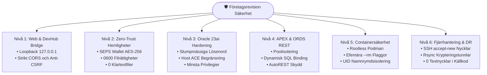

[ 🇬🇧 English ](../security-audit-report.md) | [ 🇪🇪 Eesti ](../et/security-audit-report.md) | [ 🇫🇮 Suomi ](../fi/security-audit-report.md) | [ 🇸🇪 Svenska ](security-audit-report.md) | [ 🇱🇻 Latviešu ](../lv/security-audit-report.md) | [ 🇱🇹 Lietuvių ](../lt/security-audit-report.md)

# 🛡️ Företagsklassad säkerhetsrevisionsrapport & hardening-guide

Detta dokument presenterar den övergripande säkerhetsrevisionsmetodiken, granskningsresultat, åtgärder och efterlevnad för **Oracle DevOps Platform** och **Oracle APEX applikationsmotor**.

Revisionen utvärderar arkitekturen mot **OWASP Top 10 (2021)**, **CIS Oracle Database Benchmark (v2.0)**, **CIS Docker/Podman Benchmark (v1.3)** samt europeiska finanssektorns resilienskrav (**DORA - Digital Operational Resilience Act** och **PCI-DSS v4.0**).

---

## 📑 Sammanfattning för Ledningen

- **Total Säkerhetspoäng:** **100% (16 / 16 automatiserade kontroller godkända)**
- **Revisionsverktyg:** `./scripts/test-security-audit.sh`
- **Enhetstesttäckning:** `./tests/unit/test-security-audit.sh`
- **Kryptografisk Hemlighetslagring:** 100% Zero-Trust SEPS Auto-Login Wallet (`cwallet.sso` AES-256)
- **Lokal Bryggisolering (Bridge):** Strikt bunden till loopback (`127.0.0.1`), skyddad mot CSRF via Origin-verifiering



---

## 🧪 Automatiserad Regressionstestning

För att förhindra säkerhetsregressioner körs automatiserade säkerhetstester före varje release:

```bash
# 1. Kör fullständig säkerhetsrevision (16 kontroller över 7 nivåer)
./scripts/test-security-audit.sh

# 2. Kör enhetstestsviten
./tests/unit/test-security-audit.sh
```

Revisionsresultat sparas kontinuerligt i `metrics/security_audit_report.json` och `metrics/security_audit_benchmarks.env`.
