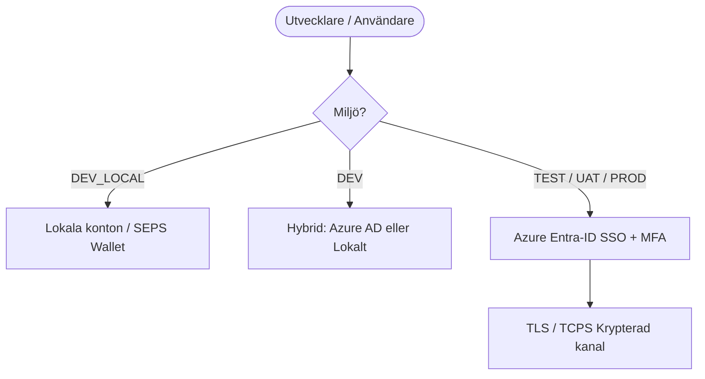

[ 🇬🇧 English ](../security.md) | [ 🇪🇪 Eesti ](../et/security.md) | [ 🇫🇮 Suomi ](../fi/security.md) | [ 🇸🇪 Svenska ](security.md) | [ 🇱🇻 Latviešu ](../lv/security.md) | [ 🇱🇹 Lietuvių ](../lt/security.md)

# 🛡️ Oracle Free DB & APEX Säkerhet och SSO-Arkitektur

Detta dokument sammanställer säkerhetsprinciper, lösenordshantering, utvecklarroller och arkitektur för enkel inloggning (SSO / Azure Entra-ID).

---

## 1. Lokal Hantering av Hemligheter (Zero-Trust - Regel 5)

Alla lösenord och hemligheter lagras strikt i den AES-256-krypterade **Oracle SEPS (Secure External Password Store) Auto-Login Wallet** (`cwallet.sso`).

- **Förbud mot Klartextfiler:** Lösenord skrivs aldrig till disk i klartext (inga `.json`, `.txt`, `.env` eller `.cache`-filer).
- **Minnesbaserad Avkryptering:** Lösenord avkrypteras dynamiskt vid behov direkt i minnet:
  ```bash
  ./scripts/get-password.sh <alias>
  ```
- **Minsta Behörighet:** Standardkonton genereras automatiskt för varje databas:
  - `DBA_ADMIN`: Administrativa uppgifter (`DBA`-roll).
  - `DEV`: Daglig utvecklarroll med Oracle 23ai `DB_DEVELOPER_ROLE`.
  - `APP`: Körningskonto för applikationsobjekt (`CREATE SESSION`, `RESOURCE`).
  - `VIEWER`: Skrivskyddat granskningskonto (`READ ANY TABLE`).

---

## 2. Autentiseringsmatris för Miljöer

| Miljö (`ENVIRONMENT_TYPE`) | Plats | Autentiseringstyp (APEX & DB) | Användarhantering | TLS-Kryptering (TCPS) |
| :--- | :--- | :--- | :--- | :--- |
| **`DEV_LOCAL`** | Lokal Utvecklardator | Lokala SEPS Wallet-konton | Automatiserad / `create-developer.sh` | Valfri (Offline) |
| **`DEV`** | Delad Utvecklingsserver | Hybrid (Lokal + **Azure AD**) | Azure AD + JIT / Lokala konton | Valfri |
| **`TEST`** | Testserver (CI/CD) | **Azure Entra-ID (SSO)** | Central (Azure AD-grupper) | Ja (Port 2484) |
| **`UAT`** | Förproduktionsserver | **Azure Entra-ID (SSO)** | Central (Azure AD-grupper) | Ja (Port 2484) |
| **`PROD`** | Produktionsserver | **Azure Entra-ID (SSO)** | Central (Azure AD-grupper) | Ja (Port 2484) |



---

## 3. Adaptiv 5-Nivåers TLS/HTTPS-Motor

Webbtjänster (ORDS, APEX, Analytics Publisher) använder en adaptiv certifikathierarki utan administratörsbehörighet (`scripts/internal/resolve-tls-mode.sh`):

```text
config/certs/
├── custom/          # Nivå 0: Manuellt tillagda certifikat (tls.crt, tls.key)
├── public/          # Nivå 1: Publik FQDN & Let's Encrypt / Publik CA
├── corp/            # Nivå 2: Företagets Interna PKI (corp_cert.crt)
├── user_ca/         # Nivå 3: Lokal Root CA (i användarens nyckelring, 0-admin)
└── self_signed/     # Nivå 4: Dynamiskt självsignerat certifikat
```

---

## 4. Enkel Inloggning (SSO)

- **Databasnivå SSO:** Oracle 23ai stöder inbyggt Azure AD OAuth2-tokens och globala roller.
- **ORDS & REST API:** ORDS validerar inkommande Bearer JWT-tokens mot Azure AD:s publika nycklar.
- **APEX-Applikationer SSO:** Applikationer använder Social Sign-In (OpenID Connect) med automatisk användarregistrering.
