[ 🇬🇧 English ](../setup-all-workflow.md) | [ 🇪🇪 Eesti ](../et/setup-all-workflow.md) | [ 🇫🇮 Suomi ](../fi/setup-all-workflow.md) | [ 🇸🇪 Svenska ](setup-all-workflow.md) | [ 🇱🇻 Latviešu ](../lv/setup-all-workflow.md) | [ 🇱🇹 Lietuvių ](../lt/setup-all-workflow.md)

# Installationsprocessens flödesschema och arkitektursteg (setup-all.sh)

Detta dokument beskriver hela livscykeln, beslutspunkterna och optimeringslogiken för plattformens primära konfigurationsskript `./scripts/setup-all.sh`.

---

## 📊 Flödesschema (Flowchart)

> [!TIP]
> Om din Markdown-läsare inte visar Mermaid-diagram direkt, se den förrenderade bilden här:

```mermaid
flowchart TD
    Start([Start: setup-all.sh]) --> LoadConfig[1. Läs in inställningar från .env]
    LoadConfig --> CheckArgs{"Kontrollera CLI-<br/>argument"}
    
    CheckArgs -->|--force / -y| NonInteractive[Automatiserat läge:<br/>Hoppa över bekräftelser]
    CheckArgs -->|Standard| Interactive[Begär bekräftelse &<br/>kontrollera diskutrymme]
    
    NonInteractive --> CheckSQLcl
    Interactive --> CheckSQLcl
    
    CheckSQLcl{"Finns lokal SQLcl<br/>och Java tillgängligt?"}
    CheckSQLcl -->|Ja| LocalSQLcl[Använd lokal<br/>run_sqlcl wrapper]
    CheckSQLcl -->|Nej| EphemeralSQLcl["Fallback: Använd tillfällig<br/>SQLcl-container (SQLCL_CONTAINER_IMAGE)"]
    
    LocalSQLcl --> Step1[Steg 1: Verifiera och<br/>hämta containeravbildningar]
    EphemeralSQLcl --> Step1
    
    Step1 --> Step2{"Är ORDS zip<br/>redan hämtad?"}
    Step2 -->|Ja| SkipORDSDownload[Hoppa över ORDS-nedladdning]
    Step2 -->|Nej| DownloadORDS[Ladda ner ORDS zip från .env URL]
    
    DownloadORDS --> Step3{"Har APEX zip<br/>ändrats eller saknas?"}
    SkipORDSDownload --> Step3
    
    Step3 -->|Nej| SkipAPEXUnzip[Hoppa över uppackning via markörfil]
    Step3 -->|Ja| UnzipAPEX[Packa upp APEX zip till apex/]
    
    UnzipAPEX --> Step4["Steg 4: Generera Podman Secrets<br/>(/run/secrets/) & starta compose"]
    SkipAPEXUnzip --> Step4
    
    Step4 --> WaitDB{"Vänta tills db-apex-proxy<br/>är healthy"}
    WaitDB --> Step45["Steg 4.5: Registrera uppgifter i<br/>Oracle SEPS Wallet (cwallet.sso)"]
    
    Step5[Steg 5: Vänta på att ORDS startar]
    Step45 --> Step5
    
    Step5 --> Step6{"Kontrollera: Finns APEX<br/>redan i databasen?"}
    Step6 -->|Ja, samma version| SkipAPEXInstall[Hoppa över APEX-motorinstallation]
    Step6 -->|Nej eller gammal| InstallAPEX["Installera APEX (zip kopieras<br/>& packas upp i containern)"]
    
    InstallAPEX --> CheckPatch{"Är APEX Patch<br/>redan installerad?"}
    SkipAPEXInstall --> CheckPatch
    
    CheckPatch -->|Ja| SkipPatch[Hoppa över Patch]
    CheckPatch -->|Nej, zip hittad| ApplyPatch[Installera Patch via catpatch.sql<br/>& uppdatera ORDS-avbildningar]
    
    ApplyPatch --> Step7[Steg 7: Initiera scheman och<br/>kör Liquibase-migreringar]
    SkipPatch --> Step7
    
    Step7 --> Step8{"Är --no-monitor-app<br/>angiven?"}
    Step8 -->|Ja| SkipApps[Hoppa över applikationsinstallation]
    Step8 -->|Nej, filer hittade| DeployApps[Driftsätt förpaketerade APEX-applikationer]
    
    DeployApps --> CreateTestUsers["Skapa testanvändare: TEST_DEV<br/>(ORDS.ENABLE_SCHEMA) & TEST_WEB_USER"]
    SkipApps --> CreateTestUsers
    
    CreateTestUsers --> TrustCert{"Identifiera OS för<br/>certifikatsförtroende"}
    
    TrustCert -->|macOS| TrustMac["Sudo keychain: security add-trusted-cert"]
    TrustCert -->|Windows / Git Bash| TrustWin["Användarlager: certutil -user -store Root"]
    TrustCert -->|WSL| TrustWSL["WSL/Windows: certutil.exe (via wslpath)"]
    TrustCert -->|--force / Annat OS| SkipTrust[Hoppa över certifikatregistrering]
    
    TrustMac --> SaveMetrics[Spara varaktighet i<br/>metrics/setup_benchmarks.json]
    TrustWin --> SaveMetrics
    TrustWSL --> SaveMetrics
    SkipTrust --> SaveMetrics
    
    SaveMetrics --> End([Klart: Miljön är redo, lösenord krypterade i Oracle SEPS Wallet])
```

> 

---

## 💡 Arkitekturprinciper och operativa steg:

1. **Säker hantering av autentiseringsuppgifter (Podman Secrets -> Oracle SEPS Wallet):**
   * **Första start (Bootstrap):** Vid första start genererar `generate-passwords.sh` unika lösenord med hög entropi i minneslagret **Podman Secrets** (`/run/secrets/`). Kodbasen innehåller inga hårdkodade reservlösenord.
   * **Beständig lagring (Runtime):** Under steg 4.5 registrerar `create-wallet.sh` alla uppgifter (`ADMIN`, `DB_APEX_PROXY_SYS`, `DB_TEST_DEV`, `TEST_WEB_USER`) i en krypterad **Oracle SEPS Wallet** (`ewallet.p12` / `cwallet.sso`).
2. **Automatisk ORDS & SQL Developer Web-aktivering (`TEST_DEV`):**
   * `TEST_DEV`-användaren tilldelas Oracle ADB-utvecklarroller (`CONSOLE_DEVELOPER`, `DWROLE`, `RESOURCE`, `DB_DEVELOPER_ROLE`) och ORDS REST aktiveras (`ORDS.ENABLE_SCHEMA` på sökvägen `test_dev`).
   * Utvecklare kan logga in direkt på `https://localhost:8443/ords/test_dev/_sdw/`.
3. **Intelligent SQLcl Fallback (tillfällig CLI-container):**
   Om Java eller SQLcl saknas lokalt dirigerar skriptet automatiskt exekveringen via en **tillfällig SQLcl-container** (`SQLCL_CONTAINER_IMAGE`) med `--rm`-flaggan.
4. **Fullständig idempotens:**
   * **APEX-motor:** Om APEX (version 26.1.2) redan finns i databasen hoppas installationen över (~5 minuters besparing).
   * **APEX Patch:** Om patchregistret visar att bunten redan tillämpats körs inte `catpatch.sql`.
   * **ORDS:** Om schemat redan är konfigurerat görs ingen ominstallation.
5. **Prestanda- och antivirusskydd (I/O-optimering):**
   Stora arkiv (APEX) packas aldrig upp på värddatorns disk. Zip-arkivet kopieras direkt in i containerns filsystem (`/tmp/`) och packas upp lokalt.
6. **Plattformsoberoende SSL-certifikatsförtroende:**
   Lokal HTTPS använder ett självsignerat rotcertifikat (`Local Dev Root CA`), vilket automatiskt registreras i operativsystemets certifikatarkiv (macOS Keychain, Windows `certutil`, WSL interop).

---

## ❓ Relaterade vanliga frågor & officiella resurser

- Felsökning, minnesfel, portkonflikter och Golden Snapshot-återställning: [Vanliga frågor (FAQ)](faq.md).
- Officiella Oracle Container Registry-avbildningar och nedladdningar: [Oracle-resurser och nedladdningar](oracle-resources-and-downloads.md).
