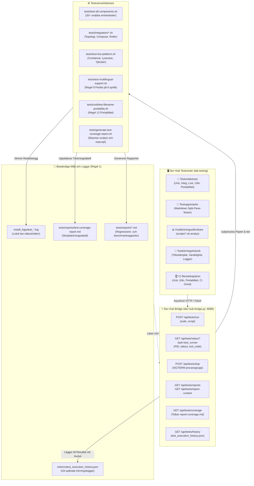

[ 🇬🇧 English ](../testing-framework-and-devhub.md) | [ 🇪🇪 Eesti ](../et/testing-framework-and-devhub.md) | [ 🇫🇮 Suomi ](../fi/testing-framework-and-devhub.md) | [ 🇸🇪 Svenska ](testing-framework-and-devhub.md) | [ 🇱🇻 Latviešu ](../lv/testing-framework-and-devhub.md) | [ 🇱🇹 Lietuvių ](../lt/testing-framework-and-devhub.md)

# 🧪 Testramverk och Developer Hub-integration

Denna tekniska guide dokumenterar plattformens flerskiktade automatiserade testarkitektur, det interaktiva **Testcentret** (`tab-testing`) i Developer Hub (`docs/dev-hub.html`), asynkron testorkestrering via `dev-hub-bridge.py` samt kodtäckningsanalys.

---

## 🏛️ 1. Teknisk Arkitektur och Komponentflöde

Testekosystemet kopplar samman utvecklarens gränssnittsåtgärder med underliggande testkörare, realtidsloggning och Git-spårade mätvärden:

---

## 🚀 2. Översikt över Testsviter

Plattformen delar in kvalitetssäkringen i specialiserade testsviter:

| Svit | Namn | Beskrivning | Kommando |
| :--- | :--- | :--- | :--- |
| `unit` | **Enhetstestsvit** | 29+ snabba isoleringstester utan aktiv databas: konfigurationer, SEPS-plånbok, syntax och logik. | `./tests/test-all-components.sh` |
| `integration` | **Integrationstester** | Flera databasers topologi, generering av compose override, profilroller och anslutningstester. | `tests/integration/*.sh` |
| `live` | **Live Plattform E2E** | Full regression mot aktiva containrar, databaslyssnare och webbtjänster. | `./tests/test-live-platform.sh` |
| `i18n` | **Flerspråkig Paritet** | Strikt Regel 9-granskning som verifierar ordlistesymmetri på alla 6 språk (EN, ET, FI, SV, LV, LT). | `./tests/test-multilingual-support.sh --all` |
| `portability` | **Filnamnsportabilitet** | Regel 13-granskning: otillåtna tecken i Windows NTFS/FAT, enhetsnamn och ASCII-sökvägar. | `./tests/unit/test-filename-portability.sh` |
| `browser` | **Webbläsare & SSO E2E** | Simulerar webbläsarinteraktioner, APEX-inloggning, Dev Hub-genvägar och SSO-autentisering. | `./scripts/test-browser-login.sh` |
| `ci_sim` | **Lokal GitHub CI** | Kör eller förhandsgranskar GitHub Actions CI/CD-arbetsflöden offline med efemära containrar. | `./scripts/test-local-ci.sh --dry-run` |
| `coverage` | **Täckningsgenerator** | Analyserar skripttäckning i `scripts/` och `scripts/internal/` och uppdaterar markdown-rapporten. | `./tests/generate-test-coverage-report.sh` |

---

## 🖥️ 3. Dev Hub Testcenter (`tab-testing`)

Developer Hubs testflik innehåller 4 specialiserade underflikar:

### 3.1 🚀 Testsvitskörare (`test-subtab-runner`)
- **Svitskort**: Tillåter körning av hela sviter eller enskilda valda skript med ett enda klick.
- **Inbäddad Realtidsterminal**: Terminalruta (`#0b0f19`) med strömmande stdout/stderr i realtid, automatisk rullning, timer, loggnedladdning och nödavbrott (`POST /api/tests/stop`).

### 3.2 📑 Testrapportarkiv (`test-subtab-reports`)
- **Delad Vy (Split-Pane)**: Vänster panel listar rapporter (`tests/reports/*.md`) med statusbrickor (`PASS`, `FAIL`, `INFO`) och tidsstämplar.
- **Renderad Markdown**: Höger panel visar formaterad HTML med aktiva Mermaid-diagram och växling till råtext.

### 3.3 📊 Kodtäckningsutforskare (`test-subtab-coverage`)
- **KPI-Sammanfattning**: Visuell förloppsfält som visar andelen täckta skript, totalt antal, täckta och otäckta skript.
- **Interaktiv Tabell**: Listar samtliga filer i `scripts/*.sh` och `scripts/internal/*.sh` samt tillhörande testfiler.
- **Filter och Sökning**: Snabbtextsökning och statusfilter ("Alla", "Täckta", "Otäckta").
- **Uppdatera Analys**: Kör `generate-test-coverage-report.sh` direkt från gränssnittet.

### 3.4 📜 Körningshistorik (`test-subtab-history`)
- Visar historik sparad i `metrics/test_execution_history.json`.
- Innehåller tidsstämpel, svit, skriptnamn, varaktighet i sekunder, statusbricka, direktlänk till `install_logs/test_*.log` samt en **Kör igen**-knapp.

---

## 🔒 4. Zero-Trust Säkerhet och Regelefterlevnad

1. **Regel 1 (Tidtagning och Loggning)**: Varje testkörning dirigerar automatiskt utdata till `install_logs/test_<suite>_<timestamp>.log` och sparar varaktigheten i `metrics/test_execution_history.json`.
2. **Regel 9 (Flerspråkighet)**: Hela gränssnittet är lokaliserat till alla sex språken (EN, ET, FI, SV, LV, LT).
3. **Regel 12 (Asynkrona Uppgifter)**: Tester körs i bakgrunden via `subprocess.Popen` utan att låsa webbläsaren eller orsaka HTTP-tidsgränser.
4. **Regel 13 (Portabilitet)**: Alla rapport- och loggfilnamn använder strikt ASCII kebab-case utan Windows-förbjudna tecken.
