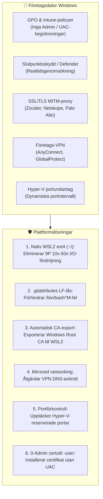

[ 🇬🇧 English ](../windows-enterprise-setup-guide.md) | [ 🇪🇪 Eesti ](../et/windows-enterprise-setup-guide.md) | [ 🇫🇮 Suomi ](../fi/windows-enterprise-setup-guide.md) | [ 🇸🇪 Svenska ](windows-enterprise-setup-guide.md) | [ 🇱🇻 Latviešu ](../lv/windows-enterprise-setup-guide.md) | [ 🇱🇹 Lietuvių ](../lt/windows-enterprise-setup-guide.md)

# Företagsguide för Windows & WSL2-installation

Denna guide ger steg-för-steg-instruktioner för att köra **Oracle DevOps-plattformen** på **företagsstyrda Windows-arbetsstationer** (Windows 10 / 11 Enterprise, Intune/GPO-hanterad, utan lokala administratörsrättigheter, företagsproxy/Zscaler och VPN).

---

## 1. Matris för systemkrav

| Resurs | Minimikrav (BP 0 / 1 / 2) | Rekommenderat (BP 5 / 6 / 7 / 8) | Kommentarer & motivering |
| :--- | :--- | :--- | :--- |
| **Processor (CPU)** | **4 kärnor (8 trådar)** x86_64 | **8 kärnor (16 trådar)** x86_64 | Virtualisering (**VT-x / AMD-V**) måste vara aktiverad i BIOS/UEFI. ARM64 (Snapdragon) stöds inte för Oracle 23ai-containrar. |
| **Arbetsminne (RAM)** | **16 GB Host RAM**<br/>*(WSL2: 6 GB)* | **32 GB Host RAM**<br/>*(WSL2: 12–16 GB)* | Windows + Teams + Defender drar 5–6 GB. Oracle Free kräver 2.5 GB, ORDS 1 GB, WebLogic/Publisher 3–4 GB. 8 GB-datorer blir extremt långsamma. |
| **Lagring (Disk)** | **50 GB ledigt utrymme på SSD** | **100 GB ledigt utrymme på NVMe SSD** | Avbildningar kräver totalt ~25 GB. Mekaniska hårddiskar (HDD) är strängt förbjudna på grund av I/O-prestanda. |
| **Operativsystem** | **Windows 10 Enterprise / Pro** (21H2+, Build 19044+) | **Windows 11 Enterprise** (23H2 / 24H2) | Windows 11 innehåller `mirrored` nätverksläge och DNS-tunnling, vilket säkerställer VPN-stabilitet. |
| **Virtualisering** | **WSL 2** (Kärna 5.15+) | **WSL 2** (Kärna 6.6+) med `systemd`-stöd | Windows-funktioner: `VirtualMachinePlatform` och `Microsoft-Windows-Subsystem-Linux`. |
| **Containermotor** | **Podman Desktop 5.x** eller Podman i WSL2 | **Podman 5.x integrerat i WSL2** | 100% fri programvara med öppen källkod (inga Docker Desktop-licensavgifter). |
| **Git & terminal** | **Git for Windows 2.40+** | **Git for Windows + Windows Terminal** | Nödvändiga inställningar: `core.autocrlf=input`, `core.longpaths=true`. |
| **PowerShell** | **Windows PowerShell 5.1** | **PowerShell 7.4+ (Core)** | Krävs för startskript och certifikatverktyg. |

---

## 2. Huvudsakliga företagshinder och arkitektoniska lösningar



### 1. Nativt WSL2-filsystemsinvariant (använd INTE `C:\...` / `/mnt/c/`)
- **Fara:** Att köra från Windows NTFS-sökvägar (`C:\Users\<user>\...`) tvingar WSL2 att använda Plan9 (9P)-drivrutinen, vilket är **10–50 gånger långsammare**. APEX och databasinstallation tar 45–90 minuter istället för 3–5 minuter.
- **Regel:** Klona alltid projektet i WSL2:s nativa Linux ext4-filsystem (`cd ~ && git clone ...`). I Utforskaren i Windows når du filerna via `\\wsl$\Ubuntu\home\<user>\...`.

### 2. Radbrytningar (CRLF VS LF)
- Alla filer är låsta till **LF (`\n`)** via `.gitattributes`. Windows `.cmd`- och `.ps1`-filer använder CRLF.

### 3. Företagsproxy och SSL-inspektion
- Utgående trafik dekrypteras via företagets interna Root CA. Skriptet `scripts/wsl/configure-wsl-enterprise.ps1` exporterar dessa automatiskt till WSL2.

### 4. VPN DNS-tunnling
- I Windows 11 konfigureras `%USERPROFILE%\.wslconfig` med `networkingMode=mirrored` och `dnsTunneling=true`.

---

## 3. Snabbstartsguide för Windows-utvecklare

### Steg 1: Klona arkivet till nativ WSL2 ext4-katalog
Öppna din WSL2-terminal (Ubuntu/Debian) och kör:
```bash
cd ~
git clone https://github.com/allanlahe/oracle-free-db-in-prod.git
cd oracle-free-db-in-prod
```

### Steg 2: Optimera WSL2 & proxycertifikat (engångsåtgärd)
Kör i Windows PowerShell (med vanliga användarrättigheter, ingen administratör behövs):
```powershell
powershell -ExecutionPolicy Bypass -File scripts\wsl\configure-wsl-enterprise.ps1
```
*Detta konfigurerar `%USERPROFILE%\.wslconfig` för 6–16 GB minne och exporterar certifikat till WSL2.*

Starta om WSL för att tillämpa ändringarna:
```powershell
wsl --shutdown
```

### Steg 2.5: Kör icke-destruktiv dry-run-kontroll
Innan långvarig installation påbörjas, verifiera miljöns kompatibilitet:
Från Windows Kommandotolk:
```cmd
test-windows-dryrun.cmd
```
Eller direkt i WSL2-terminalen:
```bash
./scripts/test-windows-dryrun.sh --fix
```
*Detta kontrollerar 10 kritiska punkter på ~2 sekunder (nativ ext4 vs /mnt/c/, radbrytningar, RAM, Hyper-V-portar, proxy TLS, VPN DNS, rootless Podman och SEPS Wallet-behörigheter). Flaggan `--fix` reparerar upptäckta CRLF-radbrytningar automatiskt.*

### Steg 3: Starta plattformen
Från Windows Kommandotolk eller Utforskaren:
```cmd
setup.cmd -b 0
```
*(Tips: du kan även köra `setup.cmd --dry-run` för att köra diagnostiken innan start).*

Eller direkt i WSL2:
```bash
./scripts/setup-all.sh -b 0
```

### Steg 4: Lita på SSL-certifikatet i Windows-webbläsare (0-Admin)
För att undvika webbläsarvarningar på `https://localhost:8448/ords/` och `https://localhost:8448/dev-hub.html`:
```cmd
scripts\certs\trust-local-cert.cmd
```
*Detta importerar lokalt Root CA till `Cert:\CurrentUser\Root` utan UAC-bekräftelse.*

---

## 4. Felsökning (FAQ)

### F1: `bash: ./scripts/setup-all.sh: /bin/bash^M: bad interpreter`
- **Orsak:** Arkivet klonades med Windows Git med inställningen `core.autocrlf=true`.
- **Lösning:** Kör `./scripts/test-windows-dryrun.sh --fix` eller klona om med `git config --global core.autocrlf input`.

### F2: Portbindning misslyckas: `An attempt was made to access a socket in a way forbidden by its access permissions`
- **Orsak:** Windows Hyper-V har reserverat den begärda porten (1532 eller 8088).
- **Lösning:** Kontrollera reserverade portar med `netsh interface ipv4 show excludedportrange protocol=tcp`. Starta om Windows NAT eller kör `test-windows-dryrun.cmd`.
