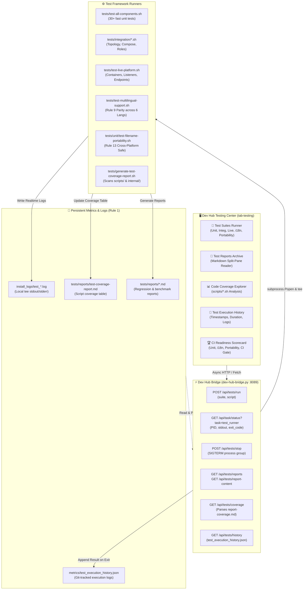

[ 🇬🇧 English ](testing-framework-and-devhub.md) | [ 🇪🇪 Eesti ](et/testing-framework-and-devhub.md) | [ 🇫🇮 Suomi ](fi/testing-framework-and-devhub.md) | [ 🇸🇪 Svenska ](sv/testing-framework-and-devhub.md) | [ 🇱🇻 Latviešu ](lv/testing-framework-and-devhub.md) | [ 🇱🇹 Lietuvių ](lt/testing-framework-and-devhub.md)

# 🧪 Testing Framework & Developer Hub Integration

This technical guide documents the platform's multi-tiered automated testing architecture, the interactive **Testing Center** (`tab-testing`) in Developer Hub (`docs/dev-hub.html`), asynchronous test orchestration via `dev-hub-bridge.py`, and code coverage tracking.

---

## 🏛️ 1. Technical Architecture & Component Flow

The testing ecosystem connects developer UI interactions with underlying test runners, real-time logging, and Git-tracked metrics:

---

## 🚀 2. Test Suites Overview

The platform divides quality verification into dedicated test suites:

| Suite Key | Name | Description | Command |
| :--- | :--- | :--- | :--- |
| `unit` | **Unit Test Suite** | 29+ fast isolation tests validating configuration parsers, SEPS wallet, script syntax, and logic without live DB. | `./tests/test-all-components.sh` |
| `integration` | **Integration Tests** | Multi-database topology, compose override generation, profile roles, and connection handshakes. | `tests/integration/*.sh` |
| `live` | **Live Platform E2E** | Full regression against active running containers, database listeners, and web service endpoints. | `./tests/test-live-platform.sh` |
| `i18n` | **Multilingual Parity** | Strict Rule 9 audit verifying dictionary symmetry across all 6 languages (EN, ET, FI, SV, LV, LT). | `./tests/test-multilingual-support.sh --all` |
| `portability` | **Filename Portability** | Strict Rule 13 audit verifying Windows NTFS/FAT forbidden chars, device names, and ASCII path standards. | `./tests/unit/test-filename-portability.sh` |
| `browser` | **Browser & SSO E2E** | Simulates browser interactions, APEX login flows, Dev Hub shortcuts, and SSO authentication. | `./scripts/test-browser-login.sh` |
| `ci_sim` | **Local GitHub CI** | Executes or dry-runs repository GitHub Actions CI/CD workflows offline using ephemeral containers. | `./scripts/test-local-ci.sh --dry-run` |
| `coverage` | **Coverage Generator** | Scans all scripts under `scripts/` and `scripts/internal/` and updates the markdown coverage report. | `./tests/generate-test-coverage-report.sh` |

---

## 🖥️ 3. Dev Hub Testing Center (`tab-testing`)

The Testing tab in Developer Hub provides 4 specialized sub-tabs:

### 3.1 🚀 Test Suites & Hierarchical Runner (`test-subtab-runner`)
- **Suite Cards**: Provides one-click execution for entire suites or specific individual scripts selected via dropdown.
- **Embedded Live Terminal**: An inline terminal box (`#0b0f19`) streaming stdout/stderr in real-time with auto-scroll toggle, execution timer, log download button, and emergency process interruption (`POST /api/tests/stop`).

### 3.2 📑 Test Reports Archive (`test-subtab-reports`)
- **Split-Pane Viewer**: Left pane lists past markdown test reports from `tests/reports/*.md` with status badges (`PASS`, `FAIL`, `INFO`) and timestamps.
- **Rendered Markdown**: Right pane displays rendered HTML with active Mermaid diagram rendering, plus a toggle for raw markdown inspection.

### 3.3 📊 Code Coverage Explorer (`test-subtab-coverage`)
- **KPI Summary**: Visual progress bar showing total script coverage percentage, total scripts, covered scripts, and uncovered scripts.
- **Interactive Script Table**: Lists every script under `scripts/*.sh` and `scripts/internal/*.sh`, showing associated test files.
- **Filter & Search**: Allows filtering by "All", "Covered", "Uncovered", and instantaneous text search.
- **On-Demand Refresh**: Runs `generate-test-coverage-report.sh` directly from the UI.

### 3.4 📜 Execution History (`test-subtab-history`)
- Tracks past test runs recorded in `metrics/test_execution_history.json`.
- Displays timestamp, suite, individual script name, duration in seconds, exit code badge, direct link to `install_logs/test_*.log`, and a 1-click **Re-run** button.

---

## 🔒 4. Zero-Trust Security & Rule Compliance

1. **Rule 1 (Timing & Logging)**: Every test run initiated from Dev Hub automatically tees output into timestamped logs under `install_logs/test_<suite>_<timestamp>.log` and records duration into `metrics/test_execution_history.json`.
2. **Rule 9 (i18n Parity)**: The entire testing tab UI is localized across 6 Nordic-Baltic languages (EN, ET, FI, SV, LV, LT).
3. **Rule 12 (Asynchronous Task Contract)**: Tests are dispatched asynchronously via `subprocess.Popen` without blocking browser connections or HTTP timeouts.
4. **Rule 13 (Filename Portability)**: All report and log filenames use strict ASCII kebab-case characters without forbidden Windows NTFS symbols.
