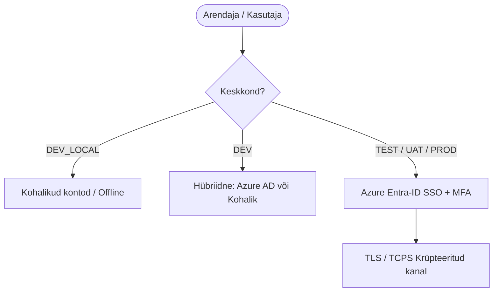

# Oracle Free DB & APEX Turvalisus ja SSO Arhitektuur

See dokument koondab kokku projekti turvakaalutlused, paroolide halduse, kasutajarollid lokaalses arenduses ning pilvepõhise ühekordse sisselogimise (SSO / Azure Entra-ID) arhitektuuri.

---

## 1. Paroolide ja Saladuste Haldus lokaalselt (Local Secrets)

Arenduskeskkonna saladused ja andmebaasi paroolid asuvad failis `.env` ning neid **ei lisata kunagi versioonihaldusesse** (on `.gitignore` nimekirjas). 

*   **Süsteemsed paroolid:** Muutujad `PUBLISHER_DB_SYS_PASSWORD` ja `APEX_DB_SYS_PASSWORD` kaitsevad andmebaaside `SYS` kontosid pordil `1531` ja `1532`.
*   **APEX-i sisemised paroolid:** 
    *   `APEX_ADMIN_PASSWORD` (vaikimisi `ApexAdminPass2026!`) – kasutatakse APEX-i tööruumi (`PROXY_WORKSPACE`) ja administraatori (`INTERNAL` vaade) arendajakontode paroolina.
    *   `APEX_SCHEMA_PASSWORD` (vaikimisi `ProxySchemaPass2026!`) – kaitseb skeemi `APEX_PROXY_SCHEMA`, mille kaudu Liquibase ja ORDS andmebaasiga suhtlevad.

---

## 2. Keskkondade sisselogimise ja turvalisuse maatriks

Projekti infrastruktuuris on määratletud viis keskkonnaklassi (seadistatakse muutuja `ENVIRONMENT_TYPE` kaudu failis `.env`), et tagada optimaalne arendusmugavus ja range toodanguturvalisus:

| Keskkond (`ENVIRONMENT_TYPE`) | Kus jookseb? | Autentimise tüüp (APEX & DB) | Kasutajate haldus | TLS krüpteering (TCPS) |
| :--- | :--- | :--- | :--- | :--- |
| **`DEV_LOCAL`** | Arendaja kohalik PC | Kohalikud kasutajakontod | Manuaalne / `create-developer.sh` | Ei (Mugavus/Offline) |
| **`DEV`** | Jagatud arendusserver | Hübriidne (Kohalik + **Azure AD**) | Azure AD + JIT / Kohalikud kontod | Valikuline |
| **`TEST`** | Testserver (CI/CD) | **Azure Entra-ID (SSO)** | Tsentraalne (Azure AD grupid) | Jah (Port 2484) |
| **`UAT`** | Eeltoodangu server | **Azure Entra-ID (SSO)** | Tsentraalne (Azure AD grupid) | Jah (Port 2484) |
| **`PROD`** | Toodanguserver | **Azure Entra-ID (SSO)** | Tsentraalne (Azure AD grupid) | Jah (Port 2484) |



### A. Lokaalne arendus (`DEV_LOCAL` arvutis)
*   **Mugavus ja offline-tugi:** Arendaja saab töötada täielikult ilma võrguühenduseta ja VPN-ita.
*   **Autonoomia ja vähimate õiguste printsiip:** Iga andmebaasi instantsi puhul luuakse automaatselt ettevalmistatud kasutajakontod koos paroolivaba Oracle Wallet (SEPS) ühendusega:
    *   **1. DBA Administraator (`DBA_ADMIN`):** Administratiivsete tegevuste ja DDL/DML halduse konto (`DBA` roll), mis ennetab `SYS` kasutaja igapäevast kasutamist ja tekitab turvalisi käitumisharjumusi. Ühendus: `sql /@DB_ALISE_DBA_ADMIN` või `sql /@DB_DB_ALISE_DBA_ADMIN`.
    *   **2. Arendaja kasutaja (`USER_DEVELOPER`):** Rakenduste ja skeemide igapäevaseks arenduseks mõeldud konto, millele on omistatud ametlik Oracle 23c/23ai **`DB_DEVELOPER_ROLE`** (lisaks `RESOURCE` ja `CREATE SESSION`). Ühendus: `sql /@DB_ALISE_DEV` või `sql /@DB_DB_ALISE_DEV`.
    *   **3. Rakenduskasutaja (`USER_APP`):** Oracle Forms ja ärirakenduste objektide ja käitusaja konto (`CREATE SESSION`, `RESOURCE`, `CREATE TABLE/VIEW/PROCEDURE`). Ühendus: `sql /@DB_FORMS_APP` või `sql /@DB_ALISE_APP`.
    *   **4. Vaataja konto (`USER_VIEWER`):** Piiratud õigustega teostus- ja testkonto, millel on rangelt ainult kõigi skeemide lugemisõigus (`SELECT ANY TABLE`, `SELECT ANY DICTIONARY`, `READ ANY TABLE`). Ühendus: `sql /@DB_ALISE_VIEWER` või `sql /@DB_DB_ALISE_VIEWER`.
    *   **5. Dual Alias Tugi:** SEPS Wallet toetab paralleelselt nii lühikesi (`DB_ALISE_*`, `DB_PROXY_*`) kui täisnimega aliaseid (`DB_DB_ALISE_*`, `DB_DB_PROXY_*`).
    *   **6. VS Code täielik sünkroonsus (`register-connections.sh`):** Kõik andmebaasi kontod (`SYS`, `DBA_ADMIN`, `SCHEMA`, `DEV`, `APP`, `VIEWER`) registreeritakse automaatselt VS Code Oracle SQL Developer laienduse kaustadesse koos salvestatud krüpteeritud paroolidega.
*   **SSO möödapääs (Bypass):** Kui arendaja soovib ajutiselt testida lokaalset SSO-d, kuid ühendust pole, saab kasutada möödapääsu parameetrit: `&fsp_sso_login_override=y`.

### B. Jagatud arenduskeskkond (`DEV` serveris)
*   **Meeskonna koostöö:** Ühine server, kus arendajad teevad esimesed integratsioonitestid.
*   **SSO valmidus:** Kui vastav seadistus on sisse lülitatud, logitakse sisse läbi ettevõtte Azure AD. Kui keegi vajab erandligipääsu ilma SSO-ta, saab kasutada kohalikke kontosid (nt avarii `ADMIN` konto).

### C. Serverikeskkonnad (`TEST`, `UAT`, `PROD`)
*   **100% SSO ja MFA:** Kasutatakse ainult keskset Azure Entra-ID-d koos kohustusliku kaheastmelise tuvastamisega.
*   **Krüpteeritud liiklus:** Kogu andmeliiklus andmebaasi (port 2484) ja rakenduste vahel on krüpteeritud.

---

## 2.5. Oracle Wallet ja sertifikaatide haldus (TEST/UAT/PROD valmidus)

Süsteemsete andmebaasi paroolide (`SYS`, `SYSTEM`) hoidmine tekstifailides (`.env`) toodangukeskkonnas on turvarisk. Selle asemel rakendatakse järgmist strateegiat:

1.  **Pilve paroolihoidlad (Secrets Managers):** Toodangus ei kirjutata paroole kunagi kettale failidesse. CI/CD runner laeb paroolid **Azure Key Vault**-ist otse mällu vahetult enne paigaldusskripti käivitamist ja hävitab need mälust kohe pärast töö sooritamist.
2.  **Oracle Wallet sertifikaatide hoidlana (TLS/TCPS):**
    *   Selle asemel, et kasutada Walletit paroolide hoidmiseks (SEPS), kasutatakse Walletit **sertifikaatide turvaliseks hoiustamiseks**.
    *   Toodangukeskkondades on andmebaasi kuulaja (Listener) konfigureeritud TLS režiimi (port `2484`, TCPS protokoll).
    *   Andmebaasi konteinerisse mountitakse kaust `/opt/oracle/admin/FREE/wallet`, mis sisaldab andmebaasi sertifikaati.
    *   ORDS ja SQLcl kliendid kasutavad usaldusväärse sertifitseerimiskeskuse (CA) juursertifikaadiga täidetud kliendi-walletit, tagades, et andmeliiklus on täielikult kaitstud pealtkuulamise eest (Man-in-the-Middle rünnakud).

---

## 2.6. Adaptiivne 5-Astmeline TLS/HTTPS Arhitektuur ja 0-Admin Usaldusväärsus

Veebiteenuste (ORDS, APEX, Analytics Publisher) HTTPS krüpteerimiseks ja brauseri hoiatusteta (*Not Secure*) toimimiseks ilma lokaalsete administraatori/root õigusteta on välja töötatud **5-astmeline hierarhiline sertifikaatide mootor** (`scripts/internal/resolve-tls-mode.sh`):

```text
config/certs/
├── custom/          # Samm 0: Arendaja käsitsi lisatud sertifikaadid (tls.crt, tls.key)
├── public/          # Variant 1: Avalik FQDN & Let's Encrypt / Avalik CA
├── corp/            # Variant 2: Ettevõtte Sise-PKI sertifikaadid (corp_cert.crt)
├── user_ca/         # Variant 3: Lokaalne CA (usaldatud kasutajahoidlas, 0-admin)
└── self_signed/     # Variant 4: Jooksvalt genereeritud iseallkirjastatud cert (Untrusted fallback)
```

### Sertifikaatide Tasemed ja Eesmärgid:
1. **Samm 0 (`CUSTOM_CERT` - `config/certs/custom/`):** Arendaja poolt käsitsi kausta kopeeritud sertifikaat. Võetakse esmase prioriteedina kasutusse.
2. **Samm 1 (`PUBLIC_DNS` - `config/certs/public/`):** Avalik domeen ja Let's Encrypt / DigiCert sertifikaat (`USE_PUBLIC_CA_CERTS=true`). Tagab 100% rohelise tabaluku kõigis seadmetes ilma lokaalse seadistuseta.
3. **Samm 2 (`CORP_PKI` - `config/certs/corp/`):** Ettevõtte sise-PKI Wildcard sertifikaat (`CORP_PKI_ENABLED=true`), mida haldab ettevõtte IT.
4. **Samm 3 (`USER_LOCAL_CA` - `config/certs/user_ca/`):** Lokaalne CA, mis usaldatakse kasutaja isiklikus hoidlas (`login.keychain-db` macOS-is või `Cert:\CurrentUser\Root` Windowsis) **ilma administraatori või root-õigusteta**.
5. **Samm 4 (`SELF_SIGNED` - `config/certs/self_signed/`):** Jooksvalt genereeritud puhas iseallkirjastatud varusertifikaat. Ei muuda ühtegi truststore'i ja toimib tehnilise turvavõrguna suletud CI/CD keskkondades (kuvab brauseris *"Not Secure"*).

### Blueprinti Rangusastme Kontroll (`TLS_ALLOWED_LEVEL`):
* `strict_public`: Lubatud ainult 0 (Custom) ja 1 (Public CA).
* `corporate_pki`: Lubatud 0, 1 ja 2 (Ettevõtte PKI).
* `trusted_local`: Lubatud 0, 1, 2 ja 3 (Nõuab usaldatud sertifikaati, keelab Variant 4).
* `permissive`: Lubatud kõik variandid 0–4 (Arendaja liivakast).

---

## 3. Andmebaasi taseme SSO (SQLcl & JDBC)

Oracle Database (alates 19.16+ ja 23ai) toetab nativselt Azure AD OAuth2 tokeneid.

*   **Kuidas see toimib:** Arendajale ei luua andmebaasi isiklikku parooliga kontot. Selle asemel luuakse andmebaasi globaalne roll, mis on seotud Azure AD grupi ID-ga:
    ```sql
    CREATE USER dev_developer IDENTIFIED GLOBALLY AS 'AZURE_GROUP_OBJECT_ID';
    ```
*   **Ühendumine SQLcl-is:** Arendaja käivitab käsu, mis avab brauseris Microsofti sisselogimise ja edastab tokeni andmebaasile:
    ```bash
    sql -thin /@sinu_db_teenus
    ```

---

## 4. ORDS ja API-de turvalisus

ORDS (Oracle REST Data Services) töötab vahekihina ja toetab väliste identiteedihaldurite (Azure AD) JWT-põhist valideerimist.

*   **REST API-d:** API päringud peavad sisaldama Azure AD poolt väljastatud tõendit: `Authorization: Bearer <JWT_token>`. ORDS kontrollib tokeni allkirja vastu Azure'i avalikke võtmeid.
*   **Veebiliides (Database Actions):** Ligipääs on kaitstud SSO-ga. ORDS kasutab andmebaasiga suhtlemiseks proxy-kasutajaid, mis tähendab, et kasutajal endal puudub otsene andmebaasi parool.

---

## 5. APEX Rakenduste sisselogimine (Application SSO)

Meie ehitatavad rakendused kasutavad APEX-i sisemist **Social Sign-In (OpenID Connect)** autentimisskeemi.

*   **Kasutaja loomine (Just-In-Time):** Kasutajaid ei pea rakendusse eelnevalt käsitsi lisama. Kui kasutaja logib esimest korda edukalt sisse läbi Azure AD, luuakse talle APEX-i taustasüsteemis automaatselt kasutajaprofiil.
*   **Autoriseerimine (Rollid):** Azure AD poolt tagastatavad kasutajagrupid (`groups` claim) kaardistatakse APEX-i autoriseerimisskeemidega (nt `IsAdmin`, `IsOperator`), mis peidavad või näitavad rakenduse komponente vastavalt kasutaja õigustele pilves.

---

## 6. Oracle Free versiooni piirangud ja riskid

*   **Turvapaikade (Security Patches) puudumine:** Oracle Free versioonile ei pakuta tootja poolt ametlikke turvapaiku ega veaparandusi. Toodangus kasutamisel peab infrastruktuur ja operatsioonisüsteem olema eraldi kaitstud (tulemüürid, isoleeritud võrgud, regulaarsed konteinerite uuendamised).
*   **Toe puudumine:** Süsteemirikete ja turvaintsidentide lahendamisel puudub tugi Oracle Support-ilt.
    
    *Detailsema ülevaate saamiseks kettamahu ja auditilogide monitooringu kohta vaata: [docs/oracle-free-db-monitoring.md](oracle-free-db-monitoring.md)*
