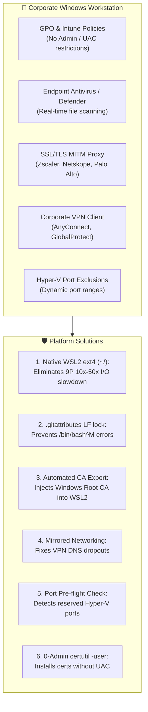

[ 🇬🇧 English ](windows-enterprise-setup-guide.md) | [ 🇪🇪 Eesti ](et/windows-enterprise-setup-guide.md) | [ 🇫🇮 Suomi ](fi/windows-enterprise-setup-guide.md) | [ 🇸🇪 Svenska ](sv/windows-enterprise-setup-guide.md) | [ 🇱🇻 Latviešu ](lv/windows-enterprise-setup-guide.md) | [ 🇱🇹 Lietuvių ](lt/windows-enterprise-setup-guide.md)

# Enterprise Windows & WSL2 Setup Guide

This guide provides step-by-step instructions for running the **Oracle DevOps Platform** on **corporate-managed Windows workstations** (Windows 10 / 11 Enterprise, Intune/GPO managed, zero-local-administrator rights, corporate proxy/Zscaler, and VPN).

---

## 1. System Requirements Matrix

| Resource | Minimum Requirement (BP 0 / 1 / 2) | Recommended (BP 5 / 6 / 7 / 8) | Notes & Justification |
| :--- | :--- | :--- | :--- |
| **Processor (CPU)** | **4 cores (8 threads)** x86_64 | **8 cores (16 threads)** x86_64 | Virtualization (**VT-x / AMD-V**) must be enabled in BIOS/UEFI. ARM64 (Snapdragon) is not supported for Oracle 23ai x86_64 containers. |
| **Memory (RAM)** | **16 GB Host RAM**<br/>*(WSL2: 6 GB)* | **32 GB Host RAM**<br/>*(WSL2: 12–16 GB)* | Windows + Teams + Defender consumes 5–6 GB. Oracle Free DB needs 2.5 GB, ORDS 1 GB, WebLogic/Publisher 3–4 GB. 8 GB machines will thrash. |
| **Storage (Disk)** | **50 GB free space on SSD** | **100 GB free space on NVMe SSD** | Containers require ~25 GB uncompressed. Mechanical HDDs are strictly prohibited due to I/O timeouts. |
| **Operating System** | **Windows 10 Enterprise / Pro** (21H2+, Build 19044+) | **Windows 11 Enterprise** (23H2 / 24H2) | Windows 11 includes `mirrored` networking and DNS tunneling for corporate VPN resilience. |
| **Virtualization** | **WSL 2** (Kernel 5.15+) | **WSL 2** (Kernel 6.6+) with `systemd` | Windows features: `VirtualMachinePlatform` and `Microsoft-Windows-Subsystem-Linux`. |
| **Container Engine**| **Podman Desktop 5.x** or Podman in WSL2 | **Podman 5.x native inside WSL2** | 100% free and open-source in enterprise environments (no Docker Desktop licensing fees). |
| **Git Client** | **Git for Windows 2.40+** | **Git for Windows + Windows Terminal** | Configured with `core.autocrlf=input`, `core.longpaths=true`. |
| **PowerShell** | **Windows PowerShell 5.1** | **PowerShell 7.4+ (Core)** | Required for bootstrap scripts and certificate trust helpers. |

---

## 2. Key Enterprise Constraints & Architectural Solutions



### 1. Native WSL2 Filesystem Invariant (Do NOT use `C:\...` / `/mnt/c/`)
- **Danger:** Running the repository from Windows NTFS paths (`C:\Users\<user>\...`) causes WSL2 to use the Plan9 (9P) translation driver. This causes a **10x–50x performance degradation**. APEX and database setup will take 45–90 minutes instead of 3–5 minutes.
- **Rule:** Always clone inside WSL2 native ext4 (`cd ~ && git clone ...`). Access files from Windows Explorer via `\\wsl$\Ubuntu\home\<user>\...`.

### 2. Line Endings (CRLF vs LF)
- All repository code files are strictly locked to **LF (`\n`)** via root `.gitattributes`. Windows `.cmd`, `.bat`, and `.ps1` scripts use CRLF.

### 3. Corporate Proxy & Zscaler / Netskope SSL Inspection
- Outbound traffic is inspected using internal corporate CAs. Use `scripts/wsl/configure-wsl-enterprise.ps1` to automatically export corporate CAs from the Windows Certificate Store into WSL2.

### 4. VPN DNS Tunneling
- In Windows 11, configure `%USERPROFILE%\.wslconfig` with `networkingMode=mirrored` and `dnsTunneling=true`. This ensures DNS resolution remains intact when connecting to corporate VPNs.

---

## 3. Step-by-Step Quickstart for Windows Developers

### Step 1: Clone Repository into Native WSL2 ext4
Open your WSL2 terminal (Ubuntu/Debian) and run:
```bash
cd ~
git clone https://github.com/allanlahe/oracle-free-db-in-prod.git
cd oracle-free-db-in-prod
```

### Step 2: Auto-Tune WSL2 & Proxy Certificates (One-Time Setup)
From Windows PowerShell (as standard user, no administrator rights needed):
```powershell
powershell -ExecutionPolicy Bypass -File scripts\wsl\configure-wsl-enterprise.ps1
```
*This configures `%USERPROFILE%\.wslconfig` for 6–16 GB RAM and exports corporate proxy certificates into WSL2.*

Restart WSL to apply changes:
```powershell
wsl --shutdown
```

### Step 2.5: Run Non-Destructive Pre-Flight Dry-Run Diagnostics
Before executing a long-running database container installation, verify environment compatibility:
From Windows Command Prompt:
```cmd
test-windows-dryrun.cmd
```
Or directly inside WSL2:
```bash
./scripts/test-windows-dryrun.sh --fix
```
*This validates 10 critical checkpoints in ~2 seconds (native ext4 vs /mnt/c/, line endings, RAM, Hyper-V dynamic ports, corporate proxy TLS, VPN DNS, rootless Podman, and SEPS Wallet permissions). If CRLF line endings or permissions are detected, `--fix` automatically repairs them.*

### Step 3: Launch Platform
From Windows Command Prompt or Explorer:
```cmd
setup.cmd -b 0
```
*(Tip: You can also run `setup.cmd --dry-run` to execute diagnostics before launching).*

Or directly inside WSL2:
```bash
./scripts/setup-all.sh -b 0
```

### Step 4: Trust SSL Certificate in Windows Browsers (0-Admin)
To eliminate browser certificate warnings for `https://localhost:8448/ords/` and `https://localhost:8448/dev-hub.html`:
```cmd
scripts\certs\trust-local-cert.cmd
```
*This imports the local development Root CA into `Cert:\CurrentUser\Root` with 0-Admin / no UAC.*

---

## 4. Troubleshooting & FAQ

### Q1: `bash: ./scripts/setup-all.sh: /bin/bash^M: bad interpreter`
- **Cause:** Repository was cloned with Windows Git using `core.autocrlf=true`.
- **Fix:** Run `dos2unix scripts/*.sh scripts/internal/*.sh` or re-clone with `git config --global core.autocrlf input`.

### Q2: Port binding fails: `An attempt was made to access a socket in a way forbidden by its access permissions`
- **Cause:** Windows Hyper-V dynamic port exclusions reserved the port (e.g. 1532 or 8088).
- **Fix:** Check excluded ports: `netsh interface ipv4 show excludedportrange protocol=tcp`. Restart the Windows NAT service: `net stop winnat && net start winnat` (requires admin) or switch blueprint port via YAML profile.

### Q3: WSL2 loses internet connection when corporate VPN connects
- **Cause:** VPN client broke virtual switch DNS forwarding.
- **Fix:** Ensure Windows 11 is up to date and run `scripts/wsl/configure-wsl-enterprise.ps1` to enable `networkingMode=mirrored` and `dnsTunneling=true`.
